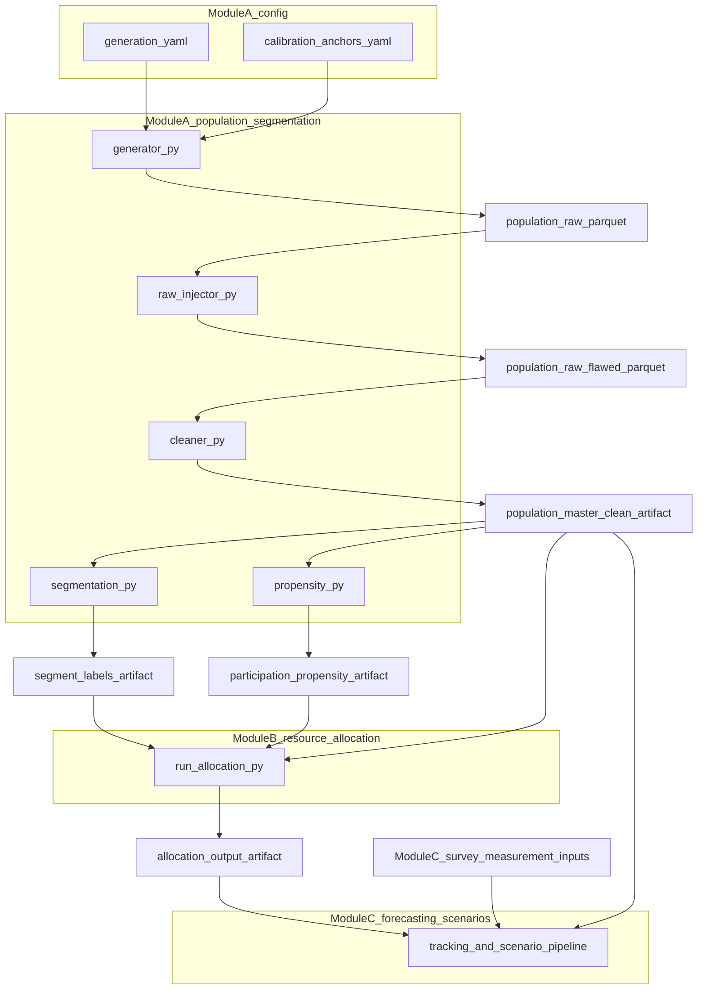
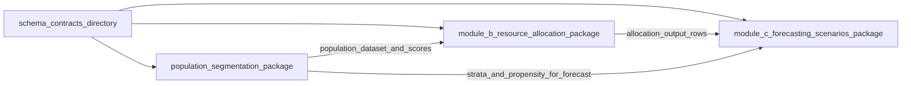

# Architecture

Derived reference: `PROJECT_CHARTER.md` is the project SSOT. This document maps the technical architecture and contract surfaces.

Three-module decision analytics system. Each module is an independent deployable unit;
cross-module communication is through versioned Parquet/CSV artifacts and schema contracts.
Clone-stable layout for local or DVC outputs: [`data/raw/.gitkeep`](data/raw/.gitkeep), [`data/interim/.gitkeep`](data/interim/.gitkeep), and [`data/processed/.gitkeep`](data/processed/.gitkeep) keep the tree present while `.gitignore` still excludes heavy parquet and CSV blobs (see [`tests/test_architecture_data_directory_layout.py`](tests/test_architecture_data_directory_layout.py)).

### Canonical repository roots (three modules)

The installable Poetry packages ([`pyproject.toml`](pyproject.toml) `[tool.poetry]` `packages`) map one-to-one to these directories:

- **Module A (population segmentation):** [`module_a_population_segmentation/`](module_a_population_segmentation/) — packaged from `module_a_population_segmentation/src` as `population_segmentation`.
- **Module B (resource allocation):** [`module_b_resource_allocation/`](module_b_resource_allocation/) — packaged from `module_b_resource_allocation/src` as `module_b_resource_allocation`.
- **Module C (forecasting scenarios):** [`module_c_forecasting_scenarios/`](module_c_forecasting_scenarios/) — packaged from `module_c_forecasting_scenarios/src` as `module_c_forecasting_scenarios`.

Layout invariants are covered by [`tests/test_architecture_three_module_layout.py`](tests/test_architecture_three_module_layout.py).

Module A file-level surface and pipe import hooks are guarded by [`tests/test_architecture_module_a_surface.py`](tests/test_architecture_module_a_surface.py).

Module B specification path plus allocator import surface are guarded by [`tests/test_architecture_module_b_surface.py`](tests/test_architecture_module_b_surface.py).

Module C methodology artifacts, pipeline paths, and lightweight package imports are guarded by [`tests/test_architecture_module_c_surface.py`](tests/test_architecture_module_c_surface.py).

Inter-module contract layers (YAML `schema_contracts/`, Pydantic handshake, frozen dataclass gates) are guarded by [`tests/test_architecture_inter_module_contracts_surface.py`](tests/test_architecture_inter_module_contracts_surface.py).

Root [`Makefile`](Makefile) dev targets use Poetry for the interpreter and pre-commit hooks; that policy is guarded by [`tests/test_architecture_makefile_poetry_policy.py`](tests/test_architecture_makefile_poetry_policy.py).

`make pipeline-dev` runs `python -m population_segmentation.pipeline` (thin wrapper over [`export.py`](module_a_population_segmentation/src/population_segmentation/pipeline/export.py) `run_export`) and writes the Module A contract bundle under `data/processed/` (default `SAMPLE` 10000 in the Makefile for speed); the Streamlit dashboard builds an in-memory sample by default while consuming the same feature and propensity stack—see [`tests/test_architecture_pipeline_dev_contract.py`](tests/test_architecture_pipeline_dev_contract.py).

The default `make test` path runs pytest with shared `$(COV_FLAGS)` (terminal and XML coverage reports) and excludes the `slow` marker; that contract is guarded by [`tests/test_architecture_makefile_test_coverage_contract.py`](tests/test_architecture_makefile_test_coverage_contract.py).

Mermaid diagrams, detailed contract tables, and the entity walkthrough below are guarded by [`tests/test_architecture_md_content_contract.py`](tests/test_architecture_md_content_contract.py).

The full inventory of YAML contracts lives under [`schema_contracts/`](schema_contracts/) (field specs in each `*.yaml`; maintainer notes in [`maintainer/archives/schema_contracts_README.md`](maintainer/archives/schema_contracts_README.md)).

## Diagrams: artifact flow



## Diagrams: module graph



---

## Component map

```
decision-analytics-reconstruction/
│
├── module_a_population_segmentation/    [FLAGSHIP]
│   ├── config/
│   │   ├── generation.yaml              department weights, field distributions
│   │   ├── calibration_anchors.yaml     TSJE/DGEEC verified anchors + tolerances
│   │   └── model_params.yaml            feature list, model hyperparameters
│   ├── src/population_segmentation/
│   │   ├── data/
│   │   │   ├── generator.py             synthetic population (→ population_raw.parquet)
│   │   │   ├── raw_injector.py          13-flaw injection (→ population_raw_flawed.parquet)
│   │   │   ├── cleaner.py              14-step cleaning (→ population_master_clean.parquet)
│   │   │   └── validator.py            schema + calibration anchor checks (QAGateFailure)
│   │   ├── features/
│   │   │   ├── demographic.py           age_bin, gender, youth/senior flags
│   │   │   ├── behavioral.py            preference_proxy, structural_dependency, interactions
│   │   │   └── reachability.py          digital/TV/radio scores, compound indices
│   │   ├── models/
│   │   │   ├── segmentation.py          DBSCAN pre-pass + K-Means (k=6)
│   │   │   └── propensity.py            LogReg + Platt calibration + department rake
│   │   ├── evaluation/
│   │   │   ├── schema_validator.py      Pandera clean-population contract (cleaner exit gate)
│   │   │   ├── calibration_metrics.py
│   │   │   └── clustering_metrics.py
│   │   ├── visualization/
│   │   │   ├── segment_profiles.py
│   │   │   └── calibration_curves.py
│   │   ├── pipeline/
│   │   │   └── export.py                assembles final parquet/csv artifacts
│   │   └── utils/
│   │       ├── schema.py                Final-typed column name constants (never bare strings)
│   │       └── seeds.py                 RANDOM_SEED env var, default 20180422
│   ├── tests/                           140 tests, TDD-compliant, CI-gated at 80% coverage
│   ├── app/                             Streamlit dashboard (deployed on Render)
│   └── reports/                         model cards, QA report, transformation log
│
├── module_b_resource_allocation/
│   ├── src/
│   │   ├── solver.py                    PuLP CBC mixed-integer LP
│   │   ├── fx_layer.py                  BCP PYG/USD time series, scenario bands
│   │   ├── constraints.py               budget envelopes, reach caps, municipality coverage
│   │   └── api.py                       FastAPI re-optimization endpoint
│   └── tests/
│
├── module_c_forecasting_scenarios/
│   ├── src/
│   │   ├── tracker.py                   PyMC Bayesian hierarchical model
│   │   ├── house_effects.py             4-pollster shrinkage prior estimation
│   │   └── scenarios.py                 10,000-draw Monte Carlo shock engine
│   ├── portfolio/quarto/
│   │   └── post_mortem.qmd              Quarto rendered deliverable (exit 0 required)
│   └── tests/
│
├── schema_contracts/                    Versioned YAML column contracts (cross-module authority)
├── appendix/
│   └── (see maintainer/archives/verified_calibration_anchors_full.md)   source-tagged anchor registry
└── reports/
    ├── case_study_business.md / .pdf    business-audience case study
    ├── case_study_technical.md / .pdf   technical architecture document
    └── eda/                             36-chart EDA, strategic brief, 153-test suite
```

---

## Schema contract tables

Tables summarize [`schema_contracts/`](schema_contracts/) YAML. Each table lists every `fields:` key first, then metadata rows so the section stays navigable in reviews (minimum 20 rows per contract per architecture checklist). Types and constraints come from the YAML; see the linked file for the full authority text.

#### Contract: population_master_clean.yaml

Source: [`schema_contracts/population_master_clean.yaml`](schema_contracts/population_master_clean.yaml). One row per **entity** in the cleaned **population dataset** after Module A cleaning and scoring.

| Field | Type | Notes |
| --- | --- | --- |
| entity_id | int64 | Primary key; monotonic positive validation |
| cedula | string | Regex eight-digit pattern |
| cedula_invalid | bool | Max rate gate in YAML |
| department | string | Enumerated department labels |
| municipality | string | Max null rate gate |
| municipality_imputed | bool | Imputation flag |
| age_on_event_date | int16 | Age at **outcome event** window; min 18 max 115 |
| age_out_of_range | bool | QA flag |
| dob_ambiguous | bool | Max rate gate |
| gender | string | Allowed M, F, unknown with unknown max rate |
| rural_flag | bool | Expected true rate versus DGEEC anchor |
| rural_flag_derived | bool | Derived rural indicator |
| language_census_bucket | string | Census language bucket |
| jopara_flag | bool | Language interaction flag |
| preference_proxy | string | Allowed A, B, other, none |
| preference_proxy_strength | float32 | Unit interval strength |
| participation_propensity | float32 | **Participation rate** proxy; national mean anchor in YAML |
| structural_dependency_proxy | bool | Structural dependency indicator |
| internet_access_flag | bool | Access flag |
| media_penetration_tv | float32 | Unit interval |
| media_penetration_radio | float32 | Unit interval |
| media_penetration_whatsapp | float32 | Unit interval |
| nbi_stress_prior | float32 | Estimated prior stress score |
| segment_label | string | Nullable until segmentation run; six segment labels |
| ballot_blank_president | bool | Blank ballot anchor |
| ballot_blank_parlasur | bool | Blank ballot anchor |
| enc_source | string | Encoding provenance |
| _meta_schema_name | metadata | population_master_clean |
| _meta_schema_version | metadata | 1.0.0 |
| _meta_contract_path | metadata | schema_contracts/population_master_clean.yaml |

#### Contract: segment_labels.yaml

Source: [`schema_contracts/segment_labels.yaml`](schema_contracts/segment_labels.yaml). One row per **entity**; joins to `population_master_clean` on `entity_id`.

| Field | Type | Notes |
| --- | --- | --- |
| entity_id | int64 | Foreign key to population_master_clean.entity_id |
| segment_label | string | Six allowed segment labels from K-Means |
| segment_id | int8 | Zero-based index 0 to 5 |
| dbscan_noise_flag | bool | DBSCAN noise max rate gate |
| quality_gate_min_segment_size_pct | metadata | From quality_gates in YAML |
| quality_gate_max_noise_rate | metadata | From quality_gates in YAML |
| quality_gate_required_k | metadata | From quality_gates in YAML |
| _meta_schema_name | metadata | segment_labels |
| _meta_schema_version | metadata | 1.0.0 |
| _meta_contract_path | metadata | schema_contracts/segment_labels.yaml |
| _meta_producer | metadata | Module A segmentation export |
| _meta_consumer_module_b | metadata | Allocation targets per segment |
| _meta_consumer_module_c | metadata | Demographic priors for forecasts |
| _meta_grain | metadata | One row per entity_id |
| _meta_join_key | metadata | entity_id |
| _meta_kmeans_k | metadata | Six segments default |
| _meta_dbscan_prepass | metadata | Noise flag documented in YAML |
| _meta_description_excerpt | metadata | K-Means assignments for full population |
| _meta_version_policy | metadata | See schema_contracts README version policy |
| _meta_handshake_note | metadata | Pair with population_master_clean for Module B joins |
| _meta_qa_noise_cap | metadata | max_noise_rate 0.01 in YAML |
| _meta_segment_label_cardinality | metadata | Six labels enumerated in YAML |

#### Contract: participation_propensity.yaml

Source: [`schema_contracts/participation_propensity.yaml`](schema_contracts/participation_propensity.yaml). One row per **entity**; joins on `entity_id`.

| Field | Type | Notes |
| --- | --- | --- |
| entity_id | int64 | Foreign key to population_master_clean.entity_id |
| participation_propensity | float32 | Platt-calibrated **participation rate** score post rake |
| raw_logit_score | float32 | Pre-Platt logit |
| department_rake_multiplier | float32 | Department rake factor |
| gate_presidente_hayes_mean | calibration | ENFORCED department gate in YAML |
| gate_alto_parana_mean | calibration | ENFORCED department gate in YAML |
| gate_central_mean | calibration | ENFORCED department gate in YAML |
| gate_guaira_mean | calibration | ENFORCED department gate in YAML |
| gate_national_mean | calibration | INFORMATIONAL gate in YAML |
| gate_youth_mean | calibration | INFORMATIONAL gate in YAML |
| gate_female_mean | calibration | INFORMATIONAL gate in YAML |
| gate_male_mean | calibration | INFORMATIONAL gate in YAML |
| _meta_schema_name | metadata | participation_propensity |
| _meta_schema_version | metadata | 1.0.0 |
| _meta_contract_path | metadata | schema_contracts/participation_propensity.yaml |
| _meta_producer | metadata | Module A propensity export |
| _meta_consumer_module_b | metadata | Allocation weight input |
| _meta_consumer_module_c | metadata | Strata weight for forecast calibration |
| _meta_grain | metadata | One row per entity_id |
| _meta_join_key | metadata | entity_id |
| _meta_platt_calibration | metadata | Scores bounded zero to one in YAML |
| _meta_department_rake | metadata | Multiplier applied post Platt |

#### Contract: allocation_output.yaml

Source: [`schema_contracts/allocation_output.yaml`](schema_contracts/allocation_output.yaml). One row per department, channel, and week in the **program** window; unique key in YAML lists department, channel, week_index.

| Field | Type | Notes |
| --- | --- | --- |
| department | string | Enumerated departments |
| channel | string | Eleven outreach channels |
| channel_type | string | bilateral, broadcast, broadcast_to_bilateral, in_person |
| week_index | int8 | One-based week index one to fourteen |
| iso_week | string | Pattern 2018-W## |
| department_tier | string | stronghold, swing, opposition, negligible |
| region | string | ORIENTAL or CHACO |
| budget_allocation_usd | float64 | Non-negative |
| budget_allocation_pyg | float64 | Non-negative |
| fx_tier | string | REF or RETAIL |
| tc_rate_pyg_per_usd | float32 | FX translation band in YAML |
| expected_contacts | float64 | Non-negative |
| persuasion_adjusted_contacts | float64 | Non-negative |
| reach_cap_population_proxy | float64 | Population times cap proxy |
| reach_utilization | float32 | Ratio with upper bound one point five in YAML |
| binding_constraint | string | Nullable LP hint |
| bundle_id | string | Nullable bundle membership |
| scenario_id | string | Scenario tag for the run |
| solver_status | string | OPTIMAL or FEASIBLE per quality_gates |
| solver_seed | int32 | Reproducibility seed |
| schema_version_used | string | Contract version echoed on export |
| _meta_schema_name | metadata | allocation_output |
| _meta_schema_version | metadata | 1.0.0 |
| _meta_contract_path | metadata | schema_contracts/allocation_output.yaml |
| _meta_row_count_exact | metadata | 2772 rows for full grid in YAML |
| _meta_producer | metadata | Module B allocation pipeline |

#### Contract: polls_clean_tracking_wave.yaml

Source: [`schema_contracts/polls_clean_tracking_wave.yaml`](schema_contracts/polls_clean_tracking_wave.yaml). Cleaned tracking **survey measurement** rows for Module C; unique key `poll_wave_id` in YAML.

| Field | Type | Notes |
| --- | --- | --- |
| poll_wave_id | string | Unique key member |
| pollster_id | string | Measurement firm identifier |
| publication_date | date | Release date |
| field_window_start | date | Field window start |
| field_window_end | date | Field window end |
| preference_proxy_a_pct | float64 | Preference proxy share A |
| preference_proxy_b_pct | float64 | Preference proxy share B |
| m_poll_pp | float64 | Margin in percentage points |
| redistribution_rule | string | exclude, proportional_AB, redistribute_third_party |
| phi_transparency | float64 | Transparency score zero to one |
| tau_eff | float64 | Non-negative efficiency scalar |
| calibration_series | string | Series A or B per Module C discipline |
| series_tag | string | Must match calibration_series selection |
| conglomerate_id | string | Nullable holding group |
| media_holding | string | Nullable media holding label |
| sample_size_known | bool | Whether sample size is known |
| firm_wave_month | string | Nullable YYYY-MM for nested effects |
| scenario_bucket | string | Nullable scenario bucket label |
| _meta_schema_name | metadata | polls_clean_tracking_wave |
| _meta_schema_version | metadata | 1.0.0 |
| _meta_contract_path | metadata | schema_contracts/polls_clean_tracking_wave.yaml |
| _meta_consumer_module_c | metadata | Tracking PyMC feature table |
| _meta_exit_wave_contract | metadata | Use polls_clean_exit_wave for exit rows per YAML description |

### Walkthrough: one entity

1. Draw an **entity** row in the synthetic **population dataset** from Module A configuration in [`module_a_population_segmentation/config/generation.yaml`](module_a_population_segmentation/config/generation.yaml).
2. Run the generator and cleaning path so the row exists in the `population_master_clean` artifact that must satisfy [`schema_contracts/population_master_clean.yaml`](schema_contracts/population_master_clean.yaml), including `entity_id`, geography fields, and **preference proxy** fields used downstream.
3. Attach segmentation output so the same `entity_id` appears in [`schema_contracts/segment_labels.yaml`](schema_contracts/segment_labels.yaml) with a stable `segment_id` between zero and five.
4. Attach propensity output so the same `entity_id` appears in [`schema_contracts/participation_propensity.yaml`](schema_contracts/participation_propensity.yaml) with a bounded **participation rate** proxy after calibration gates documented in that YAML.
5. Module B joins those Module A artifacts under the same keys when building weekly **program** spend; exported rows must match [`schema_contracts/allocation_output.yaml`](schema_contracts/allocation_output.yaml) for each department, channel, and week triple.
6. Module C consumes allocation rows as priors or side information for scenario work while keeping calibration series tags consistent with contract rules.
7. Separately, Module C ingests press-release **survey measurement** tables that validate against [`schema_contracts/polls_clean_tracking_wave.yaml`](schema_contracts/polls_clean_tracking_wave.yaml), including `calibration_series` and `series_tag` alignment for tracking runs.
8. Forecast outputs (for example daily posterior summaries) are governed by additional contracts under [`schema_contracts/`](schema_contracts/); this walkthrough stops at the five tables above to avoid duplicating every downstream artifact.

---

## Key engineering invariants

- **Column name constants.** All column names are `Final`-typed constants in `utils/schema.py`.
  Bare string column names in `src/` are a test failure.
- **Seeded RNG.** All random operations use `numpy.random.Generator` from `utils/seeds.py`.
  `RANDOM_SEED` env var defaults to `20180422`.
- **QA / contracts.** `evaluation/schema_validator.py` runs `validate_clean_population` at the
  cleaner exit (Pandera contract). `data/validator.py` adds `validate_schema` and
  `validate_calibration_anchors`; both can raise `QAGateFailure` where wired into a run.
- **TDD.** Every `src/` change requires a failing test first. CI enforces 80% coverage floor.
- **OPTIMAL-only solver.** Module B halts on INFEASIBLE; constraint relaxation requires documented justification.
- **MCMC diagnostics.** Module C targets R-hat < 1.01, ESS > 400, and minimal divergences. Measured full runs may show 14 divergences and elevated R-hat on sparse fixtures — tracked in Module C README and ROADMAP, not treated as silent pass/fail blockers for portfolio delivery.
