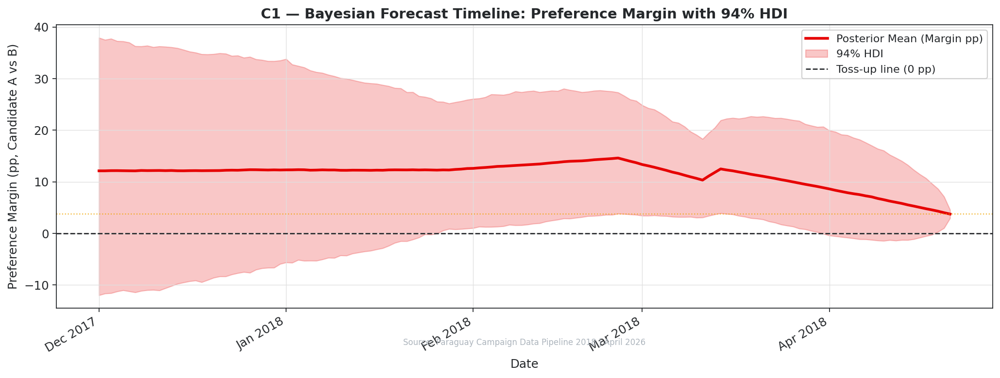
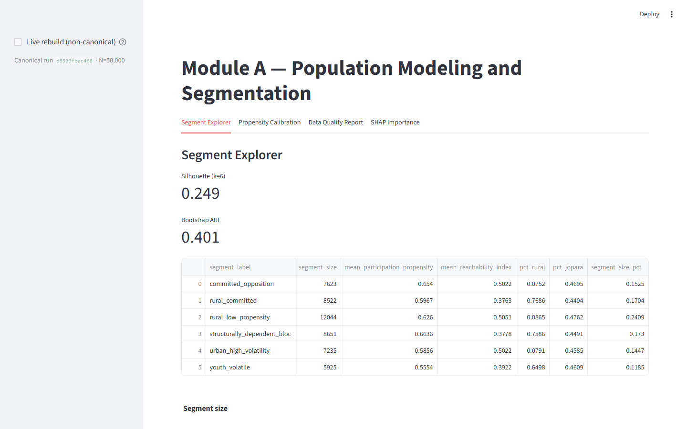
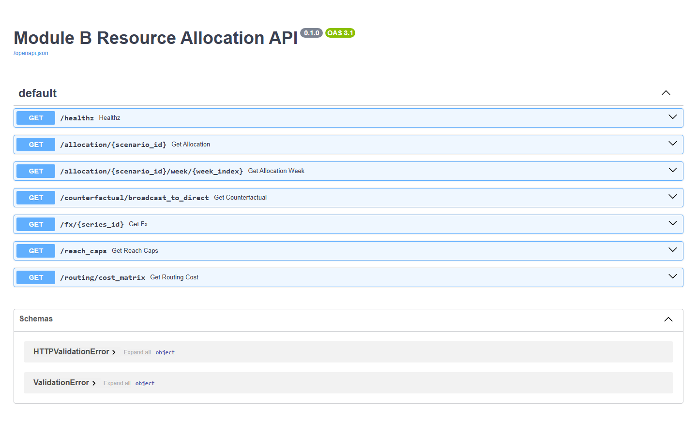

# Decision Analytics Reconstruction — Paraguay 2018 Presidential Election

**Given only what a campaign could see in early 2018 — eight public polls, census
aggregates, and a fixed budget — how do you track a national election, allocate money
across the country, and stay honest about what you actually know?** This project
reconstructs the 2018 Paraguay presidential election as three connected decision-analytics
modules and answers that question end to end. The verified result it reasons toward:
Candidate A (Abdo) won by **+3.70 pp** (46.43% vs 42.73%) on **61.25%** turnout (TSJE).

<p align="center">
  
</p>

*Module C — Bayesian poll tracking. This is a **retrodiction, not a forecast**: the model
conditions on the verified TSJE outcome and reconciles the eight real 2018 poll waves inside
a 94% credible band. Out-of-sample scoring is a separate, honest exercise — see the concrete
result below.*

- **What I built** — three modules wired as one reproducible pipeline: **(A)** synthetic
  voter segmentation + turnout propensity, **(B)** MILP budget allocation + field routing,
  **(C)** Bayesian poll tracking + Monte Carlo scenarios.
- **What's real vs. synthetic** — public anchors are **real** (TSJE returns, DGEEC/INE census
  aggregates, eight published 2018 polls); every individual voter record is **synthetic**.
  Each artifact is tagged VERIFIED / CALIBRATED / SIMULATED / ILLUSTRATIVE
  ([`reports/epistemic_boundaries.md`](reports/epistemic_boundaries.md)).
- **What you can run** — `make pipeline-full` runs A → B → C with an enforced allocation
  handoff; `make dashboard` and `make module-b-api` launch the live apps.

**One concrete result.** In a leave-one-wave-out test on the eight real 2018 polls — each
time refitting the tracking model with the actual election result held out (provably
excluded, F-069) — the model's 95% uncertainty band caught the held-out poll in **3 of 6**
tested waves. This is the project's *first true out-of-sample check*, and it is deliberately
reported unflattered: with only **eight polls** the intervals are wide and the sample is far
too small to claim forecasting skill. Detail:
[`reports/module_c/walk_forward_loo_report.md`](reports/module_c/walk_forward_loo_report.md).

> **Governance, in one paragraph.** Because the analytics come first, the governance system
> sits behind them — but it is a real differentiator. Every headline number lives in one SSOT
> table and is CI-gated; every closed audit finding is re-verified on each PR; AI-assisted
> changes pass the same finding-verification gates as human ones (agent instructions in
> [`docs/agents/`](docs/agents/)). See [`governance/AUDIT_PROCEDURE.md`](governance/AUDIT_PROCEDURE.md).

---

[](https://github.com/RafaelBraga-Kribitz/decision-analytics-reconstruction/actions/workflows/ci.yml)
[](https://github.com/RafaelBraga-Kribitz/decision-analytics-reconstruction/actions/workflows/governance.yml)
[](.python-version)

## Verified anchors (Series A)

| Quantity | Value |
|---|---|
| Outcome margin | **+3.70 pp** (46.43% vs 42.73%) |
| Turnout | **61.25%** |
| Production run scale | **50,000** voters (4.26M design reference) |
| Reconstruction window | **14 weeks** (2018-W01..W14) |

Full table: [`reports/NUMERIC_SSOT.md`](reports/NUMERIC_SSOT.md). It wins over any narrative doc.

## Skills evidence (what reviewers can run)

| Skill / claim | Evidence in repo |
|---|---|
| Segmentation + turnout propensity | Module A pipeline, silhouette/ARI/Brier CI gates |
| MILP under real constraints | Module B OPTIMAL baseline, 80% coverage floor |
| Bayesian poll tracking + MC scenarios | Module C PyMC models, walk-forward estimand fix (F-034) |
| Pipeline integration | `dvc.yaml`, `make pipeline-full`, `tests/test_golden_metrics.py` |
| Statistical honesty | AUC circularity documented; no causal counterfactual fiction |
| Reproducibility | `make test`, `scripts/generate_golden_metrics.py`, fresh-clone path in CONTRIBUTING |

Case narrative: [`reports/CASE_STUDY.md`](reports/CASE_STUDY.md). Validation gates:
[`reports/VALIDATION.md`](reports/VALIDATION.md).

## See it running

<p align="center">
  
</p>

*Module A dashboard (Streamlit) — Segment Explorer on the canonical 50,000-voter run; run ID and diagnostics shown in-app.*

<p align="center">
  
</p>

*Module B allocation API (FastAPI) — live OpenAPI docs; every endpoint serves solver outputs from the canonical run.*

The Module C report is published at
[RafaelBraga-Kribitz.github.io/decision-analytics-reconstruction](https://RafaelBraga-Kribitz.github.io/decision-analytics-reconstruction/).
Both apps run locally with `make dashboard` and `make module-b-api` (screenshots above are from local runs of this repo).
Hosted-demo availability is governed by finding **F-021** (`scripts/check_live_deployment_urls.py`): this README never claims a live URL the script has not verified, and because free-tier hosts sleep, a down demo means F-021 regressed and must be reopened.

## Quick start

```bash
poetry install
make test

# Full integrated pipeline (A → B → C → EDA)
make pipeline-full

# Local demos
make dashboard       # Module A — Streamlit
make module-b-api    # Module B — FastAPI (http://127.0.0.1:8088/docs)
make module-c-all    # Module C — poll-tracking + scenario artifacts
```

## Modules

| Module | Role | Entry |
|---|---|---|
| **A** | Voter dataset, segmentation, turnout propensity | `module_a_population_segmentation/` |
| **B** | Constrained allocation MILP + routing | `module_b_resource_allocation/` |
| **C** | Poll aggregation, Bayesian tracking, MC scenarios | `module_c_forecasting_scenarios/` |

Architecture: [`ARCHITECTURE.md`](ARCHITECTURE.md). Contracts: `schema_contracts/`.

## Governance

This project is deliberately built with an **agent-governed workflow**: AI-assisted
changes pass the same finding-verification gates as human ones, and every closed
audit finding is re-verified by CI on each PR. Agent-facing instructions live in
[`docs/agents/`](docs/agents/) (root `AGENTS.md`/`GEMINI.md` are pointer stubs).

AI-assisted work starts with:

```bash
make session-start   # → governance/SESSION_HANDOUT.md
```

Authority: `PROJECT_CHARTER.md`, `governance/AUDIT_PROCEDURE.md`, `governance/findings/`.

## Deployment

See [`docs/DEPLOYMENT.md`](docs/DEPLOYMENT.md). Live URL verification: finding **F-021**
(human platform auth required).

## License

Code is released under the [MIT License](LICENSE). Calibration anchors derive
from public sources (TSJE, DGEEC, INE, BCP) and are not separately licensed by
this project; all microdata is synthetic.

## Author

<table>
  <tr>
    <td width="110">
      
    </td>
    <td>
      <strong>Rafael Braga-Kribitz</strong><br />
      Seiersberg-Pirka, Austria · Portfolio project, 2026<br />
      <a href="https://www.linkedin.com/in/rafaelbragakribitz/">LinkedIn</a>
      ·
      <a href="mailto:rafaelbragakribitz@gmail.com">rafaelbragakribitz@gmail.com</a>
    </td>
  </tr>
</table>
