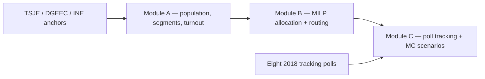

# Decision Analytics Reconstruction — Paraguay 2018 Presidential Election

<p align="center">
  
</p>

*Module C — Bayesian poll tracking. This is a **retrodiction, not a forecast**: the model
conditions on the verified TSJE outcome and reconciles the eight real 2018 poll waves inside
a 94% credible band. Out-of-sample scoring is a separate, honest exercise — see Results.*

[](https://github.com/RafaelBraga-Kribitz/decision-analytics-reconstruction/actions/workflows/ci.yml)
[](https://github.com/RafaelBraga-Kribitz/decision-analytics-reconstruction/actions/workflows/governance.yml)
[](.python-version)
[](LICENSE)
[](#status)

**Status:** Functional

**Given only what a campaign could see in early 2018 — eight public polls, census
aggregates, and a fixed budget — how do you track a national election, allocate money
across the country, and stay honest about what you actually know?** This project
reconstructs the 2018 Paraguay presidential election as three connected decision-analytics
modules and answers that question end to end. The verified result it reasons toward:
Candidate A (Abdo) won by **+3.70 pp** (46.43% vs 42.73%) on **61.25%** turnout (TSJE).

## Decision summary

Three modules, one pipeline: **(A)** synthetic voter segmentation + turnout propensity,
**(B)** MILP budget allocation + field routing, **(C)** Bayesian poll tracking + Monte Carlo
scenarios. Public anchors are **VERIFIED** (TSJE returns, DGEEC/INE census aggregates, eight
published 2018 polls); every individual voter record is **SIMULATED**. Calibration to those
anchors is **CALIBRATED**. Tracking posteriors and MC shocks are **ILLUSTRATIVE**. Full
register: [`reports/epistemic_boundaries.md`](reports/epistemic_boundaries.md).

The reconstruction does **not** claim that analytics caused the +3.70 pp margin. The public
result is the ground-truth anchor. What the model can show, and what it cannot, is the
point of the work.

## See it running

<p align="center">
  
</p>

*Module A dashboard (Streamlit) — Segment Explorer on the canonical 50,000-voter run; run ID and diagnostics shown in-app.*

<p align="center">
  
</p>

*Module B allocation API (FastAPI) — live OpenAPI docs; every endpoint serves solver outputs from the canonical run.*

The Module C report is published at
[RafaelBraga-Kribitz.github.io/decision-analytics-reconstruction](https://RafaelBraga-Kribitz.github.io/decision-analytics-reconstruction/).
Both apps run locally with `make dashboard` and `make module-b-api` (screenshots above are from local runs of this repo).
Hosted-demo availability is governed by finding **F-021** (`scripts/check_live_deployment_urls.py`): this README never claims a live URL the script has not verified, and because free-tier hosts sleep, a down demo means F-021 regressed and must be reopened.

## Explore this project

| Audience | Start here |
|---|---|
| Recruiter | This page through [Results](#results) (2-minute summary) |
| Hiring manager | [Decision summary](#decision-summary) + [Method](#method) + [Limitations](#limitations) |
| Technical reviewer | [Architecture](ARCHITECTURE.md) + [Reproduce](#reproduce) + module packages |
| Auditor | [Data](#data) + [Validation](#validation) + [`governance/AUDIT_PROCEDURE.md`](governance/AUDIT_PROCEDURE.md) |

Case narrative: [`reports/CASE_STUDY.md`](reports/CASE_STUDY.md). Numeric SSOT:
[`reports/NUMERIC_SSOT.md`](reports/NUMERIC_SSOT.md) — it wins over any narrative doc.

## Results

### Verified anchors (Series A)

| Quantity | Value |
|---|---|
| Outcome margin | **+3.70 pp** (46.43% vs 42.73%) |
| Turnout | **61.25%** |
| Production run scale | **50,000** voters (4.26M design reference) |
| Reconstruction window | **14 weeks** (2018-W01..W14); 18-week campaign scope, 14 ISO weeks of operational data |

### One concrete out-of-sample check

In a leave-one-wave-out test on the eight real 2018 polls — each time refitting the tracking
model with the actual election result held out (provably excluded, F-069) — the model's 95%
uncertainty band caught the held-out poll in **3 of 6** tested waves (95% interval coverage
50%; Brier 0.31 on the sign task; `MC_FAST=1` committed artifact). This is the project's
*first true out-of-sample check*, and it is deliberately reported unflattered: with only
**eight polls** the intervals are wide and the sample is far too small to claim forecasting
skill. Detail:
[`reports/module_c/walk_forward_loo_report.md`](reports/module_c/walk_forward_loo_report.md).

### Solver comparator (not a causal claim)

On the **$6M USD** reconstruction envelope, the Module B MILP versus a department-uniform
naive allocation yields **~54.77%** more linearized persuasion-proxy contacts. That is a
solver comparator on synthetic reach, not a verified historical effect of the 2018 campaign.

## Method

Question → public evidence → tagged assumptions → three models → uncertainty → a constrained
allocation — not a causal counterfactual.

1. **Question.** Given only 2018-visible public signals and a fixed budget, how should a
   campaign track the race and spend, while remaining explicit about what is known.
2. **Evidence.** TSJE 2018 returns, DGEEC/INE census and ICT aggregates, eight published
   tracking polls (outlet, date, and figures are the checkable columns; pollster labels are
   house-effect identifiers, not uniformly verbatim firm names).
3. **Assumptions.** Individual voters are synthetic; department-level turnout, gender, rural
   share, and language buckets are raked to verified anchors; Module B maximises a linearized
   persuasion-proxy under budget, reach-cap, FX, and an 80% coverage floor; Module C's
   tracking posterior is prior-dominated on poll-free days.
4. **Models.** Module A: K-Means (k=6) + Platt-calibrated turnout propensity. Module B:
   PuLP/CBC MILP on 2,772 rows (18 departments × 11 channels × 14 weeks). Module C: PyMC
   Gaussian random walk with house effects, then stratified Monte Carlo (10,000 draws
   default).
5. **Uncertainty.** 94% credible bands on the tracking path; walk-forward / leave-one-wave-out
   on the eight-poll fixture; HDI endpoints on the week-8 allocation replay in the case study.
6. **Decision rule.** Allocate the $6M envelope under the stated constraints. Do not treat
   the verified +3.70 pp margin as an analytics lift.

`make pipeline-full` runs A → B → C with an enforced allocation handoff.

## Data

| Source | What it anchors | Epistemic tag |
|---|---|---|
| TSJE 2018 final results | Margin **+3.70 pp**; national turnout **61.25%**; department roll counts | **VERIFIED** |
| DGEEC 2012 census / 2018 estimates | Rural share, language, age structure | **VERIFIED** (aggregates) |
| INE 2018 ICT household survey | Urban/rural internet and WhatsApp penetration | **VERIFIED** (aggregates) |
| Eight published 2018 tracking polls | Tracking likelihood; outlet/date/figures checkable | **VERIFIED** (those columns) |
| Synthetic 50,000-row voter file | Individual records; no real person is represented | **SIMULATED** / **CALIBRATED** at anchored aggregates |
| Module B allocation and routing | Solver output on the $6M envelope | **SIMULATED** |
| Module C daily posterior and MC draws | Sparse-fixture tracking and shock scenarios | **ILLUSTRATIVE** |

BCP 2018Q1 FX corridor priors feed Module B's FX layer. Full artifact register:
[`reports/epistemic_boundaries.md`](reports/epistemic_boundaries.md).

## Validation

How we know this is not only plausible-looking numbers:

| Skill / claim | Evidence in repo |
|---|---|
| Segmentation + turnout propensity | Module A pipeline; silhouette **> 0.22** (measured 0.2562 at 50k); bootstrap ARI **≥ 0.40** (measured 0.4304); Brier **< 0.237** (0.1185 at 15k holdout). AUC ≈0.89 is **circular** — not a generalization claim. |
| MILP under real constraints | Module B OPTIMAL baseline, 80% coverage floor, ~54.77% linearized lift vs naive |
| Bayesian poll tracking + MC scenarios | Module C PyMC models, 0 NUTS divergences on the full v0.4 run, walk-forward estimand fix (F-034), leave-one-wave-out report |
| Pipeline integration | `dvc.yaml`, `make pipeline-full`, `tests/test_golden_metrics.py` |
| Statistical honesty | AUC circularity documented; no causal counterfactual fiction |
| Reproducibility | `make test`, `scripts/generate_golden_metrics.py`, fresh-clone path in CONTRIBUTING |

Validation gates: [`reports/VALIDATION.md`](reports/VALIDATION.md). Golden snapshot:
`reports/golden_metrics.json`.

## Architecture



| Module | Role | Entry |
|---|---|---|
| **A** | Voter dataset, segmentation, turnout propensity | `module_a_population_segmentation/` |
| **B** | Constrained allocation MILP + routing | `module_b_resource_allocation/` |
| **C** | Poll aggregation, Bayesian tracking, MC scenarios | `module_c_forecasting_scenarios/` |

Cross-module contracts live in `schema_contracts/`. Detail: [`ARCHITECTURE.md`](ARCHITECTURE.md).

Governance sits behind the analytics and is load-bearing: every headline number lives in one
SSOT table and is CI-gated; every closed audit finding is re-verified on each PR; AI-assisted
changes pass the same finding-verification gates as human ones ([`docs/agents/`](docs/agents/)).
See [`governance/AUDIT_PROCEDURE.md`](governance/AUDIT_PROCEDURE.md).

```bash
make session-start   # → governance/SESSION_HANDOUT.md
```

## Reproduce

```bash
poetry install
make test

# Full integrated pipeline (A → B → C → EDA)
make pipeline-full

# Local demos
make dashboard       # Module A — Streamlit
make module-b-api    # Module B — FastAPI (http://127.0.0.1:8088/docs)
make module-c-all    # Module C — poll-tracking + scenario artifacts
```

Python 3.11, Poetry lockfile, seed 42 on the canonical 50k run. Deployment notes:
[`docs/DEPLOYMENT.md`](docs/DEPLOYMENT.md). Live URL verification: finding **F-021**
(human platform auth required).

## Limitations

- **No causal claim.** The verified +3.70 pp margin is a public election result, not an
  analytics treatment effect. A with/without-analytics counterfactual is unverifiable here.
- **Synthetic microdata.** No individual record is a real voter. Aggregate calibration does
  not imply the model recovered withheld personal behaviour.
- **Sparse polls.** Eight tracking waves; leave-one-wave-out n=6. Interval coverage is a
  structural diagnostic, not proof of calibration. Forecasting skill is not claimed.
- **Proxy objective.** Module B maximises linearized persuasion-adjusted contacts, not
  audited 2018 campaign accounting or fitted media-mix response curves.
- **Scale.** Default run is 50,000 voters over 14 ISO weeks. The 4.26M roll and full
  18-week operational campaign are design references, not what the pipeline executes.
- **AUC is circular.** Propensity features share calibration anchors with the target;
  do not headline AUC as generalization.
- **Falsification.** Real department-level labelled microdata, a larger independent poll
  panel, or empirically estimated response curves would change what can be claimed — and
  would retire several SIMULATED / ILLUSTRATIVE tags.

## What I would do with production data

This reconstruction uses public aggregates plus synthetic microdata. A live campaign
file would change the work in these ways:

1. **Replace the voter file.** Swap the 50,000 synthetic rows for a privacy-governed
   electoral roll or CRM extract; keep the same schema contracts so Module B/C do not
   change shape.
2. **Replace the poll fixture.** Ingest live house-identified tracking with real sample
   sizes and field windows; drop pseudonymized pollster labels; re-run walk-forward on
   held-out waves that were not used to design the model.
3. **Replace the proxy objective.** Estimate channel response from observed contacts or
   spend, then constrain the MILP with those curves instead of piecewise-linear policy
   caps.
4. **Break circularity in propensity.** Hold out departments or drop the logit offset so
   Brier/AUC measure generalization rather than rake recovery.
5. **Close the B→C loop.** Feed tracking posteriors back into the allocator automatically
   (the week-8 replay in the case study is a disclosed manual re-parameterization, not
   pipeline behaviour).
6. **Run at roll scale.** The 4.26M design reference and the unused weeks of the 18-week
   campaign become data problems, not narrative ones.

Until that swap-in exists, every individual-level chart remains a reconstruction, and
every decision number must carry its epistemic tag.

## Repository structure

| Path | Responsibility |
|---|---|
| `module_a_population_segmentation/` | Synthetic population, segments, turnout propensity, Streamlit dashboard |
| `module_b_resource_allocation/` | MILP allocator, routing, FastAPI |
| `module_c_forecasting_scenarios/` | Bayesian tracking, Monte Carlo, Quarto report |
| `schema_contracts/` | Versioned cross-module artifact contracts |
| `shared/` | Shared validators and visual system |
| `reports/` | NUMERIC_SSOT, epistemic register, validation, EDA charts |
| `governance/` | Findings, ADRs, audit procedure, session handoff |
| `docs/` | Deployment, agent protocol, screenshots |
| `scripts/` | Golden metrics, live-URL probe, SSOT and terminology gates |
| `tests/` | Cross-cutting contract and CI tests |

## Status

**Status:** Functional

Three modules run locally and through `make pipeline-full`. CI and the governance
Adversary re-verify closed findings on every PR. Hosted-demo URLs remain under F-021.
This is a portfolio reconstruction, not a production campaign system.

Repository last updated 2026-09-16 (date of the last commit).

## License

Code is released under the [MIT License](LICENSE). Calibration anchors derive
from public sources (TSJE, DGEEC, INE, BCP) and are not separately licensed by
this project; all microdata is synthetic.

## Author

<table>
  <tr>
    <td width="110">
      
    </td>
    <td>
      <strong>Rafael Braga-Kribitz</strong><br />
      Seiersberg-Pirka, Austria · Portfolio project, 2026<br />
      <a href="https://www.linkedin.com/in/rafaelbragakribitz/">LinkedIn</a>
      ·
      <a href="mailto:rafaelbragakribitz@gmail.com">rafaelbragakribitz@gmail.com</a>
    </td>
  </tr>
</table>
