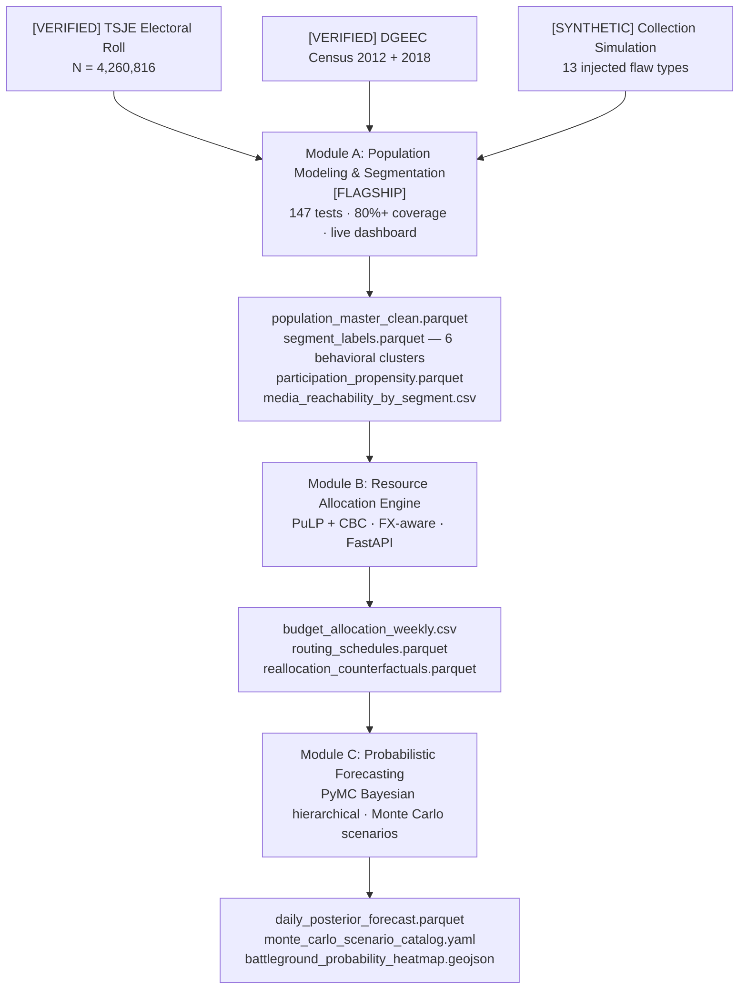

# Decision Analytics Reconstruction

**Retrospective Reconstruction of a National-Scale Marketing and Resource Allocation Decision System**

[](https://github.com/rafaelbk/decision-analytics-reconstruction/actions/workflows/ci.yml)
[](https://decision-analytics-module-a.onrender.com)
[](.python-version)

---

## What this is

A practitioner rebuilt the decision analytics stack that originally supported a
national-scale program affecting **4.26 million entities** and a verifiable binary outcome event.

The reconstruction demonstrates three interdependent capabilities:

1. **Population modeling and segmentation** — synthetic population dataset generation with verified demographic
  calibration, realistic data quality problems, and behavioral clustering into operationally distinct segments.
2. **Resource allocation** — constrained LP/MILP (PuLP + CBC) allocating a limited budget across 18 geographic units
  and 11 channel types to maximize a persuasion-adjusted contact proxy per monetary unit.
3. **Probabilistic forecasting** — Bayesian hierarchical aggregation of noisy, structurally biased survey measurements
  into a daily preference-proxy track with uncertainty (Module C; fixture-backed fast CI plus slow NUTS diagnostics).

The outcome event margin was verifiable: **+3.70 percentage points** against a field of 4.26 million participating entities (TSJE, April 22, 2018).

**Epistemic calibration:** see [`reports/epistemic_boundaries.md`](reports/epistemic_boundaries.md) for what is verified vs simulated vs illustrative.

---

## Why this matters beyond the electoral context

The three analytical systems in this project are domain-agnostic. The same combination of behavioral
segmentation, constrained resource allocation, and probabilistic forecasting applies directly to any
organization managing heterogeneous customer populations under budget constraints with a binary
performance target — including B2B manufacturers, financial services, and logistics operators in
DACH markets. Participation propensity becomes churn probability; geographic departments become sales
territories; media channels become product lines; verified margin becomes measurable KPI lift.

---

## Positioning (hiring signal)

This repository is best read as **decision analytics / marketing science / analytical engineering**: translating operational programs into reproducible systems (segmentation, constrained allocation, probabilistic measurement aggregation) — not as a generic “deep AI” or Kaggle-style single-notebook portfolio.

---

## Module A is the flagship

Module A is the most heavily engineered surface: CI with lint + Pyright + coverage floor, a live Streamlit dashboard, model cards, Pandera runtime schema contracts, and the full cleaning pipeline. Modules B and C ship **production-oriented** solver and forecasting code with growing test and reporting coverage; Module B now emits dual and budget-expansion CSVs when run with `--sensitivity` (see `make module-b-allocate-sensitivity`). Status detail: `ROADMAP.md`.

---

## How to evaluate this project in 10 minutes

1. **Open the Module A dashboard:** [https://decision-analytics-module-a.onrender.com](https://decision-analytics-module-a.onrender.com)
   Select k=6 clusters and examine the segment profile table.
   Observe the calibration curve for the propensity model.
   This shows the segmentation and behavioral modeling layer.
2. **Read the model cards:** [`module_a_population_segmentation/reports/model_card_propensity.md`](module_a_population_segmentation/reports/model_card_propensity.md) and [`module_a_population_segmentation/reports/model_card_segmentation.md`](module_a_population_segmentation/reports/model_card_segmentation.md)
   The problem, the data constraints, the methodology, the output, and what a practitioner does with it.
3. **Open this notebook:** `module_a_population_segmentation/notebooks/03_segmentation_analysis.ipynb`
   Analysis notebook for interpretability. Production code is in `src/`; the notebook is for exploration.
4. **Technical walkthrough (one entity row):** [`reports/system_walkthrough.md`](reports/system_walkthrough.md)

For technical depth: `src/` contains the full production pipeline.
For methodology depth: all model cards under `module_a_population_segmentation/reports/`.
For data provenance: `appendix/verified_calibration_anchors_full.md`.

---

## System architecture



See `ARCHITECTURE.md` for the full component breakdown, and `schema_contracts/` for cross-module data contracts.

---

## Modules

| Module | Status | Artifact | Description |
|---|---|---|---|
| **A: Population Modeling** | CI-complete — see Module A job in `.github/workflows/ci.yml` | [Streamlit dashboard](https://decision-analytics-module-a.onrender.com) | Synthetic population dataset + segmentation + propensity |
| **B: Resource Allocation** | CI job + dual/budget expansion reports (`--sensitivity`) | `make module-b-allocate` / `make module-b-allocate-sensitivity` / FastAPI (`make module-b-api`) | Constrained weekly allocation + FX + broadcast_to_direct |
| **C: Probabilistic Forecasting** | Fast pytest in CI; slow NUTS diagnostics optional | `make test-module-c` / `make module-c-all` (fixture CSV) | Calibration series gate, shock catalog, scenario HTML |

---

## Setup

```bash
git clone <repo-url>
cd decision-analytics-reconstruction
poetry install
cp .env.example .env
make test          # all modules + portfolio smoke (excludes slow NUTS)
make validate      # lint + typecheck + tests + doc-path-verify
make e2e-smoke     # fixture-only cross-module smoke (A schema + B solve + C CSV + handshake)
make tier3-smoke   # terminology sample + mlflow import (local mirror of part of CI tier3 job)
make portfolio-verify  # git-index hygiene for portfolio exports
make dashboard     # launch Streamlit dashboard (Module A)
```

**Requirements:** Python 3.11, Poetry. Docker optional (see `docker-compose.yml`). On legacy Mac workstations (Mac Pro with unreliable Metal stacks), prefer **Colima + `docker compose`** instead of Docker Desktop.

**Module C observability (optional):** MLflow logging is **opt-in**. Set `MLFLOW_TRACKING_URI` (and optionally `MLFLOW_EXPERIMENT_NAME`) when you want runs recorded to a tracking server; pipeline entry points such as `python -m module_c_forecasting_scenarios.pipeline.run_tracking` call the tracking helper only when that environment is present.

---

## Repository structure

```
├── README.md                    <- this file
├── ARCHITECTURE.md              <- component breakdown and cross-module contracts
├── ROADMAP.md                   <- honest status and next milestones per module
├── pyproject.toml               <- Poetry dependencies + tool config (Ruff, Black, Pyright, Pytest)
├── schema_contracts/            <- cross-module data contracts (authoritative)
├── reports/                     <- decision log, data dictionary, case studies
├── appendix/                    <- calibration anchor registry (TSJE/DGEEC verified anchors)
├── module_a_population_segmentation/  <- production implementation (fully tested)
│   ├── config/                  <- generation.yaml, calibration_anchors.yaml, model_params.yaml
│   ├── src/population_segmentation/   <- production code
│   ├── tests/                   <- pytest suite (see CI for counts)
│   ├── app/                     <- Streamlit dashboard
│   └── reports/                 <- model cards, QA reports
├── module_b_resource_allocation/  <- LP/MILP allocation + routing + API
└── module_c_forecasting_scenarios/ <- forecasting, scenarios, contracts
```

---

## Benchmark comparison (illustrative on synthetic reconstruction)

| Baseline | Module | Metric (higher is better unless noted) | Source |
|----------|--------|----------------------------------------|--------|
| Naive participation-rate classifier | A | Brier ≈ 0.245 vs model 0.088 | [`model_card_propensity.md`](module_a_population_segmentation/reports/model_card_propensity.md) |
| Scenario timing variants | B | Compare `total_persuasion_adjusted_contacts` across `baseline` / `early_lock` / `late_flex` | `scenario_benchmark_*.csv` from `make module-b-allocate-sensitivity` |
| Fixture-only tracking | C | Posterior export row count equals campaign day index | `module_c_forecasting_scenarios/tests/test_tracking_smoke.py` |

These deltas quantify **internal reconstruction targets**, not external campaign lift.

---

## Honest narrative

The original system was built under severe operational constraints. This repository documents modeling choices, enforces tests in CI, and separates verified anchors from synthetic layers ([`reports/epistemic_boundaries.md`](reports/epistemic_boundaries.md)). It is a reconstruction exercise demonstrating what the practitioner would build today—not a claim of original operational seniority.
