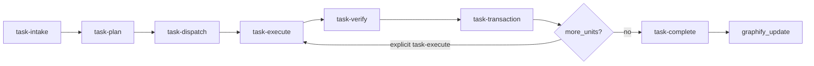

# Controlled workflow playbook

**Audience:** Operators and AI agents working in this repository.

**Scope:** This document is the **single linear narrative** for plan-first, evidence-backed work. It does not replace authoritative detail in linked files; it orders them into one path from “new work item” to “done.”

**External tools:** Optional integrations (for example enterprise delivery plugins or MCP servers) sit **after** this playbook. They never replace the in-repo harness described below.

---

## 1. Authoritative spine (read in this order)

| Step | Command / artifact | Canonical detail |
|------|---------------------|------------------|
| 0 | Rules + entrypoints | [`AGENTS.md`](../../AGENTS.md), [`.cursor/rules/08-controlled-workflow-playbook.mdc`](../../.cursor/rules/08-controlled-workflow-playbook.mdc) (`alwaysApply: true`), [`.cursor/rules/10-transaction-boundaries.mdc`](../../.cursor/rules/10-transaction-boundaries.mdc), [`.cursor/rules/00-plan-first-governance.mdc`](../../.cursor/rules/00-plan-first-governance.mdc), [`.cursor/rules/02-definition-of-done.mdc`](../../.cursor/rules/02-definition-of-done.mdc) |
| 0a | Machine-readable docs inventory | [`docs/registry/docs_registry.yaml`](../../docs/registry/docs_registry.yaml), generated navigational [`docs/INDEX.md`](../../docs/INDEX.md), retrieval order in `.cursor/rules/09-documentation-registry-governance.mdc`; **membership:** `git ls-files '*.md'` gates what the builder may emit — **semantic conformance** is [`scripts/verify_doc_registry.py`](../../scripts/verify_doc_registry.py) on the emitted YAML (`doc_registry.schema.json` is the exported structural contract); **CI** runs on committed snapshots only (`make doc-registry-verify` after `checkout`) |
| 1 | `/task-intake` | [`.cursor/commands/task-intake.md`](../../.cursor/commands/task-intake.md), [`task-taxonomy.md`](task-taxonomy.md) |
| 2 | `/task-plan` | [`.cursor/commands/task-plan.md`](../../.cursor/commands/task-plan.md) — sections A–N mandatory; write [`.cursor/runtime/current_unit.json`](../../.cursor/runtime/current_unit.json) |
| 3 | `/task-dispatch` | [`.cursor/commands/task-dispatch.md`](../../.cursor/commands/task-dispatch.md), [`routing-matrix.md`](routing-matrix.md) |
| 4 | `/task-execute` | [`.cursor/commands/task-execute.md`](../../.cursor/commands/task-execute.md), checklist B in [`checklists.md`](checklists.md) — **one `UNIT_ID` per session** |
| 5 | `/task-verify` | [`.cursor/commands/task-verify.md`](../../.cursor/commands/task-verify.md), checklist C in [`checklists.md`](checklists.md) |
| 6 | `/task-transaction` | [`.cursor/commands/task-transaction.md`](../../.cursor/commands/task-transaction.md), `make transaction-verify`, then commit — **unit closes; session stops** |
| 7 | `/task-complete` | [`.cursor/commands/task-complete.md`](../../.cursor/commands/task-complete.md), checklist D in [`checklists.md`](checklists.md) — when **all** planned units are closed |
| 8 | Graph refresh | `poetry run graphify update .` (session end; see [`.cursor/rules/graphify.mdc`](../../.cursor/rules/graphify.mdc), [`CLAUDE.md`](../../CLAUDE.md)) |

**Session rule:** after `task-transaction`, do **not** auto-continue — next unit needs a new `task-execute` turn.

---

## 2. Quality gates and rubrics (one map)

| Harness phase | Checklist | Professional / module bar |
|---------------|-----------|---------------------------|
| Plan approved | [`checklists.md`](checklists.md) § A | Success criteria rows must include **exact verification commands** (no “looks good”) |
| Execution | [`checklists.md`](checklists.md) § B | TDD: test written and observed failing before matching `src/` change |
| Verification | [`checklists.md`](checklists.md) § C | Proof table: this-session commands + numeric or exit-code evidence |
| Todo lifecycle | [`checklists.md`](checklists.md) § D | No `completed` until every criterion passes |
| Module work | [`checklists.md`](checklists.md) § E | Gates A1–A12, B1–B11, C1–C12 per specialist docs under `.cursor/agents/` |
| Release / high risk | `qa-gatekeeper` | [`routing-matrix.md`](routing-matrix.md) escalation rows; [`professional-grade-rubrics.md`](professional-grade-rubrics.md) |

Medium- and high-risk items require a **signed `qa-gatekeeper` verdict** before `/task-complete`, per routing matrix and checklists.

---

## 3. Guardrails stack (contract-first)

These layers correspond to “validate before execute” patterns for agent-assisted coding, expressed with **this repo’s** contracts instead of external narratives.

| Layer | Role | Where it lives |
|-------|------|----------------|
| Terminology | Consistent domain vocabulary in shipped strings, docs, and identifiers | [`.cursor/rules/05-terminology-compliance-gate.mdc`](../../.cursor/rules/05-terminology-compliance-gate.mdc), scope master (local `project_scope/`) |
| Tabular contracts | Versioned schemas for artifacts that cross steps or modules | [`schema_contracts/`](../../schema_contracts/) |
| Typed handoffs | Rows and structs consumed downstream | e.g. Module B→C handshake types under `module_b_resource_allocation/` |
| Cross-module edits | Producer/consumer audit before merge | [`.cursor/rules/03-cross-module-impact-gate.mdc`](../../.cursor/rules/03-cross-module-impact-gate.mdc), `reports/decision_log.md` when behavior changes |
| Module C series | Single calibration series per model; no mixed numerators | Scope + Module C config; see terminology rule for `outcome_event_date` vs mixed series |
| Transaction boundary | `UNIT_ID`, runtime lock, plan-reconciled commits | [`.cursor/rules/10-transaction-boundaries.mdc`](../../.cursor/rules/10-transaction-boundaries.mdc), `scripts/transaction_commit_gate.py`, `.cursor/runtime/README.md` |

---

## 4. Coordination: slash commands, Cursor todos, and transaction backlog

**Order of precedence (highest first):**

1. **Approved `/task-plan`** (sections A–N) — defines `UNIT_ID`, `unit_impact_set`, verification, and branch for the **active** change unit.
2. **Harness checklists** — especially [`checklists.md`](checklists.md) § D: Cursor todo states mirror plan todos; nothing moves to `completed` without verification evidence and **closed units** when multi-unit.
3. **[`maintainer/agent_transaction_backlog.md`](../../maintainer/agent_transaction_backlog.md)** — append-only discoveries that must **not** expand the current `UNIT_ID`; process in a later unit.

**Rules:**

- **`Project_Action_list.md`** is an archived stub; do **not** use it as active backlog (see file header).
- **Parallel work** (two unrelated tasks): follow [`routing-matrix.md`](routing-matrix.md) — separate `/task-plan`, branch, and typically **`.cursor/runtime/current_unit.json`** per track; confirm **no shared** `schema_contracts/**`, `config/**`, or contract outputs in flux between tracks.
- One **active `UNIT_ID`** per agent session; after `/task-transaction`, the session **ends** until explicitly dispatched again.

---

## 5. Graph and impact timing

- **Before** large or cross-cutting design or refactors: read [`graphify-out/GRAPH_REPORT.md`](../../graphify-out/GRAPH_REPORT.md) (or the wiki index if present) to see heavy dependencies and communities of modules.
- **After** work is verified and todos are honestly complete: run `poetry run graphify update .` so the knowledge graph matches the tree (see graphify rule).

Do not treat “update graph” as a substitute for `/task-verify` or git history.

---

## Appendix A — Transaction boundary (atomic units, not “git tips”)

This appendix is **binding** for autonomous agents. Full detail: **`.cursor/rules/10-transaction-boundaries.mdc`**.

### Three levels

| Level | Rule |
|-------|------|
| **Task** | May queue multiple **`UNIT_ID`** values (plan §N). |
| **Unit** | One semantic intention; **closed** after `/task-transaction` + commit. |
| **Session** | Exactly **one** active `UNIT_ID` per `/task-execute` — no auto-dispatch of the next unit. |

### Persistence

- **Runtime lock:** `.cursor/runtime/current_unit.json` (gitignored) holds `unit_impact_set`, `allowed_paths`, `status`.
- **Commit gate:** `make transaction-verify` / pre-commit — staged files ⊆ `unit_impact_set`, message contains `unit_id`, branch not `main`. If the lock file is **missing**, the gate **skips** (humans); agents **must** keep the lock current.
- **Push:** **Not** part of the unit boundary. Unit closure = commit + lock `closed` + summary. Push is sync/deploy when the operator chooses.

### Conventional Commits

`type(scope): subject` encouraged; **commit message must contain the literal `unit_id` string.**

---

## Appendix B — CRISP-DM mapped to this repository (orientation only)

CRISP-DM is a common analytics lifecycle; this project maps it to modules and harness steps **without** duplicating scope documents.

| CRISP-DM phase | Typical home here | Harness touchpoint |
|----------------|-------------------|---------------------|
| Business understanding | Narrative and decision questions in `reports/`, top-level docs | `/task-intake` goal + risk |
| Data understanding | Module A exploration, quality reports | `module_a` taxonomy; data-quality skills per routing matrix |
| Data preparation | Module A pipeline, validators | `module_a`; contracts under `schema_contracts/` |
| Modeling | Module A models; Module B optimization; Module C Bayesian stack | `module_a` / `module_b` / `module_c` |
| Evaluation | Metrics, diagnostics, handshake checks | `/task-verify` proof rows; module gates in rubrics |
| Deployment / handoff | APIs, artifacts, reproducible runs | `infra`, `cross_module`; CI via Makefile / Actions |

Authoritative numbers and acceptance thresholds remain in **scope** and **module rubrics**, not in this appendix.

---

## Appendix C — Optional external delivery integration

If your environment enables **Harness** (or similar) MCP tooling for pipelines, policies, or audits, use it as an **additional** gate after local `/task-verify`. It does not relax in-repo requirements: plan sections, proof tables, terminology, and schema contracts still apply.

---

## Related files (quick index)

| Document | Use |
|----------|-----|
| [`README.md`](README.md) | Short operator guide and failure recovery table |
| [`task-taxonomy.md`](task-taxonomy.md) | Primary label per task |
| [`routing-matrix.md`](routing-matrix.md) | Agent + skill dispatch |
| [`professional-grade-rubrics.md`](professional-grade-rubrics.md) | “Professional output” definitions |
| [`simulation-tests.md`](simulation-tests.md) | Harness simulation expectations (if used) |
