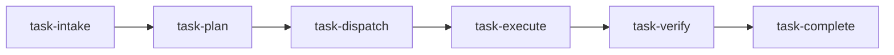

# AI orchestration harness — operator guide

This folder plus `.cursor/rules`, `.cursor/commands`, `.cursor/agents`, and `.cursor/skills` implement the **plan-first, evidence-complete** workflow for the decision-analytics reconstruction project.

## Quick start

1. **`/task-intake`** — classify and recommend routing.
2. **`/task-plan`** — lock objective, must-do/must-not, success criteria, tests, impact map, todos.
3. **`/task-dispatch`** — confirm agent + skills (`docs/ai_harness/routing-matrix.md`).
4. **`/task-execute`** — implement with gates.
5. **`/task-verify`** — attach command evidence.
6. **`/task-complete`** — move Cursor todos to **completed** only if verification is green.

## Dynamic workflow

## Failure recovery

| Failure | Action |
|---------|--------|
| Scope creep mid-task | Amend `/task-plan` sections A–I; reset todos if needed |
| Tests fail | Do **not** `/task-complete`; fix → re-`/task-verify` |
| Wrong specialist assigned | Re-run `/task-intake` + `/task-dispatch`; hand off context |
| Cross-module blast radius discovered late | Stop; add `integration-impact-auditor`; update impact map |
| Module C MCMC fails diagnostics | No results narrative; widen priors or adjust model per scope — log in decision log |

## Mirrors

Claude Code loads the same skill content from `.claude/skills/project-*/SKILL.md` — **keep in sync** with `.cursor/skills/`.

## Graph context layer

- Graphify outputs live in `graphify-out/` (`GRAPH_REPORT.md`, `graph.json`, `graph.html`).
- Cursor includes graph context every session via `.cursor/rules/graphify.mdc` (`alwaysApply: true`).
- Claude includes graph context via `CLAUDE.md` and `.claude/settings.json` PreToolUse hook.
- Keep the graph fresh with `graphify update .`; git hooks also trigger auto-refresh on commit/checkout.

## Related scope

Authoritative methodology and gates: `project_scope/` (ignored by git in this workspace — keep locally or sync separately).
