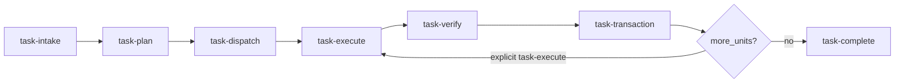

# AI orchestration harness — operator guide

This repository also ships **`docs/registry/docs_registry.yaml`**: authoritative, machine-readable documentation inventory (immutable `doc_id` → path). Humans navigate via generated [`docs/INDEX.md`](../../docs/INDEX.md). Agents MUST follow retrieval order **`registry → canonical → derived → evidence → archive`** documented in `.cursor/rules/09-documentation-registry-governance.mdc`.

--- [`.cursor/rules/08-controlled-workflow-playbook.mdc`](../../.cursor/rules/08-controlled-workflow-playbook.mdc) (`alwaysApply: true`) requires following the playbook below for non-trivial work.

**Full controlled workflow (single narrative):** [`CONTROLLED_WORKFLOW_PLAYBOOK.md`](CONTROLLED_WORKFLOW_PLAYBOOK.md) — lifecycle, guardrails, coordination precedence, and appendices (git, CRISP-DM map, optional external tools).

## Quick start

1. `**/task-intake`** — classify and recommend routing.
2. `**/task-plan`** — lock **`UNIT_ID`**, `unit_impact_set`, must-do/must-not, success criteria, tests, impact map §A–N, runtime lock.
3. `**/task-dispatch**` — confirm agent + skills (`docs/ai_harness/routing-matrix.md`).
4. `**/task-execute**` — implement **one unit per session** with gates.
5. `**/task-verify**` — attach command evidence (header names **`unit_id`**).
6. `**/task-transaction**` — `make transaction-verify`, commit (**message contains `unit_id`**), **close unit; stop session**.
7. `**/task-complete**` — when **all** planned units are closed and verification is green.
8. `poetry run graphify update .` — session end (graphify rule).

## Dynamic workflow

## Failure recovery

| Failure                                   | Action                                                                             |
| ----------------------------------------- | ---------------------------------------------------------------------------------- |
| Scope creep mid-task                      | Amend `/task-plan` sections A–I; reset todos if needed                             |
| Tests fail                                | Do **not** `/task-complete`; fix → re-`/task-verify`                               |
| Wrong specialist assigned                 | Re-run `/task-intake` + `/task-dispatch`; hand off context                         |
| Cross-module blast radius discovered late | Stop; add `integration-impact-auditor`; update impact map                          |
| Module C MCMC fails diagnostics           | No results narrative; widen priors or adjust model per scope — log in decision log |

## Mirrors

Claude Code loads the same skill content from `.claude/skills/project-*/SKILL.md` — **keep in sync** with `.cursor/skills/`.

## Graph context layer

- Graphify outputs live in `graphify-out/` (`GRAPH_REPORT.md`, `graph.json`, `graph.html`).
- Install the CLI via Poetry: dev dependency `**graphifyy`** on PyPI supplies the `graphify` command (`poetry install`, then `poetry run graphify update .` or `make graphify`). AST-only refresh needs no API keys; semantic modes may use optional LLM keys (see upstream docs).
- Cursor includes graph context every session via `.cursor/rules/graphify.mdc` (`alwaysApply: true`).
- Claude includes graph context via `CLAUDE.md` and `.claude/settings.json` PreToolUse hook.
- Keep the graph fresh: run `graphify update .` before completing any agent session (always; not conditional on which paths changed); git hooks may also trigger refresh when installed.

## Pre-public cleanup (portfolio / HR-facing)

Before the repository is treated as **complete and public**:

1. Maintain the living checklist: `**maintainer/pre_public_cleanup_manifest.md`** (agents must append new items whenever internal-only or AI-visible artifacts appear).
2. Run a repo-wide cleanup using that manifest; remove or rewrite everything listed unless the author waives it in-row.
3. Cursor enforces awareness via `.cursor/rules/07-pre-public-cleanup-manifest.mdc`.

## Related scope

Authoritative methodology and gates: `project_scope/` (ignored by git in this workspace — keep locally or sync separately).