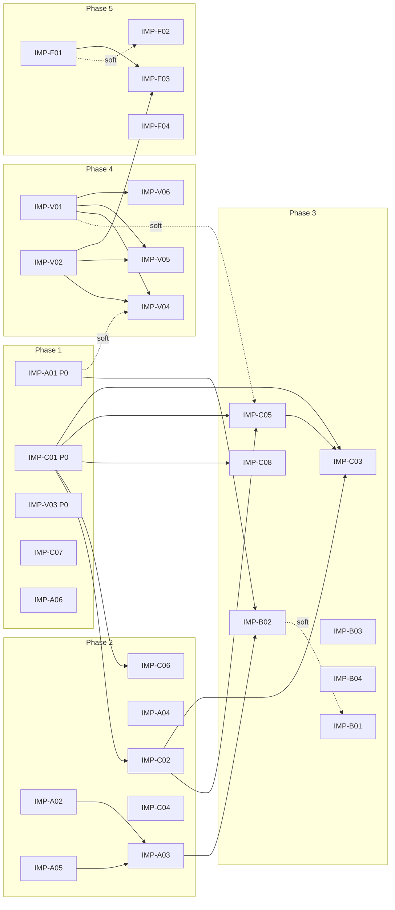

# Improvement Plan — Statistical & Analytical Foundation

**Source:** three-track statistical audit (Module A, Modules B/C, visualization +
Chart_Audit_Framework), 2026-07-07/08, branch
`claude/analytics-audit-improvement-sdciz3` in both repositories.
**Companion register:** `Chart_Audit_Framework/improvement_plan/INDEX.md`
(IMP-F series lives there; it links back here).

> **This directory is a specification set feeding the two existing work
> queues. It is not a methodology.** Roles, closure semantics, and the finding
> lifecycle are defined solely by `governance/AUDIT_PROCEDURE.md`. Findings
> execute as one-finding-per-PR remediations; issues execute through the
> `status:claude-ready` agent queue (`CLAUDE.md`, Phase 6). Nothing here
> introduces a new role, tier, or scoring system.

## Execution recipe (per document)

1. Read the `IMP-*` doc. Its front matter names the queue(s); Section 5 holds
   the verbatim stub(s).
2. File the stub(s): finding YAML gets the next free `F-NNN` at filing time
   (never pre-reserved here); issue stubs are already filed — see the register.
3. Set the doc's front matter `status: filed`.
4. Normal Remediator / agent-queue flow executes the change. A doc is `done`
   when all its queue items are closed and the Adversary stays green.

## Phase plan

Phases are dependency edges, not calendar gates; items within a phase are
parallelizable.

| Phase | Theme | Documents |
|---|---|---|
| 1 | Honest gates & enforcement foundations | IMP-A01, IMP-C01, IMP-V03 (P0 trio) + IMP-C07, IMP-A06 |
| 2 | Model-layer statistical fixes | IMP-A02 + IMP-A05 → IMP-A03; IMP-A04; IMP-C02, IMP-C04, IMP-C06 |
| 3 | Uncertainty propagation & cross-module coherence | IMP-B02 → IMP-B01; IMP-B03, IMP-B04; IMP-C05, IMP-C08 → IMP-C03 |
| 4 | Visualization system before per-chart fixes | IMP-V01 + IMP-V02 → IMP-V04, IMP-V05, IMP-V06 |
| 5 | Framework automation (interleaves with 4) | IMP-F01 (with V01/V02) → IMP-F03; IMP-F02, IMP-F04 |

Rationale: the audit's dominant failure pattern is *gates adjusted post hoc to
match output*. So the measuring instruments get fixed first (Phase 1), models
are improved against honest gates (Phase 2), only then is uncertainty
propagated across module boundaries (Phase 3), charts are fixed once inside a
shared visual system (Phase 4), and the chart-audit framework turns those
fixes into machine-checkable regressions (Phase 5).

## Document register

`issue` = GitHub issue number (repo 1 unless prefixed `CAF#`); `finding` is
assigned at filing time. Status: draft → approved → filed → done.

| ID | Title (short) | Pri | Effort | Queue | Depends on | Issue | Status |
|---|---|---|---|---|---|---|---|
| IMP-A01 | Propensity honesty: non-circular target, real AUC gate, no fabricated variance | P0 | high | findings | — | — | draft |
| IMP-A02 | Categorical encoding for distance-based methods | P1 | medium | issues | — | #54 | filed |
| IMP-A03 | Clustering selection & quality-gate integrity | P1 | high | dual | A02, A05 | #55 | issue filed |
| IMP-A04 | Cleaner & injector integrity | P1 | medium | findings | — | — | draft |
| IMP-A05 | Fixed-reference feature scaling | P2 | medium | issues | — | #56 | filed |
| IMP-A06 | Config-runtime parity & documentation truth | P1 | medium | findings | — | — | draft |
| IMP-B01 | Allocation parameter provenance | P1 | high | issues | soft: B02 | #57 | filed |
| IMP-B02 | Uncertainty-aware ingestion of Module A outputs | P1 | high | issues | A01, A03 | #58 | filed |
| IMP-B03 | MILP robustness & contract corrections | P2 | low | issues | — | #59 | filed |
| IMP-B04 | Silent-substitution elimination in B data layer | P1 | low | findings | — | — | draft |
| IMP-C01 | MCMC convergence remediation & hard diagnostic gates | P0 | high | dual | — | #60 | issue filed |
| IMP-C02 | Model spec: pollster prior families; calibrated φ→σ_obs | P1 | high | issues | C01 | #61 | filed |
| IMP-C03 | Report computed-from-artifact integrity | P1 | medium | findings | C01, C02, C05 | — | draft |
| IMP-C04 | Shock & herding parameter calibration/disclosure | P1 | high | issues | — | #62 | filed |
| IMP-C05 | Battleground/geo uncertainty integrity | P1 | high | dual | C01, C02; soft: V01 | #63 | issue filed |
| IMP-C06 | Small-sample honesty (walk-forward, exit model) | P1 | medium | findings | C01 | — | draft |
| IMP-C07 | Contract validator full-spec enforcement | P1 | medium | issues | — | #64 | filed |
| IMP-C08 | MC scenario stratification reweighting | P2 | medium | issues | C01 | #65 | filed |
| IMP-V01 | Shared visual system (palette + figure template) | P1 | medium | issues | — | #66 | filed |
| IMP-V02 | Chart single-sourcing & manifest lineage coverage | P1 | high | dual | — | #67 | issue filed |
| IMP-V03 | SHAP artifact provenance | P0 | low | findings | — | — | draft |
| IMP-V04 | Reliability-diagram standard | P1 | medium | issues | V01, V02; soft: A01 | #68 | filed |
| IMP-V05 | Residual chart encoding fixes | P2 | medium | issues | V01, V02 | #69 | filed |
| IMP-V06 | Dashboard parity & defects | P2 | low | issues | V01 | #70 | filed |
| IMP-F01 | Deterministic rule engine + numeric rubric anchors | P1 | high | issues (CAF) | — | CAF#1 | filed |
| IMP-F02 | Chart-library verification pipeline | P2 | high | issues (CAF) | soft: F01 | CAF#2 | filed |
| IMP-F03 | Cross-repo audit ratchet | P1 | medium | issues (both) | F01, V02 | CAF#3 + #71 | issue filed |
| IMP-F04 | Chart_Audit_Framework repo hygiene | P2 | low | issues (CAF) | — | CAF#4 | filed |

## Traceability matrix (audit finding → document)

Every audit code appears exactly once. Severity from the audit reports
(critical / major / moderate / minor; CF codes are gaps, not defects).

| Code | Severity | What (short) | Doc |
|---|---|---|---|
| A1 | critical | Circular propensity target/AUC | IMP-A01 |
| A2 | critical | Fake `test_auc_floor` CI gate | IMP-A01 |
| A3 | critical | Fabricated individual spread; test/prod param mismatch | IMP-A01 |
| A4 | critical | k=6 fixed a priori; label repair heuristics | IMP-A03 |
| A5 | major | Nominal categoricals in Euclidean space | IMP-A02 |
| A6 | major | Ad hoc DBSCAN eps/min_samples | IMP-A03 |
| A7 | major | Post-hoc lowered clustering gates | IMP-A03 |
| A8 | major | Two divergent bootstrap-ARI implementations | IMP-A03 |
| A9 | major | Dead validation/drift metrics (DB, CH, PSI) | IMP-A03 |
| A10 | major | Flat national rural_flag fallback | IMP-A04 |
| A11 | major | 13th flaw type documented, not implemented | IMP-A04 |
| A12 | moderate | DOB sentinel "01/01/1980" age spike | IMP-A04 |
| A13 | moderate | Tautological age clamp+validation | IMP-A04 |
| A14 | moderate | Sample-relative reachability tiers | IMP-A05 |
| A15 | moderate | Sample-relative NBI min-max scaling | IMP-A05 |
| A16 | moderate | Config params not wired (100 vs 25 bootstrap) | IMP-A06 |
| A17 | moderate | README gates contradict model card; dead links | IMP-A06 |
| A18 | minor | Stub/stale notebooks | IMP-A06 |
| A19 | minor | Reliability diagram: no bin n / error bars | IMP-V04 |
| A20 | minor | A4 heatmap [0,1] scale; A9 palette sign cue | IMP-V05 |
| B1 | major | Hand-picked persuasion multipliers ×6 | IMP-B01 |
| B2 | major | 33 uncalibrated diminishing-returns floats | IMP-B01 |
| B3 | major | No uncertainty propagation A→B | IMP-B02 |
| B4 | minor | Sensitivity sweep covers budget only | IMP-B01 |
| B5 | minor | No zero-budget/degenerate tests | IMP-B03 |
| B6 | minor | week_index le=60 vs 14-week window | IMP-B03 |
| B7 | minor | Silent FX fallback constant | IMP-B04 |
| B8 | minor | Silent row drops, no rejection report | IMP-B04 |
| C1 | critical | Non-converged production model; xfail'd gates | IMP-C01 |
| C2 | major | 94% HDI labeled 95% in Quarto report | IMP-C03 |
| C3 | major | Hardcoded diagnostics table in report | IMP-C03 |
| C4 | major | Pollster prior families config unwired | IMP-C02 |
| C5 | major | Uncalibrated shock/herding parameters | IMP-C04 |
| C6 | major | Uncalibrated transparency φ → σ_obs | IMP-C02 |
| C7 | major | σ_idio calibrated to appearance | IMP-C05 |
| C8 | moderate | Swing-factor double circularity undisclosed | IMP-C05 |
| C9 | moderate | Report narrative describes superseded model | IMP-C03 |
| C10 | moderate | Powerless walk-forward framed as proof | IMP-C06 |
| C11 | minor | Contract validator ignores declared constraints | IMP-C07 |
| C12 | minor | Exit model below reliability threshold, unflagged | IMP-C06 |
| C13 | minor | No posterior-stability reproducibility test | IMP-C01 |
| C14 | minor | Equal-thirds MC bucket stratification | IMP-C08 |
| V1 | minor | PPC nested bands single hue/alpha | IMP-V05 |
| V2 | minor | Battleground bar drops HDI uncertainty | IMP-C05 |
| V3 | moderate | Dual-axis twinx B8, duplicated | IMP-V05 |
| V4 | moderate | build_notebook.py duplicate chart source | IMP-V02 |
| V5 | moderate | Fabricated-data SHAP generator collision | IMP-V03 |
| V6 | moderate | Reliability diagrams lack 1:1 aspect | IMP-V04 |
| V7 | moderate | Colorblind-unsafe SEG_COLORS | IMP-V01 |
| V8 | moderate | Dashboard/static chart inconsistency | IMP-V06 |
| V9 | minor | st.pyplot(None) SHAP tab risk | IMP-V06 |
| V10 | minor | Plotly HDI lines without band fill | IMP-V05 |
| CF1 | gap-major | No executable audit rules/CI | IMP-F01 |
| CF2 | gap-major | 0/130 library entries verified | IMP-F02 |
| CF3 | gap | Curator path mismatch | IMP-F02 |
| CF4 | gap | Rubric lacks numeric anchors | IMP-F01 |
| CF5 | gap | No cross-repo ratchet | IMP-F03 |
| CF6 | stale | Duplicate legacy trees, crawl cruft | IMP-F04 |
| CF7 | note | Unreferenced design-history docs | IMP-F04 |

## Triage reconciliation

Open `AUD-*` rows in `governance/ISSUE_TRIAGE_MASTER.yaml` now carry a
`spec:` key naming their covering IMP document (21 rows annotated). The spec's
queue stub is the filing path for that row; row statuses were not changed.
Rows already bound to open findings (F-050/F-051/F-052) stay with their
findings; IMP-A01/IMP-A03 address those findings' root causes and say so in
their `overlaps_triage` front matter. `AUD-PUB-005` (OpenAPI schemas) is out
of scope for this plan — it is neither statistical nor visual.

## Acceptance criteria for this plan

- All 59 audit codes appear exactly once in the traceability matrix.
- Every document contains the front-matter block, the four mandated sections,
  and a Section 5 queue stub; none contains implementation code.
- The dependency graph is acyclic; every P0 document has zero unmet
  dependencies.
- Every document is independently implementable — its queue items close
  without requiring another document's items in the same PR.
- No document introduces roles, tiers, or scoring outside
  `governance/AUDIT_PROCEDURE.md`.
- Every Given-When-Then scenario is phrased against observable artifacts
  (files, columns, metric values, exit codes), not intentions.

## Change log

- 2026-07-08 — initial plan: 28 documents, 59-code matrix. Issues filed:
  #54–#71 in this repo, #1–#4 in Chart_Audit_Framework (CAF). Dual docs'
  finding YAMLs are filed later by Remediator sessions, one per PR;
  `status: filed` means all of a doc's queue items exist, `issue filed`
  means the finding stub is still pending.
