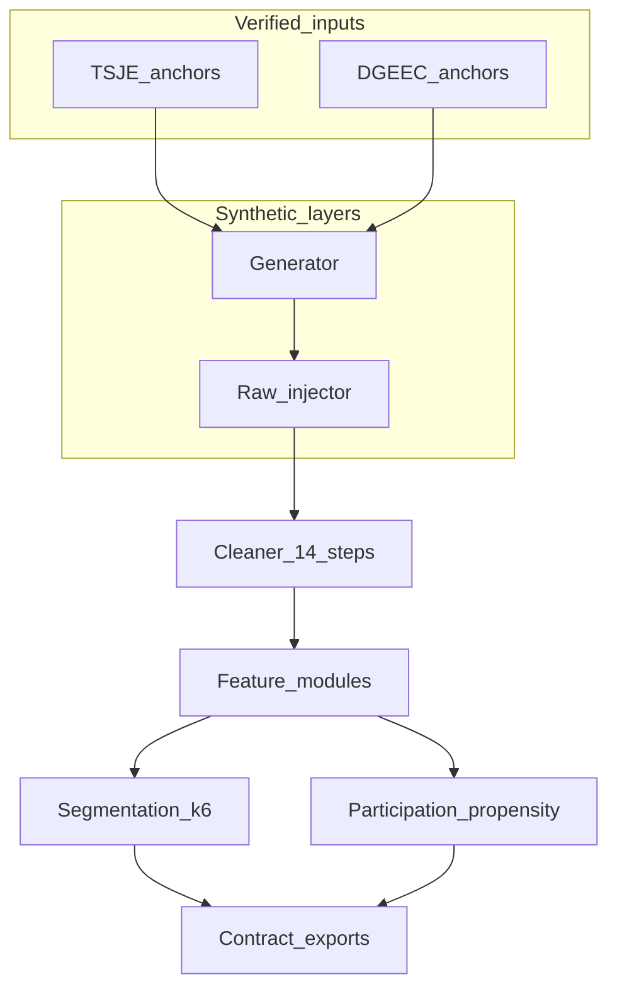

# Population dataset — lineage (Module A)

**Code map**

| Stage | Entry |
|-------|--------|
| Generate | `population_segmentation.data.generator` |
| Inject flaws | `population_segmentation.data.raw_injector` |
| Clean | `population_segmentation.data.cleaner` |
| Features | `population_segmentation.features.*` |
| Segment | `population_segmentation.pipeline.models.segmentation` |
| Propensity | `population_segmentation.pipeline.models.propensity` |
| Export | `population_segmentation.pipeline.export` |

Artifacts consumed by Module B are emitted under `schema_contracts/` names (`population_master_clean`, `segment_labels`, `participation_propensity`, reachability CSVs).
