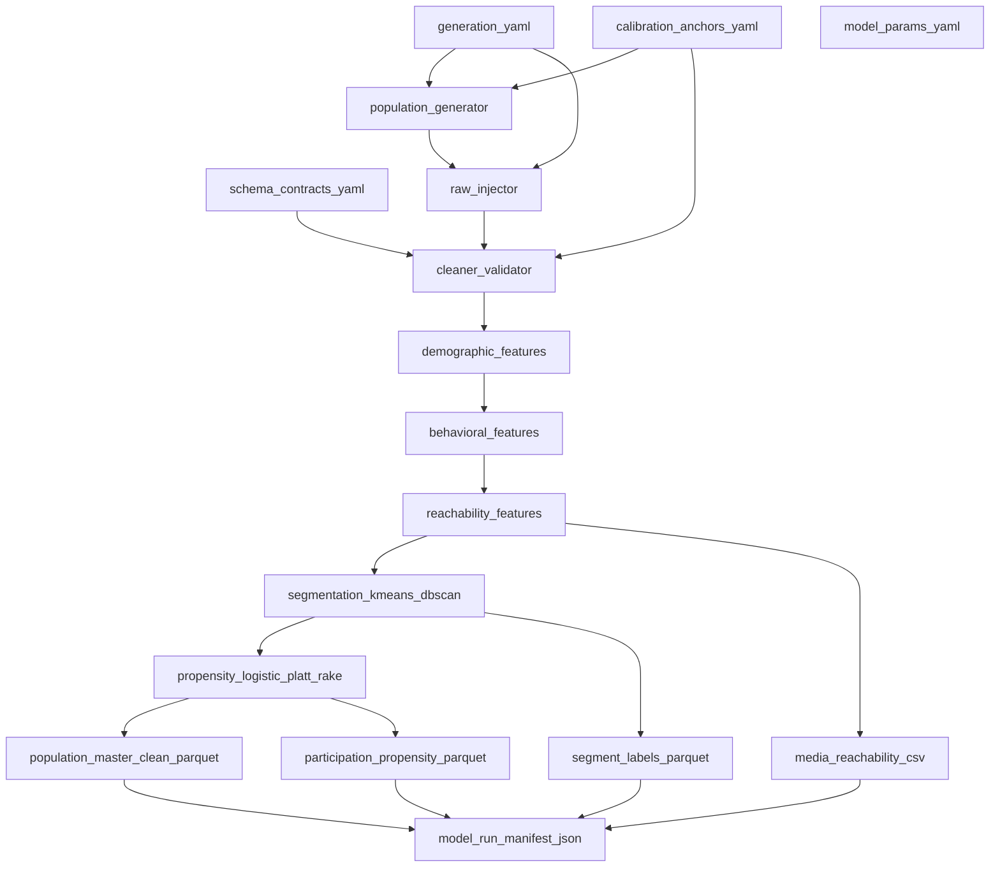

# Model hierarchy — Module A (population dataset pipeline)

This diagram maps **data and model dependencies** for the synthetic **population dataset** reconstruction: configuration files and schema contracts constrain generation and cleaning; engineered features feed segmentation and participation propensity; exported parquet and CSV artifacts feed Module B reachability assumptions and Module C strata narratives when consumption wiring is enabled.

For a prose walkthrough of one entity row, see [`reports/system_walkthrough.md`](system_walkthrough.md).

## Dependency graph

## Evidence and tests

| Stage | Primary code | Contract / config | Tests |
|-------|----------------|-------------------|--------|
| Batch export | `population_segmentation.pipeline.export.run_export` | `schema_contracts/population_master_clean.yaml`, `segment_labels.yaml`, `participation_propensity.yaml`, `media_reachability_by_segment*.yaml` | `module_a_population_segmentation/tests/test_export_artifacts.py` |
| Manifest | `population_segmentation.pipeline.model_run_manifest` | `model_run_manifest.json` (sidecar, repo-relative paths) | `test_model_run_manifest.py`, `test_export_artifacts.py::test_model_run_manifest_payload` |
| CLI | `python -m population_segmentation.pipeline` | Defaults to `module_a_population_segmentation/config/*.yaml`, `data/processed` | `test_pipeline_cli.py` |

## RNG and reproducibility

Export fixes random seeds to **42** for generation, flaw injection, cleaning, segmentation (`random_state=42`), and `PropensityModel(random_state=42)`. The same values appear under `random_seeds` in `model_run_manifest.json`.

## Downstream consumers

- **Module B:** Uses segment-aware reachability aggregates (`media_reachability_by_segment*.csv`) and allocation features derived from the clean layer (see [`schema_contracts/reachability_caps_dept_channel.yaml`](../schema_contracts/reachability_caps_dept_channel.yaml)).
- **Module C:** May consume aggregated strata weights; calibration series gates remain declared independently (do not mix calibration numerators across series).
