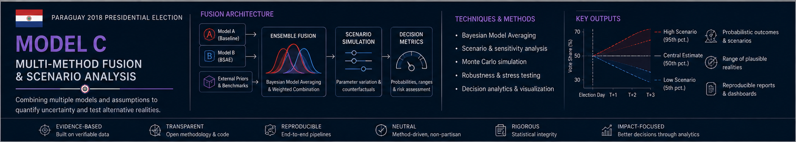

<p align="center">
  
</p>

# Module C — Probabilistic Forecasting & Scenario Analysis

Bayesian hierarchical aggregation of noisy, structurally biased survey measurements into a daily preference-proxy track with uncertainty bands. Monte Carlo shock-score engine maps posterior draws to interpretable decision scenarios.

**Verified outcome anchor:** +3.70 pp margin, April 22 2018 (TSJE official, 61.25% participation, 4.26M entities).

## Models

### 1. Tracking (hierarchical)

Daily latent preference margin via Gaussian random walk + pollster-specific house effects (4 polling firms):

```
mu_margin[t]   ~ GaussianRandomWalk(sigma=sigma_rw)
house_offset[p] ~ Normal(0, sigma_house)
m_poll[i]      ~ Normal(mu_margin[t_i] + house_offset[p_i], sigma_obs[i])
```

Sampler: PyMC NUTS (full) or fixture-backed fast CI (MC_FAST mode).

### 2. Exit / quickcount

Exit-survey-measurement bias model with OEA timing + EU observation-window flags. Produces last-mile posterior adjustment on outcome event day.

### 3. Monte Carlo shock-score

Maps 10,000 posterior margin draws to interpretable scenario buckets using:
```
s = 0.08·|Δm| + 0.35·(1−φ) + 0.12·ρ_herd
```
where `φ` = pollster transparency score, `ρ_herd` = herding coefficient. Produces probability mass across 5 scenario buckets (dominant win → margin loss).

## Quick start

```bash
# Run full NUTS sampling (slow; use for diagnostics)
poetry run python -m module_c_forecasting_scenarios.pipeline.run --mode full --seed 42

# Fast CI mode (fixture-backed, no NUTS)
poetry run pytest module_c_forecasting_scenarios/tests/ -v

# Export Quarto report
make module-c-report
# → reports/module_c/quarto_report.html

# Render GitHub Pages report
make deploy-module-c
```

## Live report

Quarto-rendered posterior report: build locally with the Pages workflow steps
(`.github/workflows/deploy-module-c-pages.yml`). The hosted GitHub Pages link
is tracked as open finding `F-021` and will be added once verifiably live.

## Source surface

| Path | Purpose |
|------|---------|
| `src/models/tracking/` | Hierarchical PyMC tracking model |
| `src/models/exit/` | Exit / quickcount model |
| `src/scenarios/monte_carlo.py` | Shock-score engine (10k draws → bucket assignment) |
| `src/geo/` | Geographic battleground classification |
| `src/viz/` | Posterior visualization (credible intervals, fan charts) |
| `src/mlflow_tracking.py` | Opt-in MLflow experiment logging |

## Diagnostics

| Diagnostic | Target | Current status |
|-----------|--------|---------------|
| R̂ (R-hat) | < 1.01 | > 1.01 on centered parameterization — non-centered reparam pending (P2-4) |
| ESS bulk | > 200 | < 100 on sparse fixture data (MC_FAST) |
| Divergences | 0 | 14 divergences under full NUTS (P2-4) |

See `ROADMAP.md` § Module C for remediation status.

## Walk-forward validation

Walk-forward cross-validation is implemented on the sparse Paraguay fixture
(held-out final-week survey measurements). Coverage on this synthetic setup is **not**
external validation — see `VALIDATION.md` and `epistemic_boundaries.md`.

## Tests and CI

```bash
poetry run pytest module_c_forecasting_scenarios/tests/ -v
```

Fast CI uses `MC_FAST=1` fixture mode (no NUTS sampling). Full diagnostics require `--run-slow` flag.

## Docs

- [`METHODOLOGY.md`](METHODOLOGY.md) — generative model, sampling, validation, shock-score derivation
- [`../reports/module_b_module_c_handshake.md`](../reports/module_b_module_c_handshake.md) — parquet contract with Module B
- [`../reports/epistemic_boundaries.md`](../reports/epistemic_boundaries.md) — verified vs simulated vs illustrative taxonomy
- [`../reports/statistical_metrics_summary.md`](../reports/statistical_metrics_summary.md) — all reported metrics with caveats
