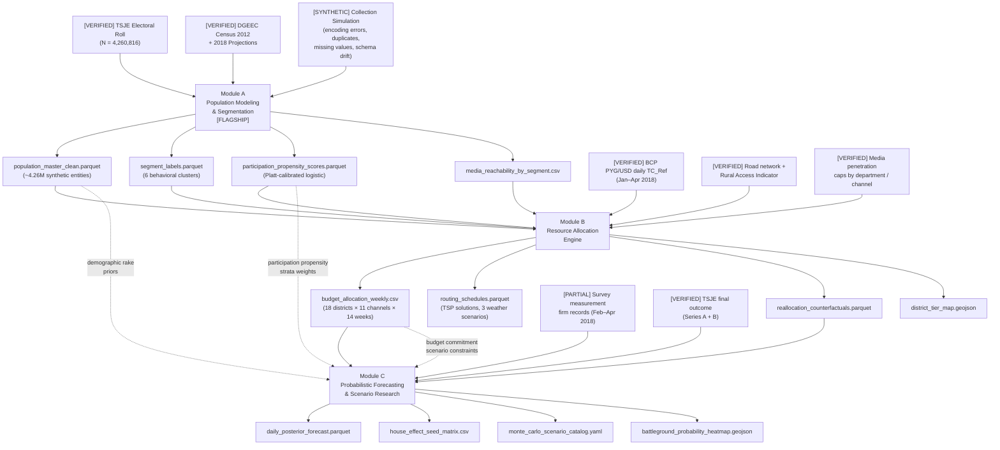
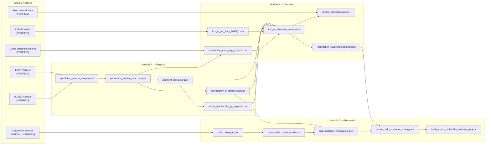

# scope_master_reconstruction_project.md (v3)

---

# Decision Analytics Reconstruction — Master Scope Document

**Repository name:** `decision-analytics-reconstruction`
**Version:** 3.0.0
**Status:** Pre-implementation — scope locked, implementation pending
**Audience:** Internal reference only. This document is the source of truth from which
all public-facing documents (README.md, ARCHITECTURE.md, IMPLEMENTATION_PLAN.md) are derived.
It does not appear in the public repository in its current form.

---

## Document Layer Map

| File | Audience | Maximum length | Derived from this document |
|---|---|---|---|
| `README.md` | Recruiter, hiring manager | 1 page equivalent | Sections 1, 2, 8, 9 (10-min guide) |
| `ARCHITECTURE.md` | Technical reviewer | 3–5 pages | Sections 4, 5, 6, 10 |
| `IMPLEMENTATION_PLAN.md` | Engineering reviewer | 2–3 pages | Sections 5, 10, 11 |
| `scope_master_reconstruction_project.md` | Internal reference | No limit | Source of truth |

---

## 1. Project Identity

### Internal title
High-Stakes Decision Analytics System: Population Modeling, Resource Optimization, and Probabilistic Forecasting Research for a National-Scale Initiative

### External title (DACH-safe)
Retrospective Reconstruction of a National-Scale Marketing and Resource Allocation Decision System

### One-sentence problem statement
A practitioner rebuilt, from scratch and with full methodological rigor, the decision analytics infrastructure originally constructed under severe operational constraints to support a national-scale program affecting 4.26 million entities and a verifiable high-stakes binary outcome.

### Synthetic data justification

Real entity-level data from this program cannot be published. It contains personal identifiers, behavioral records, and geographic precision that create privacy exposure under GDPR and comparable data protection frameworks. The synthetic data approach preserves the statistical structure, operational messiness, and calibration anchors of the original while generating no real-world privacy risk. This is not a limitation of the portfolio: it is a deliberate demonstration of a skill that is increasingly expected in regulated analytics environments — the ability to generate realistic, privacy-safe synthetic datasets that remain analytically useful for modeling, segmentation, and optimization work.

### Business value framing

**What decision does this system support?**
Three interdependent decisions, each made repeatedly across a multi-month operational window:

1. How to segment a population of 4.26 million entities into actionable groups with meaningfully different behavioral profiles, reachability characteristics, and response propensities.
2. How to allocate a constrained budget across 18 geographic units and 11 channel types to maximize expected response rate per monetary unit.
3. How to aggregate noisy, structurally biased measurement signals into a calibrated probabilistic forecast of a binary outcome, while quantifying uncertainty and simulating alternative scenarios.

**What is the cost of getting these decisions wrong?**

| Decision | Correct | Wrong |
|---|---|---|
| Segmentation | Budget reaches the right entities through the right channels at the right time | Budget reaches entities with low response propensity; high-propensity entities are invisible or unreachable |
| Allocation | Each additional dollar generates the highest marginal conversion uplift across the portfolio | Funds saturate already-converted segments; high-volatility geographic units receive nothing |
| Forecasting | Decision-makers hold calibrated expectations; operational pivots happen early enough to matter | Decision-makers chase noise; late-stage pivots consume resources without improving outcomes |

In aggregate: a miscalibrated system in any of these three decisions reduces total expected response rate by a computable margin. In this specific case, the verified final margin was +3.70 percentage points (Series A, TSJE verified). Systems that misallocate resources at that scale of marginal competition are the difference between success and failure.

**What would a practitioner do differently with this system vs without it?**
Without: allocate resources based on intuition, historical precedent, and the loudest internal voices. Measure nothing during execution. Discover errors post-outcome.
With: allocate resources based on segment-level expected lift, geography-specific reachability constraints, and a weekly updated posterior on where the outcome is trending. Catch systematic measurement bias before it corrupts allocation decisions. Quantify uncertainty rather than pretending certainty.

### Generalization scope

The architecture of this system is domain-agnostic. The same three-module pipeline applies to any large-scale constrained outreach program: public health awareness initiatives, NGO participation programs, multi-channel customer acquisition systems, or regional resource deployment under geographic access constraints. The specific calibration anchors and domain parameters are replaceable; the methodology is transferable. This reconstruction uses a particular operational case as its grounding instance precisely because that case provides verified outcome data against which calibration and forecast accuracy can be measured. A practitioner applying this system to a retail customer acquisition program would replace the participation rate anchors with conversion rate benchmarks, replace the geographic friction model with a logistics cost matrix, and replace the survey measurement aggregator with a media-mix model — the pipeline structure and the engineering standards remain identical.

---

## 2. Honest Narrative

This system was originally built in real operational conditions by a single practitioner under severe time and resource constraints. The original infrastructure used available tools, trial-and-error methodology, informal data collection practices, non-reproducible pipelines, and no version control. It worked: the initiative achieved its objective with a verified positive outcome margin.

This reconstruction applies the methodological rigor, production-grade engineering, and statistical discipline that were absent in the original. Every modeling choice is now documented, tested, and reproducible. Every synthetic data anchor is tied to a verified source. Every uncertainty estimate is propagated through the pipeline rather than suppressed for operational convenience.

The reconstruction is not a claim of original seniority. It is a demonstration of what the practitioner would build today, with the benefit of domain knowledge, operational experience, and a methodological education that was acquired partly through doing this wrong the first time. That combination — real domain exposure plus reconstructed rigor — is what no academic exercise or consulting simulation can replicate.

The outcome was verifiable: the program achieved its objective by a confirmed margin of +3.70 percentage points against a field of 4.26 million participating entities.

---

## 3. Selected Calibration Anchors

The table below contains the primary anchors used throughout the system. These values appear as calibration targets in configuration files and model cards — not as characterizations of any entity or event. In technical tables, configuration files, model cards, and calibration registries, outcome percentages, geographic unit names, and event-period references may co-occur because the context is clearly methodological. In narrative prose and marketing-facing copy, these elements are kept separate. A complete anchor registry is maintained in `appendix/verified_calibration_anchors_full.md`.

| Anchor | Value | Source | Module |
|---|---|---|---|
| Total entity count (outcome-day roll) | 4,260,816 | TSJE, April 22, 2018 | A |
| National participation rate (presidential) | 61.25% | TSJE, 2018 | A, B, C |
| Total recorded participations | 2,597,989 | TSJE, 2018 | A, C |
| Youth cohort (ages 18–24) — count | 884,927 | TSJE, 2018 | A |
| Youth cohort (ages 18–24) — participation rate | 52.8% | TSJE, 2018 | A |
| Female participation rate | 69.46% | TSJE, 2018 | A |
| Male participation rate | 67.72% | TSJE, 2018 | A |
| High-friction unit: Presidente Hayes | 32.37% | TSJE, 2018 | A, B |
| High-friction unit: Alto Paraná | 37.47% | TSJE, 2018 | A, B |
| Contrast unit: Central | 43.99% | TSJE, 2018 | A, B |
| Contrast unit: Guairá | 58.26% | TSJE, 2018 | A, B |
| Urban share (2018 projection) | 61.7% | DGEEC, 2018 | A |
| Rural share (2018 projection) | 38.3% | DGEEC, 2018 | A |
| Jopará bilingual share | 46% | DGEEC, bilingualism statistics | A |
| Guaraní-only share | 34% | DGEEC, bilingualism statistics | A |
| Spanish-only share | 15% | DGEEC, bilingualism statistics | A |
| Final outcome margin — Series A | +3.70 pp (46.43% vs 42.73%) | TSJE, 2018 | C |
| Final outcome margin — Series B | +3.88 pp (48.96% vs 45.08%) | TSJE, 2018 | C |

Full anchor registry: `appendix/verified_calibration_anchors_full.md` (55 additional rows covering departmental participation rates, road network statistics, media penetration by channel and geography, FX rate bands, pay-TV market shares, and pre-outcome measurement series).

**Labeling convention used throughout all scope documents:**
- `[VERIFIED — SOURCE]`: confirmed against primary source
- `[ESTIMATED]`: plausible prior pending verification
- `[SYNTHETIC]`: generated construct calibrated to VERIFIED anchors; no direct real-world counterpart

---

## 4. System Architecture

The three modules form a sequential decision-support pipeline. Each module's outputs are consumed as calibration inputs or constraint parameters by the next.

**Mathematical character, per module:**
Module A performs conditional probability draws calibrated to verified marginals using iterative proportional fitting (IPF/raking), followed by a K-Means clustering pass on cross-tabulated behavioral features (with DBSCAN running as a pre-pass for noise detection and outlier identification before centroid placement, preventing low-density outlier records from distorting cluster centers) and a Platt-calibrated logistic regression for participation propensity. Module B solves a linear program maximizing expected response rate per budget unit subject to geographic reachability constraints, with time-varying cost coefficients derived from the FX series and diminishing-returns curves fit per geographic unit per channel. Module C implements a research-oriented probabilistic reconstruction: a Bayesian hierarchical model with a latent daily random walk and firm-level house effects, using Markov Chain Monte Carlo sampling (No-U-Turn Sampler via PyMC) to explore how uncertainty in noisy, structurally biased measurement data propagates into scenario distributions.



### Module dependency summary

| Module | Role | Produces | Consumed by |
|---|---|---|---|
| A: Population Modeling and Segmentation | Flagship — fully implemented and deployed | Population dataset, segment labels, propensity scores, media reachability | B (allocation targets and reachability caps); C (strata weights for forecast calibration) |
| B: Resource Allocation Engine | Extension — LP core implemented; MILP and routing specified | Weekly allocation table, routing schedules, counterfactual analysis | C (budget scenario constraints for Monte Carlo, reallocation paths) |
| C: Probabilistic Forecasting and Scenario Research | Research prototype — Bayesian aggregator implemented; scenario engine specified | Daily posterior, house effects, scenario catalog, heatmap | Terminal consumer |

### Execution order
A → B → C. Module A stands alone. Modules B and C each require all upstream outputs.

### Shared infrastructure
All three modules share: the same `src/` package structure, the same `schema_contracts/` registry, the same MLflow experiment tracking backend, the same configuration management pattern (YAML plus environment variables), the same pytest test suite structure, and the same GitHub Actions CI pipeline.

---

## 5. Implementation Scope Tiers

Module A is the flagship module: fully implemented, deployed, and the recommended entry point for technical review. Modules B and C extend the system into optimization and probabilistic forecasting research respectively. Each is independently valuable but intentionally narrower in implementation depth. This is not a constraint of ambition; it is an honest representation of what one practitioner builds, tests, and deploys to a production-visible standard in a defined timeframe.

### Tier 1 — Core (fully implemented across all three modules)
- Synthetic population generation with verified marginal calibration and IPF/raking
- K-Means segmentation with silhouette-based k selection, DBSCAN noise pre-pass, and bootstrap stability validation
- Platt-calibrated logistic participation propensity model
- LP resource allocation optimizer with diminishing returns curves
- Bayesian poll aggregator (PyMC, latent daily random walk, firm-level house effects, NUTS sampler)
- All data pipelines: raw generation, flaw injection, deterministic cleaning, QA reports
- Schema contracts and validation gates (Great Expectations–style)
- MLflow experiment tracking for all trained models
- pytest test suites (≥80% coverage per module)
- GitHub Actions CI (lint, format, type-check, test)

### Tier 2 — Engineering hardening (implemented for Module A; specified and scaffolded for B and C)
- Docker and docker-compose orchestration
- DVC data versioning with remote storage
- Pyright strict-mode type checking across all `src/`
- Streamlit deployed artifact (Module A live; Module B FastAPI scaffolded)

### Tier 3 — Extended components (architecture and mathematics complete; selective implementation)
- MILP optimizer with conglomerate bundle constraints and binary linking variables
- TSP/VRP routing simulation with road network friction and weather scenarios
- Full Monte Carlo scenario engine with engagement-shock paths
- Exit-measurement bias model (layered on top of Bayesian aggregator)
- Battleground heatmap with posterior win probability by geographic unit
- Quarto interactive report on GitHub Pages (Module C)
- FastAPI REST endpoint for Module B allocation engine (full deployment)

Tier 3 components are documented in module scope documents with full mathematical specifications so they can be implemented on request or discussed in depth during technical review.

---

## 6. Data Lineage: Cross-Module Flow



---

## 7. Repository Structure

```
decision-analytics-reconstruction/
├── README.md                          # Recruiter/hiring manager entry point
├── ARCHITECTURE.md                    # Technical reviewer entry point
├── IMPLEMENTATION_PLAN.md             # Engineering reviewer entry point
├── pyproject.toml
├── poetry.lock
├── .python-version                    # 3.11.x
├── .env.example
├── .gitignore
├── docker-compose.yml
├── Makefile
│
├── .github/
│   └── workflows/
│       ├── ci.yml
│       └── deploy.yml
│
├── appendix/
│   └── verified_calibration_anchors_full.md
│
├── schema_contracts/
│   ├── population_master_raw.yaml
│   ├── population_master_clean.yaml
│   ├── segment_labels.yaml
│   ├── participation_propensity.yaml
│   ├── budget_allocation_weekly.yaml
│   ├── polls_clean.yaml
│   └── README.md
│
├── data/
│   ├── raw/                           # Git-ignored; DVC-tracked
│   ├── interim/                       # Git-ignored; DVC-tracked
│   └── processed/                     # Git-ignored; DVC-tracked
│
├── reports/
│   ├── case_study_business.pdf
│   ├── case_study_technical.pdf
│   ├── data_dictionary.md
│   ├── decision_log.md
│   └── transformation_log.md
│
├── mlflow/
│   └── mlruns/                        # Git-ignored
│
├── module_a_population_segmentation/
│   ├── README.md
│   ├── docker/
│   │   └── Dockerfile
│   ├── notebooks/
│   │   ├── 01_data_quality_exploration.ipynb
│   │   ├── 02_feature_engineering.ipynb
│   │   ├── 03_segmentation_analysis.ipynb
│   │   └── 04_propensity_model_diagnostics.ipynb
│   ├── src/
│   │   └── population_segmentation/
│   │       ├── __init__.py
│   │       ├── data/
│   │       │   ├── generator.py
│   │       │   ├── raw_injector.py
│   │       │   ├── cleaner.py
│   │       │   └── validator.py
│   │       ├── features/
│   │       │   ├── demographic.py
│   │       │   ├── behavioral.py
│   │       │   └── reachability.py
│   │       ├── models/
│   │       │   ├── segmentation.py
│   │       │   └── propensity.py
│   │       ├── evaluation/
│   │       │   ├── clustering_metrics.py
│   │       │   └── calibration_metrics.py
│   │       ├── visualization/
│   │       │   ├── segment_profiles.py
│   │       │   └── calibration_curves.py
│   │       └── utils/
│   │           ├── seeds.py
│   │           └── schema.py
│   ├── app/
│   │   └── streamlit_dashboard.py
│   ├── tests/
│   │   ├── test_generator.py
│   │   ├── test_cleaner.py
│   │   ├── test_features.py
│   │   ├── test_segmentation.py
│   │   └── test_propensity.py
│   ├── config/
│   │   ├── generation.yaml
│   │   ├── calibration_anchors.yaml
│   │   └── model_params.yaml
│   └── reports/
│       ├── case_study_business.pdf
│       ├── case_study_technical.pdf
│       ├── model_card_segmentation.md
│       ├── model_card_propensity.md
│       └── qa_report_template.md
│
├── module_b_resource_allocation/
│   ├── README.md
│   ├── docker/
│   │   └── Dockerfile
│   ├── notebooks/
│   │   ├── 01_data_quality_exploration.ipynb
│   │   ├── 02_reachability_analysis.ipynb
│   │   ├── 03_optimizer_exploration.ipynb
│   │   └── 04_routing_analysis.ipynb
│   ├── src/
│   │   └── resource_allocation/
│   │       ├── __init__.py
│   │       ├── data/
│   │       │   ├── budget_loader.py
│   │       │   ├── fx_loader.py
│   │       │   ├── reachability_loader.py
│   │       │   └── cleaner.py
│   │       ├── features/
│   │       │   ├── district_profiles.py
│   │       │   ├── channel_costs.py
│   │       │   └── routing_matrix.py
│   │       ├── models/
│   │       │   ├── lp_optimizer.py
│   │       │   ├── milp_optimizer.py       # Tier 3
│   │       │   ├── diminishing_returns.py
│   │       │   └── tsp_router.py           # Tier 3
│   │       ├── evaluation/
│   │       │   └── allocation_metrics.py
│   │       ├── visualization/
│   │       │   ├── district_map.py
│   │       │   └── allocation_charts.py
│   │       └── utils/
│   │           ├── fx_utils.py
│   │           └── geography.py
│   ├── app/
│   │   └── api.py                          # FastAPI; Tier 3
│   ├── tests/
│   │   ├── test_fx_loader.py
│   │   ├── test_reachability.py
│   │   ├── test_lp_optimizer.py
│   │   ├── test_milp_optimizer.py
│   │   └── test_tsp_router.py
│   ├── config/
│   │   ├── fx_path.yaml
│   │   ├── reachability_caps.yaml
│   │   ├── bundle_rules.yaml
│   │   └── routing_params.yaml
│   └── reports/
│       ├── case_study_business.pdf
│       ├── case_study_technical.pdf
│       ├── model_card_lp_optimizer.md
│       ├── model_card_tsp_router.md
│       └── qa_report_template.md
│
└── module_c_forecasting_scenarios/
    ├── README.md
    ├── docker/
    │   └── Dockerfile
    ├── notebooks/
    │   ├── 01_poll_data_exploration.ipynb
    │   ├── 02_house_effects_analysis.ipynb
    │   ├── 03_bayesian_model_diagnostics.ipynb
    │   └── 04_monte_carlo_scenarios.ipynb
    ├── src/
    │   └── forecasting_scenarios/
    │       ├── __init__.py
    │       ├── data/
    │       │   ├── poll_loader.py
    │       │   ├── cleaner.py
    │       │   └── transparency_scorer.py
    │       ├── features/
    │       │   ├── poll_features.py
    │       │   └── shock_features.py
    │       ├── models/
    │       │   ├── bayesian_aggregator.py
    │       │   ├── exit_measurement_bias.py    # Tier 3
    │       │   └── monte_carlo_engine.py       # Tier 3 full; Tier 1 baseline
    │       ├── evaluation/
    │       │   └── forecast_metrics.py
    │       ├── visualization/
    │       │   ├── posterior_chart.py
    │       │   └── battleground_map.py
    │       └── utils/
    │           └── calibration.py
    ├── app/
    │   └── report.qmd                         # Quarto report; Tier 3
    ├── tests/
    │   ├── test_poll_loader.py
    │   ├── test_cleaner.py
    │   ├── test_transparency_scorer.py
    │   ├── test_bayesian_aggregator.py
    │   └── test_monte_carlo_engine.py
    ├── config/
    │   ├── calibration.yaml                   # calibration.series: "A" | "B" — YAML gate
    │   ├── pollster_priors.yaml
    │   └── shock_params.yaml
    └── reports/
        ├── case_study_business.pdf
        ├── case_study_technical.pdf
        ├── model_card_bayesian_aggregator.md
        ├── model_card_monte_carlo.md
        └── qa_report_template.md
```

---

## 8. Deployed Artifacts

One deployed artifact per module. One platform. One URL.

| Module | Artifact | Platform | What it shows |
|---|---|---|---|
| A: Population Modeling (Flagship) | Streamlit dashboard | Render free tier | Segment profiles with size, participation rate, media reachability index, geographic distribution. Slider to adjust K with live silhouette score. Calibration curve for propensity model. |
| B: Resource Allocation | FastAPI with Swagger UI | Railway free tier | POST endpoint accepting budget, district list, channel mix, and FX scenario; returns allocation table with expected response rate improvement per dollar. Returns HTTP 422 with a structured error payload when input constraints are infeasible, including the binding constraint name and the minimum budget required to resolve the infeasibility. |
| C: Probabilistic Forecasting Research | Quarto HTML interactive report | GitHub Pages | Daily posterior forecast with uncertainty bands. House effects table. Scenario selector. Geographic unit heatmap with posterior win-probability gradient. |

The deployed URL for each module appears in:
- The module README header (badge format, first line)
- The top-level README
- The GitHub repository description field

---

## 9. Documentation Package

### Program-level artifacts

| Artifact | Location | Description |
|---|---|---|
| Top-level README | `/README.md` | System overview, honest narrative, architecture diagram, module links, 10-minute evaluation guide, setup instructions. Maximum 1 page equivalent. |
| Architecture document | `/ARCHITECTURE.md` | Technical reviewer entry point. Mermaid diagrams, mathematical character per module, shared infrastructure, data lineage. 3–5 pages. |
| Implementation plan | `/IMPLEMENTATION_PLAN.md` | Engineering reviewer entry point. Tier breakdown, CI/CD, Docker, DVC, test coverage targets. 2–3 pages. |
| Full calibration anchor registry | `/appendix/verified_calibration_anchors_full.md` | All 70+ anchors with source, status, module, and tolerance |
| Data dictionary | `/reports/data_dictionary.md` | Every field across all modules: type, source, validation rule, business meaning |
| Decision log | `/reports/decision_log.md` | Every non-trivial architectural choice: decision, alternatives considered, reason, date |
| Transformation log | `/reports/transformation_log.md` | Every cleaning step: what it does, why it exists, QA checkpoint |
| Business pitch deck | `/reports/case_study_business.pdf` | 6-slide PDF for non-technical reviewers |
| Technical pitch deck | `/reports/case_study_technical.pdf` | Extended 10-slide version; linked from README as secondary reference |

### 10-minute evaluation guide (required in top-level README)

```markdown
## How to evaluate this project in 10 minutes

1. Open the Module A dashboard: [LINK]
   Select k=6 clusters and examine the segment profile table.
   Observe the calibration curve for the propensity model.
   This shows the segmentation and behavioral modeling layer.

2. Read the one-page case study: [LINK to case_study_business.pdf]
   The problem, the data constraints, the methodology in one diagram,
   the output, and what a practitioner does with it.

3. Open this notebook: [LINK to 03_segmentation_analysis.ipynb on nbviewer]
   This is the analysis notebook, not the production code.
   The production code is in src/; the notebook is for interpretability.

For technical depth: src/ contains the full production pipeline.
For methodology depth: reports/case_study_technical.pdf and all model cards.
For data provenance: appendix/verified_calibration_anchors_full.md.
```

### Business pitch deck structure

**`case_study_business.pdf` (6 slides):**

| Slide | Content |
|---|---|
| 1 | Problem statement: "How do you allocate limited resources across a 4-million-entity population to maximize a measurable response rate, when your data is messy, your signals are structurally biased, and the decision window is closing?" |
| 2 | Data reality: what was real, what is synthetic, what the constraints were. One table with these fields: entity count, participation rate, geographic unit names, language distribution shares (Jopará / Guaraní-only / Spanish-only), channel penetration rates by urban and rural strata, FX rate band (PYG/USD Jan–Apr 2018), and outcome margin (+3.70 pp Series A). Status column: VERIFIED / ESTIMATED / SYNTHETIC. |
| 3 | System architecture: the three-module pipeline. One clean diagram. No equations. |
| 4 | One representative result from each module: segment profile chart, allocation heatmap, posterior forecast with uncertainty bands. |
| 5 | Decision recommendation: for each module, "Given this output, the decision is..." Phrased in operational terms a non-technical program manager would recognize. |
| 6 | What was learned and what would be improved: specific methodological upgrades made in the reconstruction, remaining open questions. |

**`case_study_technical.pdf` (adds 4 slides):**

| Slide | Content |
|---|---|
| 7 | Mathematical formulations: objective function for Module B LP; posterior structure for Module C; calibration equation for Module A propensity model. |
| 8 | Stack and tooling: Python 3.11, PyMC, PuLP/CVXPY, scikit-learn, Streamlit, FastAPI, MLflow, DVC, pytest, Docker. |
| 9 | Verification and uncertainty: Uncertainty is propagated through all three modules. Module A produces calibrated probabilities with reliability diagrams. Module B produces allocation ranges under FX scenario bounds rather than point estimates. Module C produces full posterior distributions with credible intervals. Assumptions that are not propagated are explicitly labeled ESTIMATED and documented in the decision log. |
| 10 | Extension paths: what Tier 3 components would add, why they are documented but not fully built, and what technical prerequisites they have. |

---

## 10. Shared Engineering Standards

### Python version
3.11.x (pinned via `.python-version`)

### Dependency management
Poetry with `poetry.lock`. All dependencies version-pinned. No floating specifiers.

### Scale handling
Full-scale generation (N = 4,260,816) is supported architecturally. Development and test runs use a configurable sample size (default N = 100,000) controlled via `generation.yaml:sample_size`. The default environment requires no infrastructure beyond a standard developer laptop with 16GB RAM. Full-scale runs are documented in `config/full_scale_run.md` with expected resource requirements and approximate runtime.

### Code quality gates (enforced in CI)
- Black (formatting)
- Ruff (linting: replaces Flake8, isort, pyupgrade)
- Pyright (strict mode on `src/`)
- pytest with minimum 80% line coverage per module

### Reproducibility
- All random operations seeded via a top-level `RANDOM_SEED` environment variable (default: 42)
- Seeds propagated explicitly: `numpy.random.default_rng(RANDOM_SEED)`, `random.seed(RANDOM_SEED)`, PyMC NUTS sampler seed, scikit-learn `random_state`
- No global seed state; `rng` passed as argument through the call stack where possible

### Configuration management
- No hardcoded values in `src/`
- All tunable parameters in module-level `config/*.yaml`
- All secrets and environment-specific paths in `.env` (git-ignored)
- `.env.example` committed with placeholder values and explanatory comments

### Data versioning
Generated data artifacts are tracked with DVC. The `data/` directory is git-ignored. DVC pointer files (`.dvc`) are committed. A DVC remote (Cloudflare R2 free tier or equivalent S3-compatible storage) stores artifact versions keyed to the generation configuration hash. Running `dvc pull` after `git checkout` restores the exact data artifacts corresponding to any commit.

### MLflow experiment tracking
- Each module registers experiments in a shared local MLflow instance
- Every model training run logs: parameters, metrics, artifacts, Git commit hash
- Model registry used for promoted artifacts (staging then production tags)

### Docker
- One Dockerfile per module; top-level `docker-compose.yml` orchestrates all three
- Base image: `python:3.11-slim`
- No root runtime
- Multi-stage build where compilation is required
- Dependencies installed from lockfile inside container
- No secrets baked into images

### GitHub Actions CI
Triggers: push to main, pull request targeting main.

Steps per module (parallelized):
1. Set up Python 3.11
2. Install Poetry and install from lockfile
3. Black format check
4. Ruff lint
5. Pyright type check
6. pytest with coverage
7. Upload coverage report to Codecov

---

## 11. Engineering Quality Gates

| # | Gate | Pass condition |
|---|---|---|
| 1 | Reproducibility | `make all` from a clean environment with no cached data produces identical output to the reference run, verified by artifact hash comparison |
| 2 | Seed coverage | Every random operation in `src/` is explicitly seeded; grep for unseeded `numpy.random`, `random.random`, `random.randint` returns zero results |
| 3 | Schema contracts | All datasets pass schema validation before any downstream module consumes them; failed validation raises an exception, not a warning |
| 4 | Terminology compliance | Grep over all public-facing artifacts returns zero matches for the banned term list in section 12 |
| 5 | Test coverage | pytest coverage report shows ≥80% line coverage per module |
| 6 | CI green | All GitHub Actions workflows pass on the main branch |
| 7 | Docker build | `docker-compose up --build` completes without errors on a clean machine with only Docker installed |
| 8 | Deployed artifact live | Each deployed URL returns HTTP 200 and renders correctly on both mobile and desktop viewports |
| 9 | VERIFIED anchors correct | A validation notebook confirms that each VERIFIED anchor appears in the corresponding synthetic output within its calibration tolerance (±0.1 pp for rates; ±1% for counts) |
| 10 | No secrets in repository | `git log --all -- .env` returns no committed secret files; `trufflehog` scan returns no findings |
| 11 | Documentation completeness | Data dictionary covers 100% of fields in `schema_contracts/`; model cards exist for every trained model; decision log has an entry for every non-trivial architectural choice |
| 12 | Business framing present | Each module README explicitly and directly answers: what decision does this support, what is the cost of getting it wrong, what would a practitioner do differently |
| 13 | DVC provenance | `dvc status` returns clean on the reference commit; `dvc pull` followed by `make all` reproduces all downstream artifacts deterministically |

---

## 12. Terminology Compliance

### Replacement table (authoritative — applies to all scope documents, READMEs, field names, report text, and code comments)

| Banned term | Replacement | Notes |
|---|---|---|
| voter | entity | All record-level references |
| voter file | population dataset | Dataset-level references |
| voter_id | entity_id | Field name |
| party affinity | preference proxy | Feature and field name |
| party_affinity_strength | preference_proxy_strength | Field name |
| turnout | participation rate | Metric name |
| turnout propensity | participation propensity | Model and field name |
| micro-targeting | segment-level allocation | Strategy description |
| persuasion | conversion uplift / response rate improvement | Model output description |
| persuadability | response lift susceptibility | Segment descriptor |
| clientelism_proxy_flag | structural_dependency_proxy | Field name |
| voter segment | population segment / entity segment | Segment description |
| campaign | program / initiative | Organizational unit |
| candidate | program sponsor / focal entity | Individual reference |
| principal entity | program sponsor / focal entity | Individual reference; avoids drawing attention to the evasion |
| polling | survey measurement / signal tracking | Data source description |
| poll | survey measurement record | Individual record |
| pollster | measurement firm / survey firm | Organizational reference |
| election | outcome event | Event reference |
| boca de urna | exit measurement | Survey type |
| GOTV | engagement activation | Program description |
| mobilization | engagement activation | Program description |
| behavioral outcome lift | conversion uplift / response rate improvement | Model output |
| behavioral outcome rate | participation rate / response rate | Metric name |
| swing (segment descriptor) | high-volatility (segment descriptor) | Segment label |
| Rural Loyalist | Rural Committed | Segment label |
| Opposition Locked | Committed Opposition | Segment label |
| Clientelism Bloc | Structurally Dependent Bloc | Segment label |
| Urban Persuadable | Urban High-Volatility | Segment label |
| Rural Disengaged | Rural Low-Propensity | Segment label |
| Youth Swing | Youth Volatile | Segment label |
| seccionalero | local network node | Network analysis term |
| corralones | coordinated logistics operation | Operational term |
| precinct / mesa | reporting unit | Geographic/administrative term |
| TREP | preliminary transmission | Data transmission term |
| acta | results form / tally record | Document reference |
| seccional | local administrative node | Geographic/network term |

### Semantic cluster rules

| Rule | Scope |
|---|---|
| Do not combine "response rate improvement" and "engagement activation" in the same paragraph | Narrative prose and marketing-facing copy |
| Do not combine "engagement activation" and "geographic unit" and "participation rate" in the same paragraph | Narrative prose and marketing-facing copy |
| In narrative prose and marketing-facing copy, do not combine an outcome event date reference, a specific percentage, and a named geographic unit in the same sentence. In technical tables, configuration files, model cards, and calibration registries, these elements may co-occur because the context is clearly methodological. | Narrative prose only; technical artifacts exempt |

---

## 13. Open Evidence Gaps

| Item | Status | Priority | Module | Resolution action |
|---|---|---|---|---|
| BCP daily TC_Ref exact values (Jan–Apr 2018) | `[VERIFIED band — exact CSV pending]` | BLOCKING | B | Paste BCP publication URL and file hash |
| TSJE 2018 full departmental elector totals | `[VERIFIED — exemplars only]` | BLOCKING | A | Ingest complete departmental spreadsheet |
| Budget scale (~$2M total) | `[ESTIMATED]` | REFINEMENT | B | Verify against published reporting |
| Operational scale (200 events, 5,000 field staff) | `[ESTIMATED]` | REFINEMENT | A, B | Verify plausibility via press records |
| Casa de cambio retail spread (~+50 PYG/USD) | `[PARTIAL]` | REFINEMENT | B | Ingest exchange-house panel |
| Survey firm ficha técnica availability | `[PARTIAL]` | REFINEMENT | C | Recover original press release PDFs |
| Ati Snead March vs April intra-firm attribution | `[PARTIAL]` | REFINEMENT | C | Verify original press releases |
| ProLogo April 3 firm attribution deduplication | `[PARTIAL]` | REFINEMENT | C | Resolve attribution conflict in source compilation |
| DGEEC exact table identifiers for NBI indicators | `[PARTIAL]` | REFINEMENT | A | Paste exact table numbers from census publication |
| Road network source document exact citation | `[PARTIAL]` | REFINEMENT | B | Pin MOPC / World Bank RAI specific publication |
| ICT penetration survey publication year and exact URL | `[PARTIAL]` | REFINEMENT | A, B | Cite ITU / SENATIC / ATP primary source |

---

*End of scope_master_reconstruction_project.md v3*
