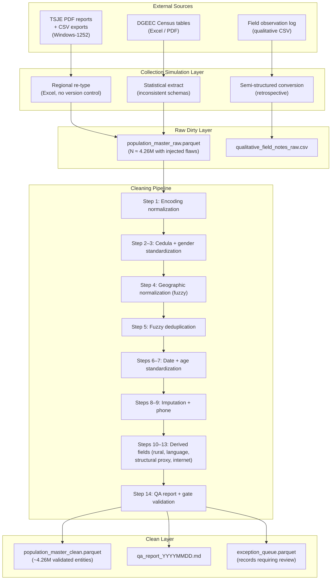
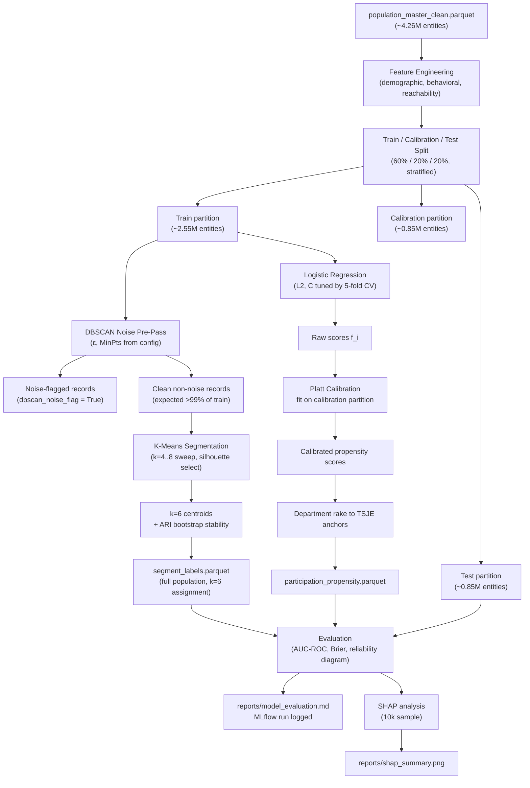

# scope_module_A_population_modeling_and_segmentation.md

---

# Module A — Population Modeling and Segmentation System

**Internal title:** Synthetic Population Modeling, Demographic Calibration, and Behavioral Segmentation Engine  
**External title:** Large-Scale Synthetic Population Generation with Behavioral Segmentation and Propensity Modeling  
**Module status:** Tier 1 — Fully implemented, deployed, recommended entry point  
**Source documents:** Original Projects 1 and 6 (TSJE turnout stratification section)  
**Audience for this file:** Internal implementation reference only

---

## 1. Project Identity

### One-sentence problem statement
Generate a synthetic population of 4.26 million entities with statistically faithful demographic structure, realistic data quality problems, and calibrated behavioral propensities, then segment that population into operationally distinct groups to support resource allocation and engagement prioritization decisions.

### Business value framing

**What decision does this module support?**
Two decisions, sequentially:

1. How to describe a large heterogeneous population in terms that are both statistically grounded and operationally useful — which entities are reachable through which channels, which have high response propensity, and which geographic concentrations warrant priority attention.
2. How to divide that population into a tractable number of segments with meaningfully different profiles so that downstream allocation and engagement decisions can be made at segment level rather than at the individual level.

**What is the cost of getting this wrong?**
A miscalibrated population model produces segments that do not reflect the actual distribution of behavioral propensities across geographic units and demographic strata. A resource allocation system built on those segments will misdirect budget: concentrating spend on already-committed entities, under-serving high-volatility entities, and systematically misreading the reachability constraints that determine what is operationally possible in each geographic unit.

**What would a practitioner do differently with this module vs without it?**
Without: assign entities to geographic units based on administrative boundaries and intuitive rules, apply uniform response rate assumptions across the population, and discover segment-level behavioral differences only after resources have been committed. With: enter the allocation phase with calibrated segment profiles, verified demographic structure, documented data quality problems and their resolutions, and a propensity model that has been evaluated against the known aggregate participation rate.

### Generalization scope
The pipeline in this module is applicable to any program requiring population-level behavioral modeling from heterogeneous administrative data: customer acquisition programs with multi-source CRM records, public health outreach with census-linked household registries, NGO participation programs with regional demographic variation, or industrial demand forecasting with geographic segmentation. The calibration anchors and domain parameters are replaceable; the synthetic generation architecture, IPF/raking methodology, and segmentation pipeline transfer directly.

---

## 2. Honest Narrative (Module-Specific)

The original version of this system was a voter file in Excel, re-typed from PDF reports, with encoding corruption, inconsistent geographic names, and no reproducibility. The segmentation was informal: geographic intuition plus historical precedent. The propensity model did not exist as a formal object.

This module reconstructs that work as it should have been built: a deterministic synthetic data generator calibrated to verified demographic and behavioral anchors, a flaw-injection layer that preserves the messiness of the original collection environment, a reproducible cleaning pipeline with documented steps and QA gates, and a segmentation model with formal evaluation. Every design choice is documented in the decision log. Every calibration claim is traceable to a primary source.

---

## 3. Calibration Anchors (Module A)

All values below appear in `config/calibration_anchors.yaml` and are validated by `src/population_segmentation/data/validator.py` at generation time. Tolerance bounds are enforced as hard QA gates.

| Anchor | Value | Source | Tolerance | Field in schema |
|---|---|---|---|---|
| Total entity count (generation default) | 4,260,816 | TSJE, April 22, 2018 | Exact | N/A — controls generation loop |
| Total entity count (RCP snapshot scenario) | 4,241,507 | TSJE, RCP | Exact | N/A — scenario flag |
| National participation rate | 61.25% | TSJE, 2018 | ±0.1 pp | `participation_propensity` mean |
| Youth cohort (18–24) — count | 884,927 | TSJE, 2018 | ±1% | Age draw |
| Youth cohort (18–24) — participation rate | 52.8% | TSJE, 2018 | ±0.5 pp | `participation_propensity` by age bin |
| Female participation rate | 69.46% | TSJE, 2018 | ±0.2 pp | `participation_propensity` by gender |
| Male participation rate | 67.72% | TSJE, 2018 | ±0.2 pp | `participation_propensity` by gender |
| Urban share | 61.7% | DGEEC 2018 | ±0.3 pp | `rural_flag` |
| Rural share | 38.3% | DGEEC 2018 | ±0.3 pp | `rural_flag` |
| Male population share | 50.4% | DGEEC 2018 | ±0.2 pp | `gender` |
| Female population share | 49.6% | DGEEC 2018 | ±0.2 pp | `gender` |
| Median age (2012 baseline) | 21.6 years | DGEEC Censo 2012 | ±1 year | `age` distribution |
| Working-age 15–64 share | 64.1% | DGEEC 2018 | ±0.5 pp | `age` distribution |
| 65+ share | 6.4% | DGEEC 2018 | ±0.3 pp | `age` distribution |
| Central + Asunción population share | ~37% | DGEEC 2018 | ±1 pp | `department` draw |
| Alto Paraná census population | >737,000 | DGEEC Censo 2012 | >700,000 | `department` draw |
| Itapúa census population | >554,000 | DGEEC Censo 2012 | >530,000 | `department` draw |
| Chaco departments combined share | <3% | DGEEC 2018 | <3.5% | `department` draw |
| Jopará bilingual share | 46% | DGEEC bilingualism | ±1 pp | `language_census_bucket` |
| Guaraní-only share | 34% | DGEEC bilingualism | ±1 pp | `language_census_bucket` |
| Spanish-only share | 15% | DGEEC bilingualism | ±1 pp | `language_census_bucket` |
| Rural sanitary deficit (NBI) | 65.9% of rural HH | DGEEC NBI, Censo 2012 | ±2 pp | `nbi_stress_prior` (rural strata) |
| Urban sanitary deficit (NBI) | 25.2% of urban HH | DGEEC NBI, Censo 2012 | ±2 pp | `nbi_stress_prior` (urban strata) |
| Presidente Hayes participation rate | 32.37% | TSJE, 2018 | ±0.5 pp | `participation_propensity` by department |
| Alto Paraná participation rate | 37.47% | TSJE, 2018 | ±0.5 pp | `participation_propensity` by department |
| Central participation rate | 43.99% | TSJE, 2018 | ±0.5 pp | `participation_propensity` by department |
| Guairá participation rate | 58.26% | TSJE, 2018 | ±0.5 pp | `participation_propensity` by department |
| Blank outcome rate — presidential | 2.41% | TSJE, 2018 | ±0.2 pp | `ballot_blank_president` |
| Blank outcome rate — Parlasur | 8.48% | TSJE, 2018 | ±0.3 pp | `ballot_blank_parlasur` |
| Urban internet penetration (HH) | 73.4% | National ICT survey, ~2018 | ±2 pp | `internet_access_flag` by `rural_flag` |
| Rural internet penetration (HH) | 27.9% | National ICT survey, ~2018 | ±2 pp | `internet_access_flag` by `rural_flag` |

---

## 4. Data Pipeline Specification

### 4.1 Collection simulation

The original data arrived through three physically separate collection streams, each with distinct failure modes:

**Stream 1: Electoral registry (TSJE)**
The national authority issued entity roll data as department-level PDF reports and occasional CSV exports encoded in Windows-1252. Field coordinators in regional offices re-typed subsets into Excel files saved locally on individual machines. Files were shared via email and WhatsApp with no version control, no naming conventions, and no deduplication protocol. Multiple regional offices independently re-entered overlapping subsets, producing duplicates with minor name-spelling differences.

**Stream 2: Geographic and demographic data (DGEEC)**
Census tables were downloaded as PDF or Excel files from the official statistical office website. Different team members extracted different subsets at different times, producing inconsistent column naming and mixed date formats.

**Stream 3: Qualitative field observations**
The program director collected informal qualitative data through direct observation: transit rides across the capital, noting billboard placements, poster density by neighborhood, and radio content. These observations were later converted to a semi-structured CSV (`qualitative_field_notes_raw.csv`) with free-text descriptions, approximate geographic tags, and subjective sentiment scores. This layer is simulated for completeness; it feeds downstream signal tracking but does not affect the core population model.

### 4.2 Raw dirty layer

| Field | Source stream | Flaw type | Description |
|---|---|---|---|
| `cedula` | TSJE re-type | `FMT` | Mixed 7-digit and 8-digit formats; zero-padding absent in older records |
| `cedula` | TSJE re-type | `DUP` | Same entity re-entered by multiple regional offices with minor spelling differences in name fields |
| `department` | TSJE CSV + re-type | `TYP` | Manual transcription variants: "Cordillera" vs "Cordilera", "Caaguazu" vs "Caaguazú", "Misiones" vs "Misione" |
| `municipality` | TSJE re-type | `NUL` | ~8% blank; field worker left empty when uncertain of correct spelling |
| `dob` | TSJE re-type | `FMT` | Mixed DD/MM/YYYY (majority of regional offices) and MM/DD/YYYY (two offices using US-locale Excel settings) |
| `encoding` | TSJE CSV export | `ENC` | Windows-1252 source; special characters (ñ, á, é, etc.) garbled on UTF-8 read without explicit decode |
| `phone` | Regional office entry | `FMT` | Three coexisting formats: `0981XXXXXXX`, `+595981XXXXXXX`, `981XXXXXXX` |
| `gender` | TSJE CSV | `TYP` | "M", "F", "Masculino", "Femenino", "1", "2" across files from different periods |
| `age` / `dob` | TSJE re-type | `RNG` | Derived age values <18 or >120 from transposed date formats |
| `department` | Multiple sources | `SCH` | Column labeled "Depto" in some files, "Departamento" in others, "dept_code" in one export |
| `rural_flag` | Derived field | `NUL` | Not present in raw data; must be derived from municipality-to-urban-classification lookup |
| `qualitative_sentiment` | Field observation log | `TYP` | Hand-scored 1–5 inconsistently; same observer used different scales across dates |
| `qualitative_district` | Field observation log | `NUL` | ~25% of entries have only a neighborhood name, no administrative district identifier |

### 4.3 Cleaning pipeline

Each step is deterministic, seeded where randomness is required, and logged to `reports/transformation_log.md` with before/after counts and the QA threshold for that step.

| Step | Operation | QA gate |
|---|---|---|
| 1 | **Encoding normalization:** detect source encoding with `chardet`; decode to UTF-8; tag provenance `enc_source ∈ {windows1252, utf8, unknown}` | Zero garbled characters in output; `enc_source` populated for 100% of rows |
| 2 | **Cedula format standardization:** apply regex `^\d{7,8}$`; zero-pad 7-digit cédulas to 8 digits; flag non-conforming values as `cedula_invalid = True` | `cedula_invalid` rate < 2%; no null cedulas in output |
| 3 | **Gender normalization:** map all observed variants to canonical `{M, F, unknown}` using lookup table; log unmapped values to exception queue | Zero unmapped gender values after lookup; `unknown` rate < 0.5% |
| 4 | **Geographic dictionary normalization:** fuzzy-match `department` and `municipality` free text against canonical TSJE list using Levenshtein distance (threshold ≤ 2); require human review for distance > 2 | All department names match canonical list; municipality null rate post-imputation < 3% |
| 5 | **Fuzzy deduplication:** block by `department`; within blocks, compute similarity on `(cedula_normalized, name_normalized, dob_normalized)`; collapse matches above Jaro-Winkler threshold 0.92; keep record with most complete fields | Duplicate collapse count logged; deduplication reduces N by expected 0.5–2% |
| 6 | **Date format standardization:** detect DD/MM/YYYY vs MM/DD/YYYY using a rule-based classifier (flag ambiguous cases where day ≤ 12); derive `age_on_event_date` as integer years on April 22, 2018; flag `dob_ambiguous = True` for irresolvable cases | Zero derived ages <18 or >115 after standardization; `dob_ambiguous` rate < 1% |
| 7 | **Age range enforcement:** require `age_on_event_date` ∈ [18, 115]; records outside range flagged `age_out_of_range = True` and excluded from modeling layer (not deleted from dataset) | Zero records with `age_on_event_date` < 18 enter the clean modeling layer |
| 8 | **Municipality imputation:** for records with null municipality, draw from the empirical municipality distribution conditioned on department using a seeded probabilistic mapping; tag `municipality_imputed = True` | Post-imputation null rate < 0.1% |
| 9 | **Phone canonicalization:** normalize to E.164 format (`+595XXXXXXXXX`); flag non-conforming as `phone_invalid = True` | `phone_invalid` rate logged; no normalization errors introduced |
| 10 | **Rural flag derivation:** join municipality to urban/rural classification table from DGEEC; flag `rural_flag_derived = True` for all derived values | 100% coverage; no null `rural_flag` in clean layer |
| 11 | **Language bucket assignment:** assign `language_census_bucket` using a conditional probabilistic model fit to DGEEC bilingualism statistics by `rural_flag` and `department`; rake joint distribution to match national language marginals ±1 pp | Language marginals within tolerance after raking |
| 12 | **Structural dependency proxy:** assign `structural_dependency_proxy` using NBI-grounded priors by `department` × `rural_flag`; elevated probability for San Pedro, Caazapá, Canindeyú rural strata | Department × rural strata coverage 100%; global prevalence within documented prior bounds |
| 13 | **Internet access flag:** assign `internet_access_flag` using conditional Bernoulli draws calibrated to 73.4% urban / 27.9% rural after DGEEC–TSJE rake | Urban/rural marginals within ±2 pp of verified anchors |
| 14 | **QA report generation:** compute and log: input row count, output row count, duplicate collapse count, null rates per field (before and after), range violations found, imputed field counts, calibration anchor validation results | All calibration anchors within tolerance; report saved to `reports/qa_report_YYYYMMDD.md` |

### 4.4 Post-clean QA report specification

The QA report is generated automatically at the end of every pipeline run and saved to `reports/qa_report_YYYYMMDD.md`. It contains:

| Section | Content |
|---|---|
| Row counts | Input rows, output rows, rows excluded (with reason), duplicate collapse count |
| Null rates per field | Before and after cleaning, with threshold flag (PASS / FAIL) |
| Encoding provenance | Count by `enc_source` |
| Calibration anchor validation | Each anchor from section 3: expected value, observed value, tolerance, PASS/FAIL |
| Imputation summary | Count and rate of imputed values per field |
| Exception queue summary | Count of records sent to human review queue and reason codes |
| Flaw injection verification | For synthetic raw layer: count of each injected flaw type, recovery rate after cleaning |

Failure of any PASS/FAIL gate raises a `QAGateFailure` exception in `validator.py` and halts the pipeline. Pipeline does not proceed to feature engineering or modeling on a failed QA run.

### 4.5 Data lineage diagram



---

## 5. Schema Contracts

### 5.1 Core entity schema (`population_master_clean.parquet`)

| Field | Type | Source | Validation rule | Expected range / values | Downstream use |
|---|---|---|---|---|---|
| `entity_id` | `int64` | Generated | Unique, non-null, monotonic | 1 to N | Primary key across all modules |
| `cedula` | `string` | TSJE (cleaned) | Regex `^\d{8}$`, non-null | 8-digit string | Deduplication key |
| `cedula_invalid` | `bool` | Cleaning step 2 | Non-null | `True` if failed format check | QA audit |
| `department` | `string` | TSJE (normalized) | Member of canonical 18-item list | 17 departments + Asunción | Geographic stratification |
| `municipality` | `string` | TSJE (normalized or imputed) | Non-null after imputation | Canonical municipality names | Geographic stratification |
| `municipality_imputed` | `bool` | Cleaning step 8 | Non-null | `True` if imputed | Data quality flag |
| `age_on_event_date` | `int16` | Derived from `dob` | ≥ 18, ≤ 115, non-null | [18, 115] | Age-bin features, propensity model |
| `age_out_of_range` | `bool` | Cleaning step 7 | Non-null | Excluded from modeling if `True` | QA audit |
| `dob_ambiguous` | `bool` | Cleaning step 6 | Non-null | `True` if date format was irresolvable | Data quality flag |
| `gender` | `string` | TSJE (normalized) | Member of `{M, F, unknown}` | `M` ~50.4%, `F` ~49.6% | Demographic stratification |
| `rural_flag` | `bool` | DGEEC lookup, derived | Non-null | `True` ~38.3%, `False` ~61.7% | All stratifications |
| `rural_flag_derived` | `bool` | Cleaning step 10 | Non-null | Always `True` (always derived) | Data quality flag |
| `language_census_bucket` | `string` | DGEEC calibration, probabilistic | Member of `{jopara_bilingual, guarani_only, spanish_only, other}` | 46% / 34% / 15% / ~5% | Language-aware messaging features |
| `jopara_flag` | `bool` | Derived from `language_census_bucket` | Non-null | `True` iff `language_census_bucket == jopara_bilingual` | Project 3 backward compatibility |
| `preference_proxy` | `string` | Probabilistic model, historical vote share | Member of `{A, B, other, none}` | Distribution calibrated to department × urban/rural priors | Segmentation features |
| `preference_proxy_strength` | `float32` | Propensity model | [0.0, 1.0], non-null | Continuous | Segmentation features |
| `participation_propensity` | `float32` | Logistic model + Platt calibration | [0.0, 1.0], non-null | Mean ~0.6125 (national anchor) | Module B allocation target; Module C strata weight |
| `structural_dependency_proxy` | `bool` | NBI-grounded priors × department | Non-null | Elevated in San Pedro, Caazapá, Canindeyú rural | Segmentation features |
| `internet_access_flag` | `bool` | Conditional Bernoulli, DGEEC/ICT | Non-null | Urban ~73.4%, Rural ~27.9% | Reachability features |
| `media_penetration_tv` | `float32` | Department-level lookup table | [0.0, 1.0], non-null | National ~0.89; Asunción/Central ~0.98 | Module B channel caps |
| `media_penetration_radio` | `float32` | Department-level lookup table | [0.0, 1.0], non-null | Varies by department | Module B channel caps |
| `media_penetration_whatsapp` | `float32` | Department × urban/rural lookup | [0.0, 1.0], non-null | Urban higher; rural lower | Module B channel caps |
| `nbi_stress_prior` | `float32` | NBI module, DGEEC Censo 2012 | [0.0, 1.0]; `ESTIMATED` until granular NBI meshes | Rural ~0.659 sanitary anchor | Segmentation feature; flagged ESTIMATED |
| `segment_label` | `string` | K-Means model output | Member of 6-label set | See segment profiles | Module B allocation target |
| `ballot_blank_president` | `bool` | Derived from participation model | Non-null | Rate ~2.41% | Down-ballot roll-off modeling |
| `ballot_blank_parlasur` | `bool` | Derived from participation model | Non-null | Rate ~8.48% | Down-ballot roll-off modeling |
| `enc_source` | `string` | Cleaning step 1 | Member of `{windows1252, utf8, unknown}` | — | Data quality audit |

### 5.2 Media reachability schema (`media_reachability_by_segment.csv`)

| Field | Type | Source | Description |
|---|---|---|---|
| `segment_label` | `string` | K-Means output | One row per segment |
| `segment_size` | `int64` | Aggregated | Count of entities in segment |
| `segment_size_pct` | `float32` | Aggregated | Share of total population |
| `mean_participation_propensity` | `float32` | Aggregated | Mean Platt-calibrated propensity |
| `pct_internet_access` | `float32` | Aggregated | Share with `internet_access_flag = True` |
| `mean_tv_penetration` | `float32` | Aggregated | Mean `media_penetration_tv` |
| `mean_radio_penetration` | `float32` | Aggregated | Mean `media_penetration_radio` |
| `mean_whatsapp_penetration` | `float32` | Aggregated | Mean `media_penetration_whatsapp` |
| `pct_rural` | `float32` | Aggregated | Share with `rural_flag = True` |
| `pct_jopara` | `float32` | Aggregated | Share with `jopara_flag = True` |
| `pct_structural_dependency` | `float32` | Aggregated | Share with `structural_dependency_proxy = True` |
| `dominant_department` | `string` | Mode | Modal department for this segment |
| `primary_reach_channel` | `string` | Derived | Channel with highest mean penetration |

---

## 6. Feature Engineering Specification

All features below are produced by `src/population_segmentation/features/`. Each feature is computed before train/test split. No target-leaking transformations.

### 6.1 Demographic features (`features/demographic.py`)

| Feature name | Type | Derivation | Expected range | Consumed by |
|---|---|---|---|---|
| `age_bin` | `string` | Binned `age_on_event_date`: `{18_24, 25_34, 35_49, 50_64, 65_plus}` | 5 categories | Segmentation, propensity model |
| `age_bin_encoded` | `int8` | Ordinal encoding of `age_bin` | [0, 4] | Model inputs |
| `gender_encoded` | `int8` | Binary: M=1, F=0, unknown=NaN | {0, 1} | Propensity model |
| `youth_flag` | `bool` | `age_on_event_date` ∈ [18, 24] | `True` ~20.8% | Segmentation, propensity model |
| `senior_flag` | `bool` | `age_on_event_date` ≥ 65 | `True` ~6.4% | Segmentation |
| `department_region` | `string` | Lookup: `{ORIENTAL, CHACO}` | 2 categories | Module B routing |
| `metro_flag` | `bool` | `department` ∈ `{Central, Asuncion}` | `True` ~37% | Segmentation, Module B |
| `chaco_flag` | `bool` | `department` ∈ `{Presidente Hayes, Boqueron, Alto Paraguay}` | `True` ~3% | Module B routing cap |

### 6.2 Behavioral features (`features/behavioral.py`)

| Feature name | Type | Derivation | Expected range | Consumed by |
|---|---|---|---|---|
| `preference_proxy_encoded` | `int8` | Label encoding: A=0, B=1, other=2, none=3 | [0, 3] | Segmentation |
| `preference_proxy_strength` | `float32` | Pass-through from schema | [0.0, 1.0] | Segmentation, propensity model |
| `structural_dependency_encoded` | `int8` | Boolean to int | {0, 1} | Segmentation, propensity model |
| `nbi_stress_prior_scaled` | `float32` | Min-max scaled `nbi_stress_prior` | [0.0, 1.0] | Segmentation; flagged ESTIMATED |
| `language_jopara_encoded` | `int8` | `jopara_flag` as int | {0, 1} | Segmentation |
| `language_guarani_flag` | `bool` | `language_census_bucket == guarani_only` | Binary | Segmentation |

### 6.3 Reachability features (`features/reachability.py`)

| Feature name | Type | Derivation | Expected range | Consumed by |
|---|---|---|---|---|
| `reachability_digital` | `float32` | `internet_access_flag * media_penetration_whatsapp` | [0.0, 1.0] | Segmentation, Module B |
| `reachability_broadcast_tv` | `float32` | `media_penetration_tv` | [0.0, 1.0] | Segmentation, Module B channel cap |
| `reachability_broadcast_radio` | `float32` | `media_penetration_radio` | [0.0, 1.0] | Segmentation, Module B channel cap |
| `reachability_index` | `float32` | Weighted average of digital, TV, radio penetration: `0.4 * reachability_digital + 0.35 * reachability_broadcast_tv + 0.25 * reachability_broadcast_radio`; weights in `config/model_params.yaml:reachability_weights` | [0.0, 1.0] | Segmentation, Module B |
| `reachability_tier` | `string` | Quantile-based: `{high, medium, low}` from `reachability_index` | 3 categories | Segment profiles |
| `urban_digital_compound` | `bool` | `rural_flag == False AND internet_access_flag == True` | Binary | Segmentation |
| `rural_offline_compound` | `bool` | `rural_flag == True AND internet_access_flag == False` | Binary; elevated Chaco and northern departments | Segmentation; Module B routing constraint |

### 6.4 Feature matrix for segmentation model

The K-Means clustering input matrix $\mathbf{X} \in \mathbb{R}^{N \times p}$ is assembled from the following features. All continuous features are standardized (mean 0, variance 1) using `StandardScaler` fit on the training partition only.

| Index | Feature | Type after encoding | Notes |
|---|---|---|---|
| 0 | `age_bin_encoded` | Ordinal [0, 4] | Standardized |
| 1 | `gender_encoded` | Binary {0, 1} | NaN → imputed to 0.5 |
| 2 | `rural_flag` | Binary {0, 1} | |
| 3 | `preference_proxy_encoded` | Ordinal [0, 3] | Standardized |
| 4 | `preference_proxy_strength` | Continuous [0, 1] | Standardized |
| 5 | `structural_dependency_encoded` | Binary {0, 1} | |
| 6 | `reachability_digital` | Continuous [0, 1] | Standardized |
| 7 | `reachability_broadcast_tv` | Continuous [0, 1] | Standardized |
| 8 | `reachability_broadcast_radio` | Continuous [0, 1] | Standardized |
| 9 | `youth_flag` | Binary {0, 1} | |
| 10 | `metro_flag` | Binary {0, 1} | |
| 11 | `language_jopara_encoded` | Binary {0, 1} | |
| 12 | `nbi_stress_prior_scaled` | Continuous [0, 1] | Standardized; ESTIMATED flag preserved in metadata |

### 6.5 Feature matrix for propensity model

The logistic regression input matrix $\mathbf{X}_\text{prop} \in \mathbb{R}^{N \times q}$ uses a subset of features plus interaction terms:

| Feature | Notes |
|---|---|
| `age_bin_encoded` | Standardized |
| `gender_encoded` | Binary |
| `rural_flag` | Binary |
| `youth_flag` | Binary; receives heavy negative coefficient prior |
| `senior_flag` | Binary |
| `metro_flag` | Binary |
| `department_logit_offset` | Department-level participation rate offset from 61.25%; computed from TSJE departmental anchors; added as a pre-computed feature rather than one-hot encoding to prevent overfitting on 18 levels |
| `structural_dependency_encoded` | Binary |
| `preference_proxy_strength` | Continuous |
| `internet_access_flag` | Binary |
| `gender_youth_interaction` | `gender_encoded * youth_flag`; captures differential youth deficit by gender |

---

## 7. Modeling Specification

### 7.1 DBSCAN noise pre-pass

**Purpose:** Identify and isolate low-density outlier records before K-Means centroid placement. Outlier records distort centroids; removing them before K-Means produces tighter, more interpretable clusters. DBSCAN output is used only for outlier flagging, not for final segment assignment.

**Mathematical formulation:**

For a dataset $X = \{\mathbf{x}_1, \ldots, \mathbf{x}_N\}$ and parameters $(\varepsilon, \text{MinPts})$:

The $\varepsilon$-neighborhood of a point is defined as:

$$N_\varepsilon(\mathbf{x}) = \{\mathbf{x}' \in X : d(\mathbf{x}, \mathbf{x}') \leq \varepsilon\}$$

A point $\mathbf{x}$ is a **core point** if $|N_\varepsilon(\mathbf{x})| \geq \text{MinPts}$.

A point is a **border point** if it is in the neighborhood of a core point but is not itself a core point.

A point is **noise** if it is neither a core point nor a border point.

Noise points are assigned `dbscan_noise_flag = True` and excluded from the K-Means input matrix $\mathbf{X}$.

**Parameters:**
- $\varepsilon$: tuned via k-distance plot (k = MinPts − 1); stored in `config/model_params.yaml:dbscan_eps`
- $\text{MinPts}$: set to $2 \times p$ where $p$ is the number of features (rule of thumb for high-dimensional data); stored in `config/model_params.yaml:dbscan_min_samples`
- Distance metric: Euclidean on the standardized feature matrix

**Evaluation:** Expected noise rate < 1% of total population; values above 3% trigger a config review logged to the decision log.

**Implementation:** `src/population_segmentation/models/segmentation.py:DBSCANNoiseFilter`

### 7.2 K-Means segmentation

**Purpose:** Partition the non-noise population into $k$ compact, operationally targetable segments. K-Means produces a fixed-k assignment that Module B consumes as allocation targets. The choice of a fixed-k method over a density-based method is deliberate: downstream allocation requires a known, stable number of segments with interpretable profiles.

**Mathematical formulation:**

Given a set of $N'$ non-noise observations $\mathbf{X}' \in \mathbb{R}^{N' \times p}$ and cluster count $k$, K-Means solves:

$$\min_{\{S_1, \ldots, S_k\}} \sum_{j=1}^{k} \sum_{\mathbf{x}_i \in S_j} \|\mathbf{x}_i - \boldsymbol{\mu}_j\|_2^2$$

where $\boldsymbol{\mu}_j = \frac{1}{|S_j|} \sum_{\mathbf{x}_i \in S_j} \mathbf{x}_i$ is the centroid of cluster $j$.

**k selection:** The silhouette coefficient is computed for $k \in \{4, 5, 6, 7, 8\}$ and the elbow is identified in the within-cluster sum of squares (WCSS). Default $k = 6$ based on domain knowledge of the six expected segment types; this is validated against the silhouette-optimized $k$ and any divergence is logged in the decision log.

The silhouette coefficient for a single point $i$ is:

$$s(i) = \frac{b(i) - a(i)}{\max(a(i), b(i))}$$

where $a(i)$ is the mean distance to all other points in the same cluster and $b(i)$ is the mean distance to all points in the nearest neighboring cluster. The mean silhouette score $\bar{s} = \frac{1}{N'}\sum_i s(i)$ is the primary cluster quality metric. Target: $\bar{s} > 0.35$.

**Bootstrap stability:** $B = 100$ bootstrap resamples of size $0.8 N'$; for each resample, K-Means is refit and cluster assignments are compared to the full-data solution using the Adjusted Rand Index (ARI). Target: mean ARI > 0.80 across resamples.

**Initialization:** K-Means++ initialization, 10 independent restarts; best solution by WCSS retained.

**Implementation:** `src/population_segmentation/models/segmentation.py:KMeansSegmenter`

**Expected segment profiles (illustrative; derive from data):**

| Segment label | Key characteristics |
|---|---|
| `rural_committed` | High `preference_proxy_strength` for Entity A; high `participation_propensity`; low `reachability_digital`; high `reachability_broadcast_radio` |
| `urban_high_volatility` | Low `preference_proxy_strength`; moderate `participation_propensity`; high `reachability_digital`; metro flag elevated |
| `youth_volatile` | `youth_flag = True`; low `participation_propensity` (~52.8%); high `reachability_digital`; urban concentration |
| `structurally_dependent_bloc` | High `structural_dependency_proxy`; elevated `participation_propensity`; rural concentration; San Pedro, Caazapá, Canindeyú elevated |
| `rural_low_propensity` | Low `participation_propensity`; low `reachability_digital`; high `rural_offline_compound`; Chaco and northern departments elevated |
| `committed_opposition` | High `preference_proxy_strength` for Entity B; moderate-to-high `participation_propensity`; urban lean |

Segment label strings are written to `segment_label` field in `population_master_clean.parquet` and to the standalone `segment_labels.parquet`.

### 7.3 Participation propensity model

**Purpose:** Produce a calibrated probability score $\hat{p}_i \in [0, 1]$ for each entity representing their expected participation probability. "Calibrated" means the mean predicted probability in any probability bin matches the actual participation rate in that bin — not merely that the model discriminates well.

**Problem type:** Binary classification (participates vs does not participate). Target variable `participated` is synthetic, generated to match TSJE aggregate strata.

**Mathematical formulation:**

The logistic regression models:

$$P(\text{participates}_i = 1 \mid \mathbf{x}_i) = \sigma\!\left(\mathbf{w}^\top \mathbf{x}_i + b\right) = \frac{1}{1 + e^{-(\mathbf{w}^\top \mathbf{x}_i + b)}}$$

The log-likelihood over the training set is:

$$\ell(\mathbf{w}, b) = \sum_{i=1}^{N_\text{train}} \left[ y_i \log \hat{p}_i + (1 - y_i) \log(1 - \hat{p}_i) \right]$$

with L2 regularization: $\ell_\text{reg}(\mathbf{w}, b) = \ell(\mathbf{w}, b) - \frac{\lambda}{2} \|\mathbf{w}\|_2^2$.

Hyperparameter $\lambda$ (inverse of regularization strength $C$ in scikit-learn) is tuned by 5-fold cross-validation on the training set.

**Platt calibration:**

The raw logistic score $f_i = \mathbf{w}^\top \mathbf{x}_i + b$ is passed through a secondary sigmoid fit on a held-out calibration set:

$$P_\text{calibrated}(y = 1 \mid f_i) = \frac{1}{1 + e^{A f_i + B}}$$

Parameters $A$ and $B$ are estimated by maximum likelihood on the calibration set. This two-stage approach decouples discriminative power (fit on train) from probability calibration (fit on calibration holdout), preventing the calibration fit from leaking into model selection.

**Split strategy:**
- 60% train
- 20% calibration (for Platt scaling)
- 20% test (held out; not used until final evaluation)
- Stratified by `department` × `age_bin` × `gender` to preserve strata balance

**Department-level participation constraint:**

After Platt calibration, a post-processing step rakes the predicted probability distribution within each department to match the TSJE departmental anchor. This ensures that mean predicted participation in Alto Paraná converges to 37.47% and Guairá to 58.26% regardless of the logistic model's raw department coefficients. The raking multiplier per department is stored in `config/calibration_anchors.yaml:department_rake_multipliers` and is recomputed at each training run.

**Evaluation metrics:**

| Metric | Definition | Target |
|---|---|---|
| AUC-ROC | Area under receiver operating characteristic curve | > 0.70 |
| Brier score | $\text{BS} = \frac{1}{N}\sum_i (f_i - y_i)^2$ | < 0.22 |
| Calibration reliability diagram | Mean predicted probability vs actual participation rate per decile | Max deviation per bin < 3 pp |
| National mean calibration | Mean $\hat{p}$ over full population | Within ±0.1 pp of 61.25% |
| Youth cohort mean calibration | Mean $\hat{p}$ for `youth_flag = True` | Within ±0.5 pp of 52.8% |
| Gender calibration | Mean $\hat{p}$ by gender | Female within ±0.2 pp of 69.46%; male within ±0.2 pp of 67.72% |
| Department calibration | Mean $\hat{p}$ per exemplar department | All four TSJE exemplars within ±0.5 pp |

**Baseline comparison:** A naive baseline predicting the national mean (61.25%) for all entities achieves Brier score 0.238. The logistic model must beat this. A stratified baseline predicting the TSJE stratum mean by `age_bin` × `gender` × `department_region` must also be reported as a second baseline.

**Explainability:** Permutation feature importance computed on the test set, reporting mean decrease in AUC-ROC per feature over 30 permutation repeats. SHAP values computed on a 10,000-entity random sample from the test set using `shap.LinearExplainer`. Both outputs saved to `reports/` and rendered in the propensity diagnostics notebook.

**Failure modes and known limitations:**

| Limitation | Description |
|---|---|
| Synthetic target circularity | The target variable `participated` is itself generated to match TSJE strata. The model therefore learns to reproduce the generation process, not an independently observed outcome. This is documented explicitly in the model card. |
| Department rake rigidity | Post-hoc raking to department anchors can mask genuine within-department heterogeneity. The raking multiplier is logged so its magnitude is visible. |
| Platt calibration sample size | With N = 4.26M, the 20% calibration set is large; but if sample_size is reduced to 100,000 for development runs, calibration set is 20,000 rows, which may produce noisier $A$ and $B$ estimates. Flag this in QA when `generation.yaml:sample_size < 500000`. |
| Missing gender | `gender = unknown` (~0.5% of records) is imputed to 0.5 for the binary gender feature; this introduces a small systematic bias documented in the model card. |

**Implementation:** `src/population_segmentation/models/propensity.py:PropensityModel`

### 7.4 Modeling pipeline diagram



---

## 8. Deployed Artifact Specification

**Artifact type:** Streamlit dashboard
**Platform:** Render free tier
**URL:** Specified in `README.md` header badge after deployment

### What the dashboard shows

The dashboard has three tabs:

**Tab 1: Segment Explorer**
- Dropdown to select k value (range: 4–8; default 6)
- Segment profile table: segment label, entity count, share of population, mean participation propensity, mean reachability index, dominant department, primary reach channel
- Silhouette score display for selected k
- WCSS elbow chart for k ∈ {4, 5, 6, 7, 8}
- Geographic distribution heatmap by department for each segment (Plotly choropleth using GeoJSON boundaries)

**Tab 2: Propensity Calibration**
- Reliability diagram: 10 decile bins, predicted vs actual participation rate
- National calibration summary: mean predicted vs 61.25% anchor
- Youth / gender / four-department calibration rows with PASS/FAIL indicators
- Permutation importance bar chart (top 10 features)

**Tab 3: Data Quality Report**
- QA report rendered from latest `reports/qa_report_YYYYMMDD.md`
- Row count summary (input / output / excluded)
- Null rate table (before and after cleaning, with threshold flags)
- Calibration anchor validation table

### Usage by a non-technical reviewer
A hiring manager opens the dashboard, selects k=6 from the dropdown, sees a table of six segments with plain-language names and participation rate differentials, and can immediately identify which segment has the lowest reach via digital channels. No code, no file downloads, no setup.

---

## 9. GitHub Structure (Module A)

```
module_a_population_segmentation/
├── README.md                          # Business + technical framing; dashboard link badge
├── docker/
│   └── Dockerfile
├── notebooks/
│   ├── 01_data_quality_exploration.ipynb
│   ├── 02_feature_engineering.ipynb
│   ├── 03_segmentation_analysis.ipynb       # Linked from 10-min guide
│   └── 04_propensity_model_diagnostics.ipynb
├── src/
│   └── population_segmentation/
│       ├── __init__.py
│       ├── data/
│       │   ├── __init__.py
│       │   ├── generator.py           # Synthetic population draws (IPF/raking)
│       │   ├── raw_injector.py        # Deterministic flaw injection
│       │   ├── cleaner.py             # 14-step cleaning pipeline
│       │   └── validator.py           # Schema contracts; QA gate enforcement
│       ├── features/
│       │   ├── __init__.py
│       │   ├── demographic.py         # age_bin, gender_encoded, metro_flag, etc.
│       │   ├── behavioral.py          # preference_proxy_encoded, structural_dependency, etc.
│       │   └── reachability.py        # reachability_digital, reachability_index, etc.
│       ├── models/
│       │   ├── __init__.py
│       │   ├── segmentation.py        # DBSCANNoiseFilter + KMeansSegmenter
│       │   └── propensity.py          # PropensityModel (logistic + Platt + department rake)
│       ├── evaluation/
│       │   ├── __init__.py
│       │   ├── clustering_metrics.py  # silhouette, WCSS, ARI bootstrap
│       │   └── calibration_metrics.py # Brier, reliability diagram, stratum checks
│       ├── visualization/
│       │   ├── __init__.py
│       │   ├── segment_profiles.py    # Profile tables, heatmaps
│       │   └── calibration_curves.py  # Reliability diagram, SHAP summary
│       └── utils/
│           ├── __init__.py
│           ├── seeds.py               # Seed management; rng factory
│           └── schema.py              # Pydantic or dataclass schema definitions
├── app/
│   └── streamlit_dashboard.py         # Three-tab dashboard
├── tests/
│   ├── __init__.py
│   ├── test_generator.py              # Marginal calibration within tolerance
│   ├── test_raw_injector.py           # Flaw injection counts match config
│   ├── test_cleaner.py                # Cleaning steps; QA gates
│   ├── test_validator.py              # Schema violations raise QAGateFailure
│   ├── test_features.py               # Feature ranges, null rates, type correctness
│   ├── test_segmentation.py           # DBSCAN noise rate; K-Means silhouette > threshold
│   └── test_propensity.py             # Brier < 0.22; calibration within tolerance
├── config/
│   ├── generation.yaml                # sample_size, N_full, department_weights, language_priors
│   ├── calibration_anchors.yaml       # All TSJE/DGEEC anchors with tolerance bounds
│   ├── model_params.yaml              # dbscan_eps, dbscan_min_samples, kmeans_k_range, lr_C_grid, reachability_weights
│   └── full_scale_run.md              # Expected runtime and RAM for N = 4,260,816
└── reports/
    ├── case_study_business.pdf
    ├── case_study_technical.pdf
    ├── model_card_segmentation.md
    ├── model_card_propensity.md
    ├── qa_report_template.md
    └── shap_summary.png               # Generated at training time
```

---

## 10. Documentation Package (Module A)

| Artifact | Location | Description |
|---|---|---|
| Module README | `module_a_population_segmentation/README.md` | Business + technical framing; deployed dashboard badge; setup instructions; link to case study |
| Model card — segmentation | `reports/model_card_segmentation.md` | K-Means + DBSCAN: training data description, k selection method, silhouette threshold, bootstrap ARI threshold, known limitations (segment instability at low k, ESTIMATED features) |
| Model card — propensity | `reports/model_card_propensity.md` | Logistic + Platt: features used, calibration method, evaluation metrics against all TSJE strata, synthetic target circularity limitation, intended use, out-of-scope uses |
| Data dictionary (module) | Contributed to `/reports/data_dictionary.md` | All fields in section 5.1 and 5.2 |
| Transformation log (module) | Contributed to `/reports/transformation_log.md` | All 14 cleaning steps with rationale |
| Decision log entries | Contributed to `/reports/decision_log.md` | K selection strategy; DBSCAN vs isolation forest; Platt vs isotonic calibration; department rake approach; ESTIMATED vs VERIFIED feature handling |
| QA report | `reports/qa_report_YYYYMMDD.md` | Auto-generated at each pipeline run |

### Model card: segmentation (outline)

```
Model name: KMeansSegmenter
Version: tracked in MLflow
Training data: population_master_clean.parquet, non-noise partition (>99% of N)
Features: 13 standardized features (section 6.4)
k selection: silhouette + domain knowledge; k=6 default
Primary metric: mean silhouette score (target > 0.35)
Secondary metric: mean ARI across bootstrap resamples (target > 0.80)
Known limitations:
  - nbi_stress_prior is ESTIMATED; segment boundaries sensitive to this feature's values
  - Segment profiles reflect the synthetic generation parameters; they are not directly
    validated against observed behavioral data beyond the aggregate TSJE anchors
Intended use: population segmentation for resource allocation input; Module B integration
Out-of-scope: individual-level behavioral prediction; real-world identity inference
```

### Model card: propensity (outline)

```
Model name: PropensityModel
Version: tracked in MLflow
Training data: 60% split of population_master_clean.parquet
Calibration data: 20% split (Platt parameters)
Test data: 20% split (evaluation only)
Features: 11 features + department_logit_offset (section 6.5)
Target: participated (synthetic binary, calibrated to TSJE aggregate strata)
Primary metric: AUC-ROC (target > 0.70)
Calibration metric: max reliability diagram deviation < 3 pp per decile
Known limitations:
  - Synthetic target circularity: target variable is generated from TSJE anchors;
    model learns to reproduce generation, not independently observed outcomes
  - Post-hoc department raking may mask within-department heterogeneity
  - gender=unknown records imputed; introduces ~0.5% systematic bias
Intended use: participation propensity scoring for allocation and forecast calibration
Out-of-scope: causal effect estimation; policy evaluation; real-world identity profiling
```

---

## 11. Engineering Quality Gates (Module A)

Gates 1–13 from the master scope apply in full. The following additional gates are Module A specific.

| # | Gate | Pass condition |
|---|---|---|
| A1 | Calibration anchor validation | Every TSJE and DGEEC anchor in `config/calibration_anchors.yaml` passes its tolerance check in `validator.py` at the end of each pipeline run |
| A2 | Flaw injection coverage | All 13 flaw types in section 4.2 are present in `population_master_raw.parquet` at rates within ±20% of their configured injection rates |
| A3 | Cleaning recovery rate | QA report shows null rate reduction for `municipality` from ~8% to < 0.1%; duplicate collapse count > 0; encoding errors: 0 garbled characters in clean layer |
| A4 | DBSCAN noise rate | Noise flag rate < 1% on full-scale run; > 3% triggers config review and decision log entry |
| A5 | Silhouette threshold | Mean silhouette score for k=6 solution > 0.35 on test partition |
| A6 | Bootstrap ARI threshold | Mean ARI across 100 bootstrap resamples > 0.80 |
| A7 | Propensity Brier score | Brier score on test partition < 0.22 (beats naive national-mean baseline of 0.238) |
| A8 | Youth cohort calibration | Mean predicted propensity for `youth_flag = True` within ±0.5 pp of 52.8% |
| A9 | Gender calibration | Mean predicted propensity for female within ±0.2 pp of 69.46%; male within ±0.2 pp of 67.72% |
| A10 | Department calibration | All four TSJE exemplar departments within ±0.5 pp of their anchors in the test partition |
| A11 | Segment size coverage | All 6 segments contain ≥ 1% of total population (no empty or near-empty clusters) |
| A12 | Streamlit dashboard loads | Dashboard renders without error on Render free tier; all three tabs load within 30 seconds; k slider updates segment table without page refresh error |

---

## 12. Terminology Compliance (Module A)

### 12.1 High-risk field name replacements

| Original field name | Compliant field name | Status |
|---|---|---|
| `voter_id` | `entity_id` | Replaced |
| `turnout_propensity` | `participation_propensity` | Replaced |
| `party_affinity` | `preference_proxy` | Replaced |
| `party_affinity_strength` | `preference_proxy_strength` | Replaced |
| `clientelism_proxy_flag` | `structural_dependency_proxy` | Replaced |

### 12.2 Narrative framing rules

All prose in the module README, model cards, and Streamlit dashboard uses:
- "participation propensity" not "turnout propensity"
- "preference proxy" not "party affinity"
- "engagement activation" not "mobilization" or "GOTV"
- "program sponsor / focal entity" in narrative prose; "focal entity" acceptable in technical field names only
- "structurally dependent" not "clientelism"
- "outcome event" not "election"
- "survey measurement firm" not "pollster"

### 12.3 Internal naming conventions

| Convention | Rule |
|---|---|
| Python field names | snake_case; no camelCase anywhere |
| Segment labels | Use compliant labels from section 7.2; never use banned terms in label strings |
| YAML config keys | snake_case; no banned terms in key names |
| MLflow experiment names | `module_a_segmentation`, `module_a_propensity`; no domain-specific names |
| Test function names | `test_<what_is_tested>`; descriptive without political framing |
| Notebook titles | Plain technical descriptions; no domain framing that references political operations |

---

*End of scope_module_A_population_modeling_and_segmentation.md*
