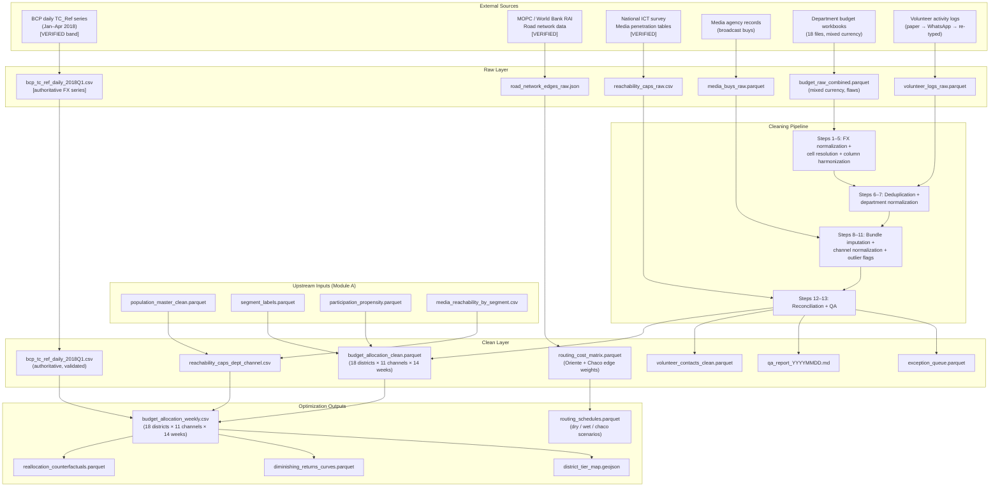
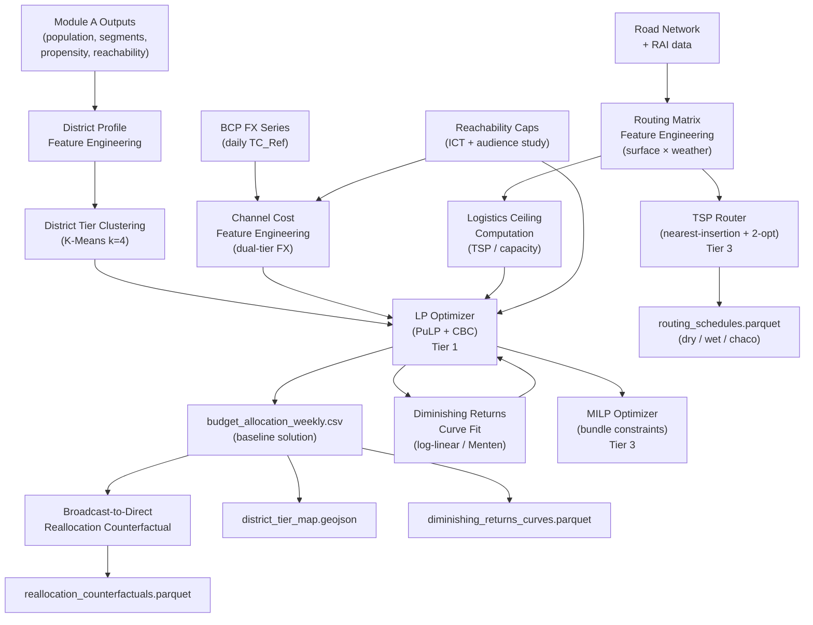

# scope_module_B_resource_allocation_engine.md

---

# Module B — Resource Allocation Engine

**Internal title:** Constrained Multi-Channel Budget Optimization with Geographic Routing and FX-Adjusted Cost Modeling  
**External title:** Constrained Optimization for Regional Resource Deployment Under Real-World Logistics Constraints  
**Module status:** Tier 1 core LP implemented; Tier 2 engineering hardening specified; Tier 3 MILP and routing specified  
**Source document:** Original Project 4  
**Upstream dependency:** Module A outputs (`population_master_clean.parquet`, `segment_labels.parquet`, `participation_propensity.parquet`, `media_reachability_by_segment.csv`)  
**Audience for this file:** Internal implementation reference only

---

## 1. Project Identity

### One-sentence problem statement
Given a constrained budget, 18 geographic units, 11 channel types, time-varying cost coefficients, and verified reachability caps derived from census and infrastructure data, compute the weekly allocation that maximizes expected response rate improvement per dollar while respecting operational logistics constraints.

### Business value framing

**What decision does this module support?**
A single recurring decision made weekly across a 14-week operational window: how to distribute the total available budget across geographic units and channel types to produce the highest possible marginal improvement in confirmed entity contacts, given that channels saturate, costs vary with exchange rate dynamics, and field logistics in a geographically heterogeneous territory impose hard ceilings on what is achievable in a given week regardless of budget.

**What is the cost of getting this wrong?**

| Error type | Consequence |
|---|---|
| Ignoring diminishing returns | Continuing to spend in already-saturated channels; marginal contact rate drops to near zero while nominal spend stays high |
| Uniform geographic allocation | Treating all 18 districts equivalently; high-volatility districts with low current contact rates and high reachability receive the same budget as committed strongholds where additional spend produces no lift |
| Ignoring FX path dependence | Applying a single exchange rate to a four-month budget; systematically mismeasuring the USD cost of PYG-denominated operations by up to 3–5% depending on the month |
| Ignoring logistics ceilings | Allocating field contact budget that assumes rural districts are as accessible as metro districts; generating allocation recommendations that are physically infeasible given road surface and travel time constraints |
| Ignoring bundle constraints | Attempting to buy a single broadcast channel in isolation; facing price premia or outright infeasibility from media group minimum commitment requirements |

In aggregate: a naive allocation model that ignores these five constraints will systematically misdirect resources toward operationally unconstrained channels in accessible urban districts, leaving high-friction high-volatility rural districts underserved precisely where marginal contact value is highest.

**What would a practitioner do differently with this system vs without it?**
Without: allocate based on political intuition, historical spend patterns, and media agency recommendations. Discover saturation retrospectively. Discover logistics infeasibility in the field after budget has already been committed. Without: a static exchange rate assumption buried in a spreadsheet that no one checks.
With: a weekly optimization run that takes updated participation propensity scores from Module A, current FX rates from the BCP daily series, and the reachability caps and routing constraints from the logistics model, and returns an allocation table with expected response rate improvement estimates, district-tier saturation curves, and an explicit counterfactual comparing the current allocation to a broadcast-heavy vs direct-contact-heavy alternative.

### Generalization scope
This module is a constrained resource allocation engine with logistics modeling. The identical pipeline applies to: multi-channel marketing budget optimization across regional sales territories, humanitarian program resource deployment under road-access constraints, public health intervention resource allocation with population-level penetration caps, or any program where a budget must be distributed across heterogeneous geographic units with channel-specific reachability limits and time-varying costs. The domain parameters (channel types, geography, FX dynamics, road friction model) are replaceable configuration inputs. The LP formulation, diminishing returns model, and routing cost matrix are domain-agnostic.

---

## 2. Honest Narrative (Module-Specific)

The original version of this allocation system was a set of Excel workbooks, one per department, maintained by different finance staff using inconsistent column names, mixed currencies, hand-typed exchange rates in cell comments, and no deduplication of volunteer records. Media buys were tracked in a separate agency spreadsheet with no join key to the department budget files. Allocation decisions were made in meetings based on whoever had the most recent numbers and the loudest voice.

This module reconstructs that work as a formal optimization system. The LP formulation makes the objective function explicit: maximize expected response rate improvement per budget unit subject to verified constraints. The FX model treats exchange rate path dependence as a state variable, not a spreadsheet cell. The routing model encodes the actual road infrastructure of the territory, not a uniform speed assumption. Every constraint and every coefficient is traceable to a documented source.

The MILP extension and TSP routing simulation are Tier 3 components: their mathematics and architecture are fully specified here, and their implementation is modular. A practitioner who wants to add bundle constraints or solve the routing problem on a full district graph can do so by implementing the specified interfaces. The Tier 1 LP is fully built and produces defensible allocation recommendations on its own.

---

## 3. Calibration Anchors (Module B)

| Anchor | Value | Source | Status | Config key |
|---|---|---|---|---|
| Total program budget | ~$2,000,000 USD | Internal records | `[ESTIMATED]` | `budget_params.yaml:total_budget_usd` |
| Budget horizon | 14 weeks (Jan–Apr 22, 2018) | Program timeline | `[VERIFIED]` | `budget_params.yaml:n_weeks` |
| Geographic units | 18 (17 departments + Asunción) | TSJE administrative geography | `[VERIFIED]` | `geography.yaml:n_districts` |
| Channel types | 11 (taxonomy in section 4) | Channel taxonomy | `[VERIFIED — structure]` | `channel_taxonomy.yaml` |
| BCP TC_Ref floor — March 2018 | ≥ 5,500 PYG/USD | BCP daily series | `[VERIFIED band]` | `fx_path.yaml:march_floor` |
| BCP TC_Ref band — April 2018 | ~5,600–5,700 PYG/USD | BCP daily series | `[VERIFIED band]` | `fx_path.yaml:april_band` |
| Retail spread (casa de cambio) | ~+50 PYG/USD above TC_Ref | `[PARTIAL]` | `[PARTIAL]` | `fx_path.yaml:delta_spread` |
| National road network length | >70,000 km | MOPC / World Bank RAI, ~2018 | `[VERIFIED]` | `routing_params.yaml:network_km` |
| Paved road share | ~8.7% | MOPC / World Bank RAI, ~2018 | `[VERIFIED]` | `routing_params.yaml:paved_share` |
| Earth / unimproved road share | ~85–88% | MOPC / World Bank RAI, ~2018 | `[VERIFIED]` | `routing_params.yaml:unpaved_share` |
| Unpaved speed multiplier range | 3–8× vs paved baseline | Logistics modeling literature | `[ESTIMATED]` | `routing_params.yaml:time_mult_range` |
| Seasonal impassability days/year | ~70 days | Road access literature, ~2018 | `[VERIFIED band]` | `routing_params.yaml:fragile_days` |
| Rural Access Indicator | 42.4% within ≤2 km all-season paved | World Bank RAI, ~2018 | `[VERIFIED]` | `routing_params.yaml:rural_access_pct` |
| Chaco road share unpaved | ~94% | Road network data, ~2018 | `[VERIFIED]` | `routing_params.yaml:chaco_unpaved_share` |
| Oriente road density | ~0.38 km road/km² | Development diagnostics, ~2018 | `[VERIFIED]` | `routing_params.yaml:oriente_road_density` |
| Chaco population share | ~3% of national | DGEEC 2018 | `[VERIFIED]` | `geography.yaml:chaco_population_share` |
| Urban internet penetration (HH) | 73.4% | National ICT survey, ~2018 | `[VERIFIED]` | `reachability_caps.yaml:urban_internet` |
| Rural internet penetration (HH) | 27.9% | National ICT survey, ~2018 | `[VERIFIED]` | `reachability_caps.yaml:rural_internet` |
| National FTA TV HH reach | ~89% | Audience study, ~2018 | `[VERIFIED]` | `reachability_caps.yaml:fta_tv_national` |
| Asunción + Central FTA TV reach | ~98% | Audience study, ~2018 | `[VERIFIED]` | `reachability_caps.yaml` |
| Alto Paraná + Itapúa FTA TV reach | ~90–92% | Audience study, ~2018 | `[VERIFIED]` | `reachability_caps.yaml` |
| San Pedro + Concepción FTA TV reach | ~75–80% | Audience study, ~2018 | `[VERIFIED]` | `reachability_caps.yaml` |
| Radio attention-to-ads share | 57% | Audience study, ~2018 | `[VERIFIED]` | `reachability_caps.yaml:radio_attention_mult` |
| Radio encendido share | 21.48% | Audience benchmark, ~2018 | `[VERIFIED]` | `reachability_caps.yaml:radio_tune_rate` |
| TV encendido share | 12.90% | Audience benchmark, ~2018 | `[VERIFIED]` | `reachability_caps.yaml:tv_tune_rate` |
| Pay-TV subscriber base | ~610,000 | Industry data, ~2018 | `[VERIFIED]` | `reachability_caps.yaml:pay_tv_subs` |
| Tigo Star pay-TV share | ~75.7% | Industry data, ~2018 | `[VERIFIED]` | `reachability_caps.yaml:tigo_star_share` |
| Open TV ad market scale | ~USD 58M | Industry/advertiser data, ~2018 | `[VERIFIED]` | `reachability_caps.yaml:tv_market_usd` |
| Presidente Hayes participation rate | 32.37% | TSJE, 2018 | `[VERIFIED]` | `district_profiles.yaml` |
| Alto Paraná participation rate | 37.47% | TSJE, 2018 | `[VERIFIED]` | `district_profiles.yaml` |
| Central participation rate | 43.99% | TSJE, 2018 | `[VERIFIED]` | `district_profiles.yaml` |
| Guairá participation rate | 58.26% | TSJE, 2018 | `[VERIFIED]` | `district_profiles.yaml` |

---

## 4. Data Pipeline Specification

### 4.1 Collection simulation

The original budget data arrived through four physically distinct and incompatible streams:

**Stream 1: Department budget workbooks**
Finance staff in 18 regional offices maintained separate Excel workbooks per department, updated weekly. Some staff denominated amounts in PYG; others in USD; a minority mixed both in the same workbook. Exchange rates were typed as cell comments by the person who prepared the file, based on whatever rate was visible on a finance news site at the time of entry. Column names for identical concepts varied across files and across months as staff improvised new columns without versioning. Merged cells were common and caused silent data loss on CSV export.

**Stream 2: Volunteer activity logs**
Volunteer attendance and contact records were kept on paper at local administrative nodes, photographed, shared via WhatsApp to headquarters, and re-typed into a shared spreadsheet by a rotating group of data entry volunteers. The same individual was frequently logged by multiple events in the same week, producing duplicates with minor name-spelling differences. Volunteer identifiers were not standardized: some records used names, others used informal ID numbers, others used phone numbers as identifiers.

**Stream 3: Media buy sheet**
A single media agency maintained a master spreadsheet of broadcast and outdoor advertising purchases. This file used informal department nicknames (e.g., "CDE" for Ciudad del Este / Alto Paraná) rather than the canonical administrative names. Conglomerate bundle tags were missing on approximately 40% of rows. Channel tier descriptors were free text, producing values like "AM", "am radio", "Radio AM", "Radio (AM)", and "radio-am" as synonyms.

**Stream 4: Field observation supplement**
The qualitative field observation layer from Module A provides a supplement for validating media presence claims (billboard placements, radio content audibility) by zone. It does not feed the LP directly but informs the `reachability_adjustment_manual` override field in the reachability cap table.

### 4.2 Channel taxonomy

| Channel ID | Channel name | Type | Cost denomination | Attribution type |
|---|---|---|---|---|
| `ch_whatsapp` | WhatsApp chatbot | Bilateral digital | PYG per contact | Direct response |
| `ch_messenger` | Messenger chatbot | Bilateral digital | PYG per contact | Direct response |
| `ch_facebook_ads` | Facebook targeted ads | Broadcast-to-bilateral | USD per impression (CPC available) | Click / conversion |
| `ch_sms` | SMS outbound | Bilateral | PYG per message | Delivery / response |
| `ch_email` | Email outbound | Bilateral digital | PYG per send | Open / click |
| `ch_tv_fta` | FTA television spot | Broadcast | PYG per GRP | Impression |
| `ch_tv_pay` | Pay-TV spot | Broadcast | PYG per GRP | Impression |
| `ch_radio_am` | AM radio spot | Broadcast | PYG per GRP | Impression |
| `ch_radio_fm` | FM radio spot | Broadcast | PYG per GRP | Impression |
| `ch_billboard` | Outdoor billboard | Broadcast | PYG per unit-week | Impression |
| `ch_canvassing` | Door-to-door canvassing | In-person | PYG per contact-day | Contact result |
| `ch_events` | Rallies and gatherings | In-person | PYG per event | Attendance count |
| `ch_sound_cars` | Mobile audio vehicles | Broadcast | PYG per route-day | Impression |

Note: the original taxonomy included 11 channels; sound cars are added as channel 13 for completeness. The LP solver supports arbitrary channel count via configuration.

### 4.3 Raw dirty layer

| Source | Field | Flaw type | Description |
|---|---|---|---|
| Department budgets | `amount` | `FMT` | Mixed PYG and USD in the same column; no currency label field |
| Department budgets | `fx_rate_cell_comment` | `FMT` | Stale spot rates typed manually; some cells blank; no date stamp on rate |
| Department budgets | `fx_tier` | `NUL` | No distinction between interbank reference (Tier 1) and retail casa de cambio (Tier 2); wrong tier used in ~30% of entries |
| Department budgets | column names | `SCH` | "Gasto", "Costo", "Monto", "Amount" used interchangeably across files and months |
| Department budgets | cell format | `RNG` | Merged cells across rows and columns silently produce blank values on CSV export |
| Volunteer logs | `volunteer_id` | `DUP` | Same volunteer logged by 2–3 different events in the same week under different identifiers |
| Volunteer logs | `contact_result` | `SCH` | "Confirmado", "Si", "1", "Yes", "confirmed", "OK" as synonyms for the same outcome |
| Media buy sheet | `department` | `REF` | Informal nicknames: "CDE" (Alto Paraná), "Asun" (Asunción), "Conce" (Concepción); no canonical join key |
| Media buy sheet | `bundle_id` | `NUL` | Conglomerate package tag missing ~40% of rows; cannot apply bundle floor constraint without it |
| Media buy sheet | `channel_tier` | `TYP` | Free-text channel description: "AM", "am radio", "Radio AM", "Radio (AM)", "radio-am" for the same channel tier |
| Media buy sheet | `amount` | `TYP` | Manual re-keying transpositions: 45,000 → 54,000; detectable only via range outlier flag |
| All budget files | `date` | `FMT` | Some files use ISO dates, others use "Semana 3 Febrero", others use the Excel serial number format |
| All sources | `currency` | `FMT` | PYG vs USD mixed; some cells contain currency symbol embedded in the number string ("Gs. 4500000") |

### 4.4 Cleaning pipeline

| Step | Operation | QA gate |
|---|---|---|
| 1 | **FX tier assignment:** classify each line item `fx_tier ∈ {REF, RETAIL}` from vendor class (`media_agency → REF`; `local_administrative_node_petty_cash → RETAIL`); apply `TC_Ref(date)` for REF rows and `TC_Retail(date) = TC_Ref(date) + Δ_spread` for RETAIL rows; never a single scalar for the full period | All rows have `fx_tier` assigned; zero rows use a static rate; output columns: `amount_pyg`, `amount_usd_ref`, `amount_usd_retail_equiv` |
| 2 | **Excel merged-cell resolution:** detect and expand merged cells before CSV parsing; replace with row-propagated values; log count of expanded cells | Merged cell expansion count logged; zero silent blanks from merges in output |
| 3 | **Column name harmonization:** map all observed column name variants to canonical budget dictionary; version the mapping by `(source_file, month)` to preserve audit trail | 100% of column names in clean layer match canonical dictionary; mapping table committed to `config/column_name_dictionary.yaml` |
| 4 | **Date standardization:** parse "Semana N Mes" as the Monday of that ISO week; parse Excel serial numbers using openpyxl; normalize all dates to ISO 8601; derive `week_number ∈ [1, 14]` | Zero null dates in clean layer; all dates fall within program window Jan–Apr 22, 2018 |
| 5 | **Currency extraction:** strip currency symbols from amount strings; enforce numeric type; flag `currency_symbol_stripped = True` | Zero non-numeric amounts in clean layer |
| 6 | **Volunteer deduplication:** block by `week_number`; within blocks, match on `(name_normalized, phone_normalized)` with Jaro-Winkler threshold 0.92; keep earliest record per person per event; log collapse count | Collapse count logged; post-dedup contact count plausible vs event attendance figures |
| 7 | **Department code normalization:** map media buy sheet informal nicknames to canonical 18-unit list using lookup table; log unmapped entries to exception queue | Zero unmapped department codes after lookup; exception queue count < 1% of rows |
| 8 | **Bundle tag imputation:** for rows with null `bundle_id`, infer from `(broadcaster, channel_tier, purchase_date)` using a lookup against the known media group schedule; tag `bundle_imputed = True` for inferred rows | Post-imputation `bundle_id` null rate < 5%; `bundle_imputed` rate logged |
| 9 | **Channel tier normalization:** map free-text `channel_tier` variants to canonical `channel_id` from taxonomy in section 4.2 using lookup table | 100% of channel descriptions map to a canonical `channel_id`; lookup table committed to config |
| 10 | **Transposition error detection:** flag `amount` values that fall more than 3 IQR above the department × channel × week median; route to exception queue for review; do not auto-correct | Exception queue count logged; no silent auto-corrections |
| 11 | **Contact result normalization:** map all `contact_result` variants to canonical enum `{confirmed, refused, no_contact, unknown}`; log mapping table | 100% coverage; mapping table committed to config |
| 12 | **Cross-source reconciliation:** sum department budget files by week; compare to media buy sheet totals by week; log absolute and percentage discrepancies; flag weeks where discrepancy > 5% of weekly total | Discrepancy report saved; weeks with discrepancy > 5% flagged for decision log review |
| 13 | **QA report generation:** row counts, null rates per field, FX tier coverage, amount range summary, exception queue summary, cross-source reconciliation results | All gates pass or pipeline halts with `QAGateFailure` |

### 4.5 Post-clean QA report specification

| Section | Content |
|---|---|
| Row counts | Input rows per source, output rows, exception queue count |
| FX coverage | Count by `fx_tier`; count with `fx_rate_cell_comment` replaced; zero-static-rate confirmation |
| Currency audit | Rows with `currency_symbol_stripped`; rows with mixed-currency flag |
| Column harmonization | Count of column name variants mapped; unmapped count (should be zero) |
| Volunteer deduplication | Pre-dedup contacts, post-dedup contacts, collapse rate by week |
| Bundle imputation | Pre-imputation null rate, post-imputation null rate, `bundle_imputed` count |
| Transposition flags | Count of `amount_outlier_flag = True` by department |
| Cross-source reconciliation | Weekly discrepancy table; flagged weeks |
| Calibration anchor validation | FX rate values within BCP verified bands; reachability caps within ICT verified ranges |

### 4.6 Data lineage diagram



---

## 5. Schema Contracts

### 5.1 Budget allocation schema (`budget_allocation_clean.parquet`)

| Field | Type | Source | Validation rule | Expected range |
|---|---|---|---|---|
| `district_id` | `string` | Canonical geography | Member of 18-unit list | `{Asuncion, Alto_Paraguay, ...}` |
| `channel_id` | `string` | Channel taxonomy | Member of 13-item list | See section 4.2 |
| `week_number` | `int8` | Derived from date | [1, 14] | 14 weeks |
| `week_start_date` | `date` | Derived | ISO 8601; within Jan–Apr 22, 2018 | [2018-01-01, 2018-04-22] |
| `amount_pyg` | `int64` | Cleaned budget | ≥ 0, non-null | Context-dependent |
| `amount_usd_ref` | `float64` | `amount_pyg / TC_Ref(week_start_date)` | ≥ 0, non-null | Context-dependent |
| `amount_usd_retail_equiv` | `float64` | `amount_pyg / TC_Retail(week_start_date)` | ≥ 0; null if `fx_tier == REF` | Context-dependent |
| `fx_tier` | `string` | Cleaning step 1 | Member of `{REF, RETAIL}` | REF for broadcast; RETAIL for field |
| `tc_ref_applied` | `float64` | BCP daily series | [5,400, 6,000] for Jan–Apr 2018 | BCP verified band |
| `delta_spread_applied` | `float64` | `fx_path.yaml:delta_spread` | ~50; null if `fx_tier == REF` | Default 50 PYG/USD |
| `bundle_id` | `string` | Media buy sheet (cleaned) | Non-null post-imputation | Conglomerate group identifier |
| `bundle_imputed` | `bool` | Cleaning step 8 | Non-null | `True` if inferred |
| `unit_quantity` | `float64` | Cleaned budget | ≥ 0 | GRPs for broadcast; contacts for direct |
| `unit_type` | `string` | Channel taxonomy | Member of `{grp, contact, event, route_day, unit_week}` | Per channel |
| `amount_outlier_flag` | `bool` | Cleaning step 10 | Non-null | `True` if > 3 IQR above weekly median |
| `contact_result` | `string` | Volunteer logs (where applicable) | Member of `{confirmed, refused, no_contact, unknown, N/A}` | Direct channels only |
| `district_region` | `string` | Geography lookup | Member of `{ORIENTAL, CHACO}` | Routing bifurcation |

### 5.2 BCP FX series schema (`bcp_tc_ref_daily_2018Q1.csv`)

| Field | Type | Source | Validation rule |
|---|---|---|---|
| `date` | `date` | BCP publication | ISO 8601; no gaps in Jan–Apr 22, 2018 (weekdays only) |
| `tc_ref` | `float64` | BCP interbank reference | [5,400, 6,000] for this period |
| `tc_retail_estimate` | `float64` | `tc_ref + delta_spread` | `tc_retail_estimate > tc_ref` always |
| `data_source` | `string` | Provenance | `{BCP_official, interpolated_holiday}` |
| `month` | `string` | Derived | Member of `{2018-01, 2018-02, 2018-03, 2018-04}` |

### 5.3 Reachability caps schema (`reachability_caps_dept_channel.csv`)

| Field | Type | Source | Description |
|---|---|---|---|
| `district_id` | `string` | Canonical geography | 18-unit list |
| `channel_id` | `string` | Channel taxonomy | Per channel cap |
| `reach_cap` | `float64` | ICT / audience study | Maximum reachable population share [0, 1] |
| `reach_cap_source` | `string` | Evidence register | Source label; `[VERIFIED]` or `[ESTIMATED]` |
| `urban_rural_stratum` | `string` | DGEEC | `{urban, rural, mixed}` |
| `attention_multiplier` | `float64` | Audience study | Effective reach adjustment (e.g., 0.57 for radio) |
| `pay_tv_eligible` | `bool` | Income proxy | `True` only for Asunción, Central, Alto Paraná urban |
| `digital_reachability` | `float64` | Module A output | From `media_reachability_by_segment.csv` |
| `reachability_adjustment_manual` | `float64` | Field observation supplement | Override for field-observed anomalies; default 1.0 |

### 5.4 Routing cost matrix schema (`routing_cost_matrix.parquet`)

| Field | Type | Source | Description |
|---|---|---|---|
| `origin_node_id` | `string` | Geographic nodes | Municipality or district centroid |
| `destination_node_id` | `string` | Geographic nodes | Municipality or district centroid |
| `edge_class` | `string` | Road network data | Member of `{paved, unpaved_tertiary, earth_track}` |
| `base_travel_time_min` | `float64` | Road network + speed limit | Paved baseline |
| `time_mult_dry` | `float64` | `routing_params.yaml` | Multiplier for standard conditions; 1.0 for paved |
| `time_mult_wet` | `float64` | `routing_params.yaml` | Multiplier under wet/seasonal conditions |
| `adjusted_travel_time_dry_min` | `float64` | Derived | `base_travel_time_min * time_mult_dry` |
| `adjusted_travel_time_wet_min` | `float64` | Derived | `base_travel_time_min * time_mult_wet` |
| `walk_terminal_min` | `float64` | Rural Access Indicator | Last-mile walking time when edge is unpaved-terminal |
| `district_region` | `string` | Geography | `{ORIENTAL, CHACO}` |
| `chaco_flag` | `bool` | Geography | `True` if either node is in Chaco departments |

---

## 6. Feature Engineering Specification

All features below are produced by `src/resource_allocation/features/`. They feed the optimizer as parameters, not as model inputs in the conventional ML sense.

### 6.1 District profile features (`features/district_profiles.py`)

| Feature name | Type | Derivation | Source |
|---|---|---|---|
| `district_population` | `int64` | Module A population count by district | Module A |
| `district_participation_rate_prior` | `float64` | Module A mean propensity by district | Module A |
| `district_high_volatility_share` | `float64` | Share of entities in `urban_high_volatility` or `youth_volatile` segments | Module A |
| `district_committed_share` | `float64` | Share of entities in `rural_committed` or `committed_opposition` segments | Module A |
| `district_tier` | `string` | K-Means k=4 on `{district_participation_rate_prior, district_high_volatility_share, district_committed_share}` | Derived |
| `district_tier_label` | `string` | Mapped from cluster: `{committed_stronghold, high_volatility_priority, opposition_leaning, low_priority}` | Derived |
| `district_region` | `string` | `{ORIENTAL, CHACO}` | Geography lookup |
| `metro_flag` | `bool` | `district_id ∈ {Asuncion, Central}` | Geography |
| `chaco_flag` | `bool` | `district_id ∈ {Presidente_Hayes, Boqueron, Alto_Paraguay}` | Geography |
| `mean_reachability_index` | `float64` | Mean `reachability_index` from Module A by district | Module A |
| `mean_digital_reachability` | `float64` | Mean `reachability_digital` by district | Module A |
| `mean_tv_penetration` | `float64` | TSJE-verified anchor or ICT-derived cap | Reachability caps |
| `mean_radio_penetration` | `float64` | Audience study | Reachability caps |
| `structural_dependency_share` | `float64` | Share with `structural_dependency_proxy = True` | Module A |

### 6.2 Channel cost features (`features/channel_costs.py`)

| Feature name | Type | Derivation | Description |
|---|---|---|---|
| `unit_cost_pyg` | `float64` | Historical or market rate | PYG cost per unit (GRP, contact, etc.) per week |
| `unit_cost_usd_ref` | `float64` | `unit_cost_pyg / tc_ref(week)` | USD cost at interbank reference |
| `unit_cost_usd_retail` | `float64` | `unit_cost_pyg / tc_retail(week)` | USD cost at retail rate |
| `fx_tier` | `string` | Channel class | `REF` for broadcast/billboard; `RETAIL` for field |
| `attention_multiplier` | `float64` | Audience study | Effective conversion adjustment |
| `reach_cap_district` | `float64` | Reachability caps table | Maximum reachable share for this channel × district |
| `bundle_group` | `string` | Media buy sheet | Conglomerate group affiliation |
| `bundle_min_commitment_usd` | `float64` | Conglomerate terms | Minimum spend to unlock bundle pricing (Tier 3 MILP) |
| `unbundle_surcharge_pct` | `float64` | Market intelligence | Price premium for isolated channel buys (Tier 3 MILP) |

### 6.3 Routing matrix features (`features/routing_matrix.py`)

| Feature name | Type | Derivation | Description |
|---|---|---|---|
| `travel_time_matrix_dry` | `np.ndarray` | Road network + `time_mult_dry` | N×N matrix of adjusted travel times, dry scenario |
| `travel_time_matrix_wet` | `np.ndarray` | Road network + `time_mult_wet` | N×N matrix of adjusted travel times, wet scenario |
| `contacts_per_staff_day_dry` | `float64` | `MAX_SHIFT_HOURS / (travel_time + service_time + walk_terminal)` | Effective capacity per field staff member per day |
| `contacts_per_staff_day_wet` | `float64` | Same with wet travel times | Reduced capacity under seasonal conditions |
| `max_contacts_district_week_dry` | `int64` | `contacts_per_staff_day_dry * n_staff * n_days` | Hard ceiling on direct contacts per district per week |
| `max_contacts_district_week_wet` | `int64` | Wet scenario ceiling | Reduced ceiling |
| `chaco_accessibility_score` | `float64` | `1 / mean_adjusted_travel_time` to Chaco nodes | Inversely proportional to travel burden |

---

## 7. Modeling Specification

### 7.1 District strategic tier clustering

**Purpose:** Classify 18 districts into 4 operational tiers that determine budget priority. This is a pre-optimization step that reduces the LP problem to a tractable and interpretable structure.

**Method:** K-Means with $k = 4$ on features `{district_participation_rate_prior, district_high_volatility_share, district_committed_share, mean_reachability_index}`. Standardized prior to clustering.

**Output labels:**

| Tier label | Characteristics | Allocation implication |
|---|---|---|
| `committed_stronghold` | High participation prior; high committed share; already-secured | Maintain floor spend; no incremental investment |
| `high_volatility_priority` | Moderate participation prior; high high-volatility share; high reachability | Highest marginal value; primary LP investment target |
| `opposition_leaning` | High committed share for alternative; lower reachability for primary channels | Minimal incremental spend; monitor not invest |
| `low_priority` | Low participation prior; low reachability; low volatility share | Minimum floor budget only; logistics often prohibitive |

**Validation:** Silhouette score for $k \in \{3, 4, 5\}$; ARI bootstrap stability over 50 resamples. Target: mean silhouette > 0.30 (lower threshold than Module A because district-level aggregation reduces variance).

### 7.2 LP resource allocation optimizer (Tier 1)

**Problem type:** Linear programming (continuous relaxation; implemented with PuLP + CBC solver or CVXPY + CLARABEL).

**Decision variables:**

Let $x_{i,c,t} \geq 0$ be the quantity of channel $c$ purchased in district $i$ in week $t$ (GRPs for broadcast; contacts for direct; unit-weeks for outdoor).

**Objective function:**

$$\max_{\mathbf{x}} \sum_{i=1}^{I} \sum_{c=1}^{C} \sum_{t=1}^{T} \phi_{i,c,t}(x_{i,c,t}) \cdot w_{i,c}$$

where:
- $I = 18$ districts, $C = 13$ channels, $T = 14$ weeks
- $\phi_{i,c,t}(x_{i,c,t})$ is the expected response rate improvement per unit (see diminishing returns model in section 7.3)
- $w_{i,c}$ is the segment-weighted priority weight for district $i$ on channel $c$, derived from `district_high_volatility_share` and `mean_reachability_index`

Note: in the LP relaxation, $\phi_{i,c,t}$ is linearized using a piecewise linear approximation of the diminishing returns curve (see section 7.3). The full nonlinear objective is handled by the MILP + nonlinear solver path in Tier 3.

**Constraints:**

**(1) Weekly budget constraint:**

$$\sum_{i=1}^{I} \sum_{c=1}^{C} \frac{p_{i,c,t}^{\text{PYG}}}{TC_{\text{tier}(c)}(t)} \cdot x_{i,c,t} \leq B_t^{\text{USD}} \quad \forall t \in \{1,\ldots,T\}$$

where:
- $p_{i,c,t}^{\text{PYG}}$ is the PYG-denominated unit acquisition cost in district $i$, channel $c$, week $t$
- $TC_{\text{tier}(c)}(t) = TC_{\text{Ref}}(t)$ for broadcast/outdoor channels; $TC_{\text{Ref}}(t) + \Delta_{\text{spread}}$ for field channels
- $B_t^{\text{USD}}$ is the weekly budget envelope in USD

**(2) Total budget constraint:**

$$\sum_{t=1}^{T} \sum_{i=1}^{I} \sum_{c=1}^{C} \frac{p_{i,c,t}^{\text{PYG}}}{TC_{\text{tier}(c)}(t)} \cdot x_{i,c,t} \leq B_{\text{total}}^{\text{USD}}$$

**(3) Reachability cap constraints:**

$$x_{i,c,t} \leq R_{i,c} \cdot N_i \quad \forall i, c, t$$

where $R_{i,c}$ is the channel-specific reach fraction from `reachability_caps_dept_channel.csv` and $N_i$ is the district population from Module A. This enforces that broadcast GRP purchases do not exceed the actual receivable audience and direct contact allocations do not exceed the reachable population.

**(4) Direct contact logistics ceiling (from routing model):**

$$x_{i,\text{ch\_canvassing},t} \leq \text{max\_contacts\_district\_week\_}s(i,t) \quad \forall i, t$$

where $s(i,t) \in \{\text{dry}, \text{wet}\}$ is the weather scenario flag for week $t$, district $i$.

**(5) Pay-TV eligibility constraint:**

$$x_{i,\text{ch\_tv\_pay},t} = 0 \quad \forall i \text{ where } \text{pay\_tv\_eligible}_{i} = \text{False}$$

**(6) Non-negativity:**

$$x_{i,c,t} \geq 0 \quad \forall i, c, t$$

**FX path scenarios:**

The LP is solved under two FX path configurations defined in `config/fx_path.yaml`:

| Scenario | Description |
|---|---|
| `early_lock` | Budget committed in February–March at strong Guaraní (TC_Ref ≈ 5,500); high PYG-denominated costs fixed early |
| `late_flex` | Budget held in USD until April; benefits from weaker Guaraní (TC_Ref ≈ 5,600–5,700) on domestic field operations |

Both scenarios use the same LP structure; only the `TC_Ref(t)` vector changes. The counterfactual between scenarios is reported in the allocation output.

**Solver configuration:**
- PuLP with CBC (default; open-source, no license)
- CVXPY with CLARABEL as alternative (better scaling for large instances)
- Solver seed fixed via `config/optimization.yaml:solver_seed`
- Maximum solve time: 60 seconds for Tier 1 LP; 300 seconds for Tier 3 MILP

**Output:** `budget_allocation_weekly.csv` — 18 districts × 13 channels × 14 weeks, with fields: `district_id`, `channel_id`, `week_number`, `units_allocated`, `cost_pyg`, `cost_usd_ref`, `expected_response_rate_lift`, `reachability_cap_utilized_pct`.

### 7.3 Diminishing returns model

**Purpose:** Encode the empirical reality that the first dollar in a channel produces more response lift than the hundredth dollar. Without this, the LP drives all budget into the single channel with the highest unit productivity, which is unrealistic and operationally incorrect.

**Mathematical formulation:**

For each `(district, channel)` pair, the expected response rate improvement as a function of spend $x$ follows a concave saturation curve. Two functional forms are supported (selected in `config/model_params.yaml:diminishing_returns_form`):

**Form A: Log-linear (default for piecewise LP approximation)**

$$\phi(x) = \alpha \cdot \ln(1 + \beta \cdot x)$$

Parameters $\alpha > 0$ (scaling) and $\beta > 0$ (productivity) are fit by nonlinear least squares on historical spend-response data per `(district, channel)` where available, or assigned from prior distributions conditioned on `district_tier` and `channel_id` where data is absent.

**Form B: Michaelis-Menten (hyperbolic saturation)**

$$\phi(x) = \frac{\phi_{\max} \cdot x}{K + x}$$

where $\phi_{\max}$ is the asymptotic maximum response rate improvement and $K$ is the half-saturation spend level. This form is used when the theoretical maximum is interpretable (e.g., full channel penetration cap).

**Piecewise linear approximation for LP:**

The nonlinear $\phi(x)$ is approximated by $M$ linear segments for use in the LP:

$$\phi(x) \approx \sum_{m=1}^{M} \Delta\phi_m \cdot \lambda_m, \quad \sum_{m=1}^{M} \lambda_m = 1, \quad \lambda_m \geq 0$$

where $\Delta\phi_m$ is the slope of the $m$-th segment. Because the function is concave, the LP naturally selects the higher-productivity segments first without requiring integer variables.

$M = 5$ segments by default; configurable in `config/model_params.yaml:n_pwl_segments`.

**Parameter estimation:**
- When historical data is available: nonlinear least squares with bounds on $\alpha, \beta$ or $\phi_{\max}, K$.
- When no historical data: use district tier priors from `config/model_params.yaml:diminishing_returns_priors` (indexed by `district_tier × channel_id`).
- ESTIMATED flag applied to all prior-based parameters; VERIFIED flag available only when fit from observed spend-response series.

**Saturation detection:** When `reachability_cap_utilized_pct > 85%` for any `(district, channel, week)`, log a saturation warning in the QA report. This signals that the channel is near its physical ceiling in that district and marginal spending is in the near-flat region of the curve.

### 7.4 MILP optimizer with bundle constraints (Tier 3)

**Purpose:** Extend the LP to enforce media group minimum commitment requirements and budget linking constraints that the continuous LP cannot represent.

**Additional decision variables:**

$$y_G \in \{0, 1\} \quad \forall G \in \mathcal{G}$$

where $y_G = 1$ if conglomerate group $G$ receives any spend in the program.

**Additional constraints:**

**(7) Bundle floor constraint:**

$$\sum_{t=1}^{T} \sum_{i=1}^{I} \sum_{c \in G} \frac{p_{i,c,t}^{\text{PYG}}}{TC_{\text{tier}(c)}(t)} \cdot x_{i,c,t} \geq B_{\min,G}^{\text{USD}} \cdot y_G \quad \forall G \in \mathcal{G}$$

**(8) Unbundle surcharge:**

For channels purchased outside a bundle ($y_G = 0$ but $x_{i,c,t} > 0$ for $c \in G$), apply a per-unit price surcharge:

$$p_{i,c,t}^{\text{PYG,effective}} = p_{i,c,t}^{\text{PYG}} \cdot (1 + \pi_{\text{unbundle},G}) \quad \text{if } y_G = 0$$

Implemented as a mixed-integer penalty term in the objective.

**Solver:** CVXPY with GLPK\_MI or CBC (both open-source). MILP solve time bounded at 300 seconds; if not solved to optimality, best feasible solution is returned with `solver_status` logged.

**Conglomerate map (informational; political lean labels removed):**

| Conglomerate group | Associated channels |
|---|---|
| `grupo_vierci` | Telefuturo (FTA TV), SNT Canal 9, print outlets |
| `grupo_cartes` | Trece (FTA TV), La Tele, radio properties |
| `grupo_zuccolillo` | ABC Color (print), ABC Cardinal 730 AM |
| `albavisión` | Paravisión (FTA TV), regional radio properties |

Channel-to-conglomerate mapping stored in `config/bundle_rules.yaml`. Editorial stance parameters (`ζ_network`) are scenario hyperparameters in `config/model_params.yaml:editorial_stance_multipliers` with default 1.0 (neutral) and are explicitly flagged ESTIMATED.

### 7.5 TSP / VRP routing model (Tier 3)

**Purpose:** Compute the maximum number of confirmed direct contacts achievable per district per week given road network friction, weather conditions, and field staff availability. This is a logistics constraint generator, not an allocation optimizer: its outputs feed the LP/MILP as constraint parameters.

**Input:** Travel time matrix $\mathbf{T} \in \mathbb{R}^{n \times n}$ from `routing_cost_matrix.parquet`, keyed by weather scenario.

**Cost matrix construction:**

$$c_{ij}^{(s)} = \begin{cases} t_{ij}^{\text{base}} & \text{if edge class is paved} \\ t_{ij}^{\text{base}} \times \gamma_s & \text{if edge class is unpaved/earth track} \end{cases}$$

where $\gamma_s \in [3, 8]$ is the surface multiplier for scenario $s \in \{\text{dry}, \text{wet}\}$, drawn from `routing_params.yaml:time_mult_range`.

Last-mile terminal cost is appended for any destination node classified as `rural_offline_compound`:

$$c_{ij}^{(s,\text{eff})} = c_{ij}^{(s)} + \tau_{\text{walk}} \sim \text{Uniform}(\gamma_{\min}, \gamma_{\max})$$

with $\gamma_{\min}, \gamma_{\max}$ from `routing_params.yaml:walk_terminal_minutes`.

**Oriente vs Chaco bifurcation:** District nodes are tagged `{ORIENTAL, CHACO}` before graph construction. Chaco subgraphs use:
- $v_{\max} = $ severely reduced (encoded in edge class `earth_track` with mandatory `time_mult ≥ 5`)
- No small-world shortcuts; enforce actual geographic detours
- 50–65% of destination nodes flagged with elevated `walk_terminal_min`

**TSP formulation (pedagogical Tier 3 for ≤ 25 nodes):**

Given nodes $V$ (locations for a single day's route) and travel time matrix $c_{ij}$:

$$\min \sum_{i \neq j} c_{ij} \cdot x_{ij}$$

subject to:

$$\sum_{j \neq i} x_{ij} = 1 \quad \forall i \in V \quad \text{(leave each node exactly once)}$$

$$\sum_{i \neq j} x_{ij} = 1 \quad \forall j \in V \quad \text{(arrive at each node exactly once)}$$

$$\sum_{i \in S, j \in S, i \neq j} x_{ij} \leq |S| - 1 \quad \forall S \subset V,\ 2 \leq |S| \leq |V| - 1 \quad \text{(Miller-Tucker-Zemlin subtour elimination)}$$

$$x_{ij} \in \{0, 1\}$$

For $n > 25$ (production scale): nearest-insertion initialization followed by 2-opt local search. For $n \leq 25$: exact MILP with CBC.

**Daily capacity post-processing:**

$$\text{contacts\_possible}_{i,\text{week},s} = \left\lfloor \frac{H_{\text{shift}} - T_{\text{route}}^{(s)}}{\bar{t}_{\text{service}}} \right\rfloor \cdot n_{\text{staff}}$$

where:
- $H_{\text{shift}}$ = daily shift length in minutes (from `routing_params.yaml:shift_hours`)
- $T_{\text{route}}^{(s)}$ = TSP route tour length for scenario $s$
- $\bar{t}_{\text{service}}$ = mean service time per contact (from `routing_params.yaml:service_time_min`)
- $n_{\text{staff}}$ = number of field staff assigned to district in that week

This value becomes `max_contacts_district_week_dry` and `max_contacts_district_week_wet` in the LP constraint (4).

**Scenarios produced:** `{dry_standard, wet_election_week, chaco_stress}`. Each scenario produces a separate routing schedule in `routing_schedules.parquet`.

### 7.6 Broadcast-to-direct reallocation counterfactual

**Purpose:** Quantify the estimated change in total confirmed contacts and expected response rate improvement if a defined fraction of broadcast spend (TV + radio + billboard) is reallocated to direct contact channels (canvassing + events + bilateral digital).

**Methodology:**

1. Solve LP under current spend mix $\mathbf{x}^*$ → baseline expected lift $L^*$.
2. Shift $\delta \in \{10\%, 20\%, 30\%\}$ of broadcast budget to direct channels; enforce logistics ceiling; re-solve LP → alternative lift $L^{(\delta)}$.
3. Report: $\Delta L^{(\delta)} = L^{(\delta)} - L^*$, breakdown by district tier, and the logistics ceiling binding constraints that limit the reallocation.

**Caution:** Direct contact reallocation cannot assume linear savings from broadcast removal. The LP's piecewise-linear diminishing returns curves mean that partial broadcast budget reduction may leave the program in the high-productivity region of the broadcast curve, so the freed USD does not translate one-for-one into direct contact gain. This is stated explicitly in the counterfactual output header.

**Output:** `reallocation_counterfactuals.parquet` with fields: `reallocation_pct`, `scenario`, `baseline_lift`, `alternative_lift`, `delta_lift`, `binding_constraint`, `logistics_ceiling_binding_district`.

### 7.7 Modeling pipeline diagram



---

## 8. Deployed Artifact Specification

**Artifact type:** FastAPI application with Swagger UI  
**Platform:** Railway free tier  
**URL:** Specified in `README.md` header badge after deployment

### Endpoint specification

**POST `/allocate`**

Request body:

```json
{
  "total_budget_usd": 2000000,
  "n_weeks": 14,
  "district_list": ["Asuncion", "Central", "Alto_Paraguay", "..."],
  "channel_mix": ["ch_tv_fta", "ch_radio_am", "ch_canvassing", "ch_facebook_ads"],
  "fx_scenario": "early_lock",
  "weather_scenario": "dry_standard",
  "reallocation_counterfactual_pct": 20
}
```

Response (HTTP 200):

```json
{
  "allocation_table": [
    {
      "district_id": "Central",
      "channel_id": "ch_radio_am",
      "week_number": 1,
      "units_allocated": 450.0,
      "cost_usd_ref": 18000.0,
      "expected_response_rate_lift": 0.0031,
      "reachability_cap_utilized_pct": 62.0
    }
  ],
  "total_cost_usd_ref": 1985000.0,
  "total_expected_lift": 0.041,
  "saturation_warnings": ["Central / ch_facebook_ads / week_8: cap 87%"],
  "solver_status": "Optimal",
  "counterfactual_summary": {
    "reallocation_pct": 20,
    "baseline_lift": 0.041,
    "alternative_lift": 0.039,
    "delta_lift": -0.002,
    "binding_constraint": "logistics_ceiling / Alto_Paraguay / week_3"
  }
}
```

Response (HTTP 422 — infeasible):

```json
{
  "detail": "Allocation problem is infeasible under current constraints.",
  "binding_constraint": "weekly_budget / week_1",
  "minimum_budget_required_usd": 2150000.0,
  "suggestion": "Increase total_budget_usd by at least 150,000 or reduce channel_mix."
}
```

**GET `/district-tiers`**

Returns district tier classification with profile summary.

**GET `/reachability-caps`**

Returns reachability caps table for all district × channel combinations.

**GET `/diminishing-returns/{district_id}/{channel_id}`**

Returns the fitted diminishing returns curve parameters and a sample of the curve values.

### Usage by a non-technical reviewer
A program manager opens the Swagger UI at the Railway URL, fills in the budget and channel mix in the request body form, clicks Execute, and receives an allocation table ranked by expected response rate improvement with a plain-English saturation warning where applicable. No code, no solver setup, no FX calculations.

---

## 9. GitHub Structure (Module B)

```
module_b_resource_allocation/
├── README.md
├── docker/
│   └── Dockerfile
├── notebooks/
│   ├── 01_data_quality_exploration.ipynb
│   ├── 02_reachability_analysis.ipynb
│   ├── 03_optimizer_exploration.ipynb      # LP solution analysis
│   └── 04_routing_analysis.ipynb           # TSP cost matrix exploration
├── src/
│   └── resource_allocation/
│       ├── __init__.py
│       ├── data/
│       │   ├── __init__.py
│       │   ├── budget_loader.py            # Load + merge 18 budget workbooks
│       │   ├── fx_loader.py                # Load BCP TC_Ref; compute TC_Retail
│       │   ├── reachability_loader.py      # Load + validate reachability caps
│       │   └── cleaner.py                  # 13-step cleaning pipeline
│       ├── features/
│       │   ├── __init__.py
│       │   ├── district_profiles.py        # Aggregate from Module A
│       │   ├── channel_costs.py            # Dual-tier FX cost coefficients
│       │   └── routing_matrix.py           # Edge weights + logistics ceiling
│       ├── models/
│       │   ├── __init__.py
│       │   ├── district_tier_clustering.py # K-Means k=4 on district features
│       │   ├── diminishing_returns.py      # Log-linear + Menten; PWL approximation
│       │   ├── lp_optimizer.py             # Tier 1: PuLP / CVXPY LP
│       │   ├── milp_optimizer.py           # Tier 3: bundle constraints
│       │   └── tsp_router.py               # Tier 3: nearest-insertion + 2-opt
│       ├── evaluation/
│       │   ├── __init__.py
│       │   ├── allocation_metrics.py       # Lift per dollar, saturation rates
│       │   └── counterfactual.py           # Broadcast-to-direct delta
│       ├── visualization/
│       │   ├── __init__.py
│       │   ├── district_map.py             # Choropleth via GeoPandas + Plotly
│       │   └── allocation_charts.py        # Diminishing returns curves, weekly stacks
│       └── utils/
│           ├── __init__.py
│           ├── fx_utils.py                 # TC_Ref interpolation, tier assignment
│           └── geography.py                # ORIENTAL/CHACO tagging, canonical list
├── app/
│   └── api.py                              # FastAPI; 4 endpoints
├── tests/
│   ├── __init__.py
│   ├── test_fx_loader.py                   # TC_Ref within BCP verified bands
│   ├── test_reachability_loader.py         # Cap values within ICT verified ranges
│   ├── test_cleaner.py                     # All 13 steps; QA gate enforcement
│   ├── test_district_tier_clustering.py    # k=4 silhouette > threshold
│   ├── test_diminishing_returns.py         # Concavity; parameter bounds
│   ├── test_lp_optimizer.py                # Feasibility; budget constraint binding
│   ├── test_milp_optimizer.py              # Bundle floor satisfaction
│   └── test_tsp_router.py                  # Tour validity; Chaco ceiling
├── config/
│   ├── budget_params.yaml                  # total_budget_usd, n_weeks
│   ├── fx_path.yaml                        # TC_Ref series path, delta_spread
│   ├── reachability_caps.yaml              # All channel × district caps
│   ├── bundle_rules.yaml                   # Conglomerate map, B_min, π_unbundle
│   ├── routing_params.yaml                 # time_mult_range, fragile_days, shift_hours
│   ├── channel_taxonomy.yaml               # Channel ID, type, FX tier
│   ├── geography.yaml                      # Canonical district list, region tags
│   ├── model_params.yaml                   # Optimizer params, DR form, cluster k
│   └── full_scale_run.md
└── reports/
    ├── case_study_business.pdf
    ├── case_study_technical.pdf
    ├── model_card_lp_optimizer.md
    ├── model_card_milp_optimizer.md
    ├── model_card_tsp_router.md
    └── qa_report_template.md
```

---

## 10. Documentation Package (Module B)

| Artifact | Location | Description |
|---|---|---|
| Module README | `module_b_resource_allocation/README.md` | Business + technical framing; API endpoint badge; setup; link to case study |
| Model card — LP optimizer | `reports/model_card_lp_optimizer.md` | Objective function, constraints, FX treatment, diminishing returns form, solver, failure modes |
| Model card — MILP optimizer | `reports/model_card_milp_optimizer.md` | Tier 3; bundle constraint formulation, binary variable semantics, solver limits |
| Model card — TSP router | `reports/model_card_tsp_router.md` | Cost matrix construction, Oriente/Chaco bifurcation, weather scenarios, capacity calculation |
| Data dictionary (module) | Contributed to `/reports/data_dictionary.md` | All fields in sections 5.1–5.4 |
| Transformation log (module) | Contributed to `/reports/transformation_log.md` | All 13 cleaning steps |
| Decision log entries | Contributed to `/reports/decision_log.md` | LP vs MILP tier decision; PuLP vs CVXPY; PWL segments count; TSP heuristic choice; FX tier assignment rules |

### Model card: LP optimizer (outline)

```
Model name: LPResourceAllocator
Version: tracked in MLflow
Input features: district_profiles, channel_costs, reachability_caps, routing_ceiling
Objective: maximize expected response rate improvement per USD, subject to 6 constraint types
FX treatment: dual-tier time-varying TC_Ref; two path scenarios (early_lock, late_flex)
Diminishing returns: piecewise-linear approximation, M=5 segments per (district, channel)
Solver: PuLP + CBC (default); CVXPY + CLARABEL (alternative)
Known limitations:
  - Diminishing returns parameters are ESTIMATED for most (district, channel) pairs
    without historical spend-response data; priors from district_tier × channel_id lookup
  - LP relaxation ignores bundle minimum commitments; MILP required for that
  - Routing ceiling uses conservative weather scenario by default; optimistic scenario
    may overestimate achievable direct contacts in wet weeks
Intended use: weekly allocation recommendation; counterfactual analysis; saturation detection
Out-of-scope: individual-level targeting; causal effect estimation; post-hoc attribution
```

---

## 11. Engineering Quality Gates (Module B)

Gates 1–13 from the master scope apply in full. The following additional gates are Module B specific.

| # | Gate | Pass condition |
|---|---|---|
| B1 | FX coverage | Every row in `budget_allocation_clean.parquet` has `fx_tier` assigned; zero rows retain a static rate scalar |
| B2 | TC_Ref validation | All values in `bcp_tc_ref_daily_2018Q1.csv` fall within [5,400, 6,000] PYG/USD for Jan–Apr 2018 |
| B3 | March floor | Mean TC_Ref for March 2018 ≥ 5,500 PYG/USD |
| B4 | Reachability caps within bounds | All cap values in `reachability_caps_dept_channel.csv` within ICT verified ranges ±5 pp |
| B5 | LP feasibility | LP solver returns status `Optimal` on the reference budget scenario; any `Infeasible` outcome triggers a structured 422 response with binding constraint identified |
| B6 | Budget constraint binding | Total allocated cost ≤ `total_budget_usd` in all scenarios; shortfall (unused budget > 5%) triggers a logged warning |
| B7 | Diminishing returns concavity | For all fit curves, $\phi''(x) < 0$ for all $x > 0$; monotone increasing; concavity tests in `test_diminishing_returns.py` |
| B8 | Logistics ceiling respected | No `(district, channel_id=ch_canvassing, week)` allocation exceeds `max_contacts_district_week` for the active weather scenario |
| B9 | Chaco ceiling enforced | No canvassing allocation to Chaco districts exceeds the TSP-derived ceiling; verified by `test_tsp_router.py` |
| B10 | API 200 response | FastAPI `/allocate` endpoint returns HTTP 200 with a valid JSON allocation table for the reference request body |
| B11 | API 422 response | FastAPI `/allocate` endpoint returns HTTP 422 with `binding_constraint` and `minimum_budget_required_usd` when budget is set below feasibility threshold |
| B12 | Counterfactual bounds | Broadcast-to-direct reallocation counterfactual produces `delta_lift` within the theoretically bounded range $[-\phi^*_{\text{broadcast}}, +\phi^*_{\text{direct}}]$; out-of-bounds values trigger a QA flag |

---

## 12. Terminology Compliance (Module B)

### 12.1 High-risk field name replacements

| Original term | Compliant replacement | Location |
|---|---|---|
| `voter_contact` | `confirmed_entity_contact` | Field names, API response |
| `GOTV_budget` | `engagement_activation_budget` | Config keys |
| `canvassing_voter_ids` | `canvassing_entity_ids` | Schema fields |
| `turnout_lift` | `participation_rate_lift` | Metric names |
| `party_preference` | `preference_proxy` | Feature names (inherited from Module A) |
| `electoral_district` | `geographic_unit` / `district` | All references |
| `political_media_buy` | `program_media_buy` | Budget records |
| `campaign_finance` | `program_budget` | All references |

### 12.2 Narrative framing rules

- "media purchasing" not "political advertising"
- "response rate improvement" not "vote gain" or "persuasion lift"
- "geographic unit" or "district" not "constituency"
- "direct contact" not "GOTV contact" or "voter contact"
- "program sponsor" in narrative prose; "focal_entity" acceptable in technical field names only
- "confirmed entity contact" not "confirmed voter"

### 12.3 Internal naming conventions

| Convention | Rule |
|---|---|
| Config file keys | snake_case; no political terminology |
| LP variable names | `x_{i}_{c}_{t}` format; no domain-specific suffix |
| Channel IDs | Neutral descriptors: `ch_canvassing`, `ch_tv_fta`, etc. |
| District tier labels | `committed_stronghold`, `high_volatility_priority`, `opposition_leaning`, `low_priority` |
| MLflow experiment names | `module_b_lp_optimizer`, `module_b_district_clustering` |
| Counterfactual scenario names | `broadcast_heavy`, `direct_contact_heavy`, `balanced` |

---

*End of scope_module_B_resource_allocation_engine.md*
