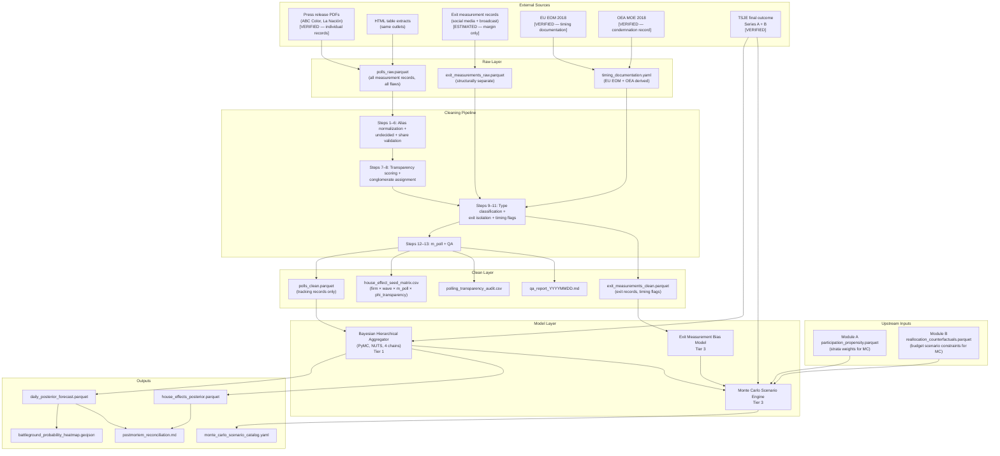
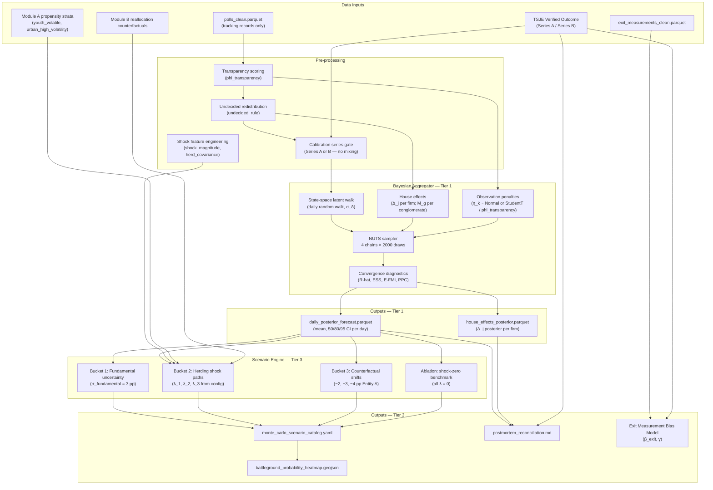

# scope_module_C_forecasting_and_scenario_engine.md

---

# Module C — Probabilistic Forecasting and Scenario Research Engine

**Internal title:** Bias-Aware Bayesian Measurement Aggregation and Uncertainty Propagation Research  
**External title:** Probabilistic Forecasting Under Structural Measurement Bias: A Bayesian Reconstruction  
**Module status:** Tier 1 Bayesian aggregator implemented; Tier 3 scenario engine and exit-measurement bias model specified  
**Framing:** Research-oriented probabilistic reconstruction. This module is a prototype exploring uncertainty propagation and structural measurement bias. It is not positioned as a production forecasting system. Convergence diagnostics, posterior predictive checks, and identifiability constraints are mandatory before any inference claim is stated.  
**Source document:** Original Project 5  
**Upstream dependencies:** Module A (`participation_propensity.parquet`, demographic strata); Module B (`reallocation_counterfactuals.parquet`, budget scenario constraints)  
**Audience for this file:** Internal implementation reference only

---

## 1. Project Identity

### One-sentence problem statement
Given a set of survey measurement records exhibiting systematic firm-level bias, structural opacity, and potential herding effects, construct a Bayesian hierarchical model that recovers a calibrated posterior distribution over the true outcome margin while propagating all sources of uncertainty into scenario simulations.

### Business value framing

**What decision does this module support?**
One class of decisions, repeated weekly across the forecast horizon: whether the current measurement signal reflects a stable and predictable outcome or whether the uncertainty is large enough to warrant operational changes — reallocation of resources, shift in engagement targeting, or adjustment of expected outcomes communicated internally.

**What is the cost of getting this wrong?**

| Error type | Consequence |
|---|---|
| Taking biased headline measurements at face value | Decision-makers believe the outcome is a near-certainty when the posterior credible interval is wide; operational pivots that would have been warranted are not made |
| Under-weighting house effects | Firms with documented directional bias contaminate the aggregate; posterior mean is shifted away from the true outcome margin |
| No uncertainty quantification | Point forecasts communicated without credible intervals; internally, the system cannot distinguish signal from noise in weekly tracker movements |
| Failing to separate tracking from exit measurements | Exit measurement figures released during the outcome event contaminate the tracking posterior; the two instruments have structurally different biases and must be modeled separately |

In this specific case: the raw headline measurement mean across available firms was approximately +20 to +30 pp favoring Entity A. The verified outcome margin was +3.70 pp (Series A, TSJE). A system that ingests headline means without bias correction would overstate certainty in a large margin and fail to identify the competitive scenario that the final result represents. The value of this module is quantifying exactly how large that error is and what a correctly calibrated posterior would have looked like.

**What would a practitioner do differently with this module vs without it?**
Without: report the raw headline mean of available measurement records; communicate a confident large-margin forecast; be wrong by 15–25 pp when the verified margin arrives.
With: fit house effects that absorb systematic firm bias; weight measurement records by transparency and sample size; produce a posterior credible interval that brackets the verified outcome; communicate uncertainty rather than false confidence; use the scenario engine to stress-test operational assumptions against alternative outcome distributions.

### Generalization scope
The Bayesian measurement aggregation pipeline in this module applies to any setting where multiple noisy, potentially biased measurement instruments must be combined to infer a latent quantity: multi-vendor consumer sentiment tracking, analyst forecast aggregation with known institutional biases, multi-source supplier quality scoring, or any program where N observers of the same underlying quantity have different systematic tendencies. The domain-specific parameters (firm priors, transparency penalty, engagement-reduction shock) are replaceable. The hierarchical state-space structure and PyMC implementation transfer directly.

---

## 2. Honest Narrative (Module-Specific)

The original version of this work was no formal system at all. Available measurement records were read and discussed informally. Some records were trusted more than others based on personal familiarity with the firms. No house effects were estimated. No uncertainty was quantified. No distinction was made between tracking and exit measurements. The outcome margin was not predicted; it was experienced as a surprise when preliminary transmission figures showed a far tighter result than the measurement environment had suggested.

This module reconstructs that work as a formal probabilistic model. The house effects that absorbed systematic bias are now estimated parameters with credible intervals. The transparency penalty that should have down-weighted methodologically opaque records is now an explicit multiplier in the observation noise. The uncertainty that was informally felt but never quantified is now a posterior distribution with documented diagnostics.

This reconstruction does not claim it would have predicted the outcome precisely. It claims that a correctly specified model would have known it did not know — which is the more valuable epistemic product. A calibrated 80% credible interval that brackets the verified outcome is more useful than a point forecast that misses by 20 pp.

---

## 3. Research Framing and Epistemic Constraints

This module operates under an explicit epistemic stance that must appear in every public-facing artifact, model card, and notebook preamble:

> "Tracking measurement records in this reconstruction are not treated as independent and identically distributed observations of a latent outcome probability. They enter the model as potentially agenda-setting instruments — records whose public release may itself influence the quantity they purport to measure — alongside classical sampling error. This is a modeling hypothesis, not an adjudicated claim of misconduct. The model uses house effects matrices, transparency weights, and Monte Carlo shock paths to represent this hypothesis, with an ablation branch where all shocks are set to zero as a benchmark comparison."

This framing is stored in `config/model_metadata.yaml:epistemic_disclaimer` and rendered verbatim in the Quarto report and all model cards.

### Calibration series gate

The model must declare exactly one active calibration series per run. Mixing numerators from one series with denominators from another is a configuration error that produces meaningless posterior means.

```yaml
# config/calibration.yaml
calibration:
  series: "A"     # "A" = 46.43 / 42.73 / +3.70 pp [VERIFIED — TSJE]
                  # "B" = 48.96 / 45.08 / +3.88 pp [VERIFIED — TSJE]
  # Enforced by: src/forecasting_scenarios/utils/calibration.py:validate_series_gate()
  # Raises ConfigurationError before model fitting if series is ambiguous or mixed.
```

The posterior convergence check at the end of every MCMC run must confirm that the posterior mean of $\delta_T$ (latent margin on outcome event day) falls within ±2 pp of the Series-declared target. Any run where the posterior mean is outside this band is logged as a calibration failure in the QA report.

---

## 4. Calibration Anchors (Module C)

| Anchor | Value | Source | Status | Config key |
|---|---|---|---|---|
| Final outcome — Series A Entity A | 46.43% | TSJE, 2018 | `[VERIFIED]` | `calibration.yaml:series_a_entity_a` |
| Final outcome — Series A Entity B | 42.73% | TSJE, 2018 | `[VERIFIED]` | `calibration.yaml:series_a_entity_b` |
| Final outcome — Series A margin m* | +3.70 pp | TSJE, 2018 | `[VERIFIED]` | `calibration.yaml:series_a_margin` |
| Final outcome — Series B Entity A | 48.96% | TSJE, 2018 | `[VERIFIED]` | `calibration.yaml:series_b_entity_a` |
| Final outcome — Series B Entity B | 45.08% | TSJE, 2018 | `[VERIFIED]` | `calibration.yaml:series_b_entity_b` |
| Final outcome — Series B margin m* | +3.88 pp | TSJE, 2018 | `[VERIFIED]` | `calibration.yaml:series_b_margin` |
| Pre-outcome internal primary — Entity A | 50.93% / 567,592 | TSJE, Dec 17, 2017 | `[VERIFIED]` | `calibration.yaml:primary_entity_a` |
| Pre-outcome internal primary — Entity B | 43.30% / 482,649 | TSJE, Dec 17, 2017 | `[VERIFIED]` | `calibration.yaml:primary_entity_b` |
| Pre-outcome internal primary — margin | +7.63 pp | TSJE, Dec 17, 2017 | `[VERIFIED]` | `calibration.yaml:primary_margin` |
| National participation rate | 61.25% | TSJE, 2018 | `[VERIFIED]` | `calibration.yaml:national_participation_rate` |
| Youth cohort (18–24) participation | 52.8% | TSJE, 2018 | `[VERIFIED]` | `calibration.yaml:youth_participation_rate` |
| Exit measurement releases before legal window | Documented | EU EOM 2018 | `[VERIFIED]` | `shock_params.yaml:exit_timing_violation` |
| OEA condemnation of early release | Documented | OEA MOE 2018 | `[VERIFIED]` | `shock_params.yaml:oea_condemnation_flag` |
| Capli Feb 2018 measurement record | +13.2 pp | Press record, Feb 2018 | `[VERIFIED]` | `house_effect_seed_matrix.csv` |
| Capli 1 Mar 2018 measurement record | +31.2 pp | Press record, Mar 2018 | `[VERIFIED]` | `house_effect_seed_matrix.csv` |
| Capli Mar 2018 general | +13.3 pp | Press record, Mar 2018 | `[VERIFIED]` | `house_effect_seed_matrix.csv` |
| Capli via ABC Color 6 Apr 2018 | +16.1 pp | Press record, Apr 2018 | `[VERIFIED]` | `house_effect_seed_matrix.csv` |
| Taka Chase / ICA 18 Mar 2018 | +31.4 pp | Press record, Mar 2018 | `[VERIFIED]` | `house_effect_seed_matrix.csv` |
| ECODAT 27 Mar 2018 | +24.4 pp | Press record, Mar 2018 | `[VERIFIED]` | `house_effect_seed_matrix.csv` |
| Grau & Asociados 10 Apr 2018 | +24.3 pp | Press record, Apr 2018 | `[VERIFIED]` | `house_effect_seed_matrix.csv` |
| Ati Snead Mar 2018 | −4.5 pp | Press record, Mar 2018 | `[VERIFIED]` | `house_effect_seed_matrix.csv` |
| Ati Snead 9 Apr 2018 | +28.0 pp | Press record, Apr 2018 | `[VERIFIED]` | `house_effect_seed_matrix.csv` |
| Market / La República Mar 2018 | −4.1 pp | Press record, Mar 2018 | `[VERIFIED]` | `house_effect_seed_matrix.csv` |
| ProLogo 3 Apr 2018 | −1.7 pp | Press record, Apr 2018 | `[PARTIAL — attribution]` | `house_effect_seed_matrix.csv` |
| Raw headline mean (blowout cluster) | ~+20 to +24 pp | Computed from records above | `[SYNTHETIC — computed]` | Baseline comparison |
| Exit measurement margin (reported) | ~60–70% Entity A | Widely reported | `[ESTIMATED]` | `shock_params.yaml:exit_margin_reported` |
| Fundamental uncertainty (±pp) | ~3 pp | Standard political forecasting | `[ESTIMATED]` | `shock_params.yaml:sigma_fundamental` |

---

## 5. Data Pipeline Specification

### 5.1 Collection simulation

Measurement records arrived through two physically distinct streams:

**Stream 1: Press-release PDF extractions**
Firms published results as PDF press releases, typically via ABC Color and La Nación. Research staff manually extracted figures to CSV files. Different firms used different candidate name conventions, different undecided-response handling rules, and different reporting formats. Some press releases included a technical disclosure sheet (ficha técnica); most did not. Field period dates were rarely explicit; single publication dates were provided instead. Sample sizes were sometimes embedded in body text and not captured during manual extraction. Margin of error was absent in most records.

**Stream 2: HTML table extractions**
A minority of records appeared as HTML tables in online editions of the same outlets. Scraped automatically but with inconsistent column structure across outlets and over time.

**Stream 3: Exit measurement records (structurally distinct)**
Exit measurements circulated on outcome event day via social media and broadcast channels, beginning before the legally established release window. These records are modeled as a structurally separate layer with a timing compliance flag derived from EU EOM and OEA documentation. They are never mixed into the tracking posterior; they feed only the exit-measurement bias sub-model (Tier 3).

### 5.2 Raw dirty layer

| Field | Flaw type | Description |
|---|---|---|
| `entity_name` | `TYP` | Same entity referenced as "Mario Abdo", "Marito", "Abdo Benitez", "Benitez", "Abdo B.", across records from different firms and dates |
| `sample_size` | `NUL` | Missing in ~30% of entries; embedded in press release body text and not captured during manual extraction |
| `undecided_pct` | `SCH` | Three incompatible conventions: some records exclude undecided entirely (report A + B shares only), some include as explicit option summing to 100%, some redistribute silently |
| `field_date_start` | `FMT` | "semana pasada" (last week), "mediados de marzo", or absent; single publication date provided instead of field window |
| `field_date_end` | `FMT` | Same as above; commonly null |
| `margin_of_error` | `NUL` | Missing in most press-release extractions; present only when ficha técnica was published |
| `firm_name` | `TYP` | "Capli", "CAPLI", "First Análisis", "First Analisis y Estudios", "Capli / First Análisis" for the same organization |
| `ficha_present` | `BIN` | Binary flag for whether technical disclosure sheet was published; 0/1 encoding inconsistent (some use True/False, some use Yes/No) |
| `conglomerate_carrier` | `TYP` | Media group conduit is sparse and inconsistently named |
| `entity_a_share` | `RNG` | Rare data entry errors producing shares > 100% or < 0% |
| `undecided_rule_applied` | `NUL` | No explicit flag for which redistribution rule was used by the extracting researcher |
| `measurement_type` | `NUL` | No distinction between tracking and exit measurement in raw data; must be inferred from date and context |
| `publication_timing_vs_window` | `NUL` | Not present in raw data; derived from EU EOM / OEA documentation |

### 5.3 Cleaning pipeline

| Step | Operation | QA gate |
|---|---|---|
| 1 | **Entity alias normalization:** create canonical alias map `{entity_id: [all_observed_aliases]}`; replace all variants with canonical `entity_id ∈ {entity_a, entity_b, entity_other}`; log unmapped aliases to exception queue | Zero unmapped entity references in clean layer |
| 2 | **Undecided standardization:** tag each record with `undecided_rule ∈ {exclude, proportional_ab, redistribute_third_party}` based on what can be inferred from context; preserve `NULL` when unresolvable; do not fabricate a redistribution rule | `undecided_rule` populated for ≥ 80% of records; null rate logged |
| 3 | **Sample size recovery:** where sample size is missing, attempt recovery from body text via regex; preserve `NULL` when absent; never fabricate a sample size | `sample_size_recovered` flag logged; fabrication count = 0 |
| 4 | **Field-window imputation:** where `field_date_start` or `field_date_end` is absent, apply default: `field_end = publication_date`, `field_start = publication_date − 7 days`; tag `field_window_imputed = True` | All records have a field window (actual or imputed); `field_window_imputed` rate logged |
| 5 | **Firm name normalization:** map all observed firm name variants to canonical `firm_id ∈ {capli, ica_taka_chase, ecodat, grau, ati_snead, market_la_republica, prolog, other}`; deduplicate rows where same wave appears under two firm name variants | Zero unmapped firm names after normalization |
| 6 | **Share validation:** enforce `entity_a_share + entity_b_share ≤ 100`; enforce `entity_a_share ≥ 0`, `entity_b_share ≥ 0`; flag and route violating rows to exception queue | Exception queue count logged; violating rows excluded from model |
| 7 | **Transparency scorer:** compute `phi_transparency ∈ (0, 1]` from four pillars: `has_ficha`, `sample_size_known`, `field_window_known`, `mode_known`; each pillar worth 0.25; floor of 0.1 for zero-pillar records | All records have `phi_transparency`; mean score logged by firm |
| 8 | **Conglomerate assignment:** map `firm_id` to `conglomerate_group ∈ {grupo_vierci, grupo_cartes, grupo_zuccolillo, albavisión, independent, unknown}` via `config/pollster_priors.yaml:firm_to_conglomerate` | All records have `conglomerate_group` |
| 9 | **Measurement type classification:** classify each record as `{tracking, exit_measurement, quick_count}` based on `field_date_end` relative to outcome event date (April 22, 2018); tag `exit_before_window` using EU EOM / OEA timing documentation | `measurement_type` populated for 100% of records; `exit_before_window` rate logged |
| 10 | **Exit measurement isolation:** records with `measurement_type == exit_measurement` are moved to `exit_measurements_clean.parquet`; they do not enter the tracking posterior likelihood | Zero exit-measurement records in `polls_clean.parquet` |
| 11 | **Publication timing compliance flag:** for exit records, derive `timing_compliance ∈ {legal, early_release, unknown}` from outcome event timeline and EU EOM documentation; store in `exit_measurements_clean.parquet` | All exit records have `timing_compliance` |
| 12 | **m_poll computation:** compute `m_poll = entity_a_share − entity_b_share` for all cleaned records; compute `m_poll_vs_series_a = m_poll − 3.70` and `m_poll_vs_series_b = m_poll − 3.88` | All records have `m_poll`; bias magnitude visible in QA report |
| 13 | **QA report generation** | All gates pass or pipeline halts |

### 5.4 Transparency scorer specification

The transparency score $\phi_{\text{transparency},j}$ for firm $j$ is a weighted sum of disclosure pillars:

$$\phi_{\text{transparency},j} = \max\left(0.1,\ \frac{1}{4}\sum_{k=1}^{4} \mathbf{1}[\text{pillar}_k \text{ disclosed}]\right)$$

| Pillar | Field | Condition for credit |
|---|---|---|
| `has_ficha` | `ficha_present == 1` | Technical disclosure sheet present |
| `sample_size_known` | `sample_size IS NOT NULL` | Sample size not imputed from text |
| `field_window_known` | `field_window_imputed == False` | Field dates explicitly stated |
| `mode_known` | `survey_mode IS NOT NULL` | Interview mode documented (phone, in-person, online) |

Floor of 0.10 prevents infinite observation noise for zero-disclosure records.

The `phi_transparency` value feeds the effective observation noise:

$$\sigma_j^{\text{eff}} = \frac{\sigma_j^{\text{base}}}{\phi_{\text{transparency},j}}$$

A firm with $\phi = 0.25$ (one pillar) has observation noise $4\times$ higher than a fully transparent firm with $\phi = 1.0$.

### 5.5 Post-clean QA report specification

| Section | Content |
|---|---|
| Row counts | Input records, output tracking records, exit records isolated, exception queue |
| Entity alias coverage | Unmapped aliases count (must be zero); alias map version |
| Undecided rule coverage | Distribution of `undecided_rule` values; null rate |
| Sample size | Count recovered from text; count preserved as null |
| Field window | Count imputed vs actual; `field_window_imputed` rate by firm |
| Transparency scores | Mean and median `phi_transparency` by firm; count at floor (0.10) |
| Measurement type | Count by type; exit records isolated count |
| Bias summary | `m_poll` distribution; mean vs Series A m* (3.70 pp); mean vs Series B m* (3.88 pp); firm-level mean `m_poll` table |
| Calibration series gate | Confirmation that `calibration.series` is set; no hybridization detected |

### 5.6 Data lineage diagram



---

## 6. Schema Contracts

### 6.1 Tracking measurement records (`polls_clean.parquet`)

| Field | Type | Source | Validation rule | Notes |
|---|---|---|---|---|
| `record_id` | `string` | Generated | Unique, non-null | `{firm_id}_{publication_date}_{wave_index}` |
| `firm_id` | `string` | Cleaning step 5 | Member of canonical firm list | 8 canonical firms |
| `conglomerate_group` | `string` | Cleaning step 8 | Member of 6-group list | Feeds conglomerate random effect |
| `publication_date` | `date` | Source | ISO 8601; within Dec 2017–Apr 21, 2018 | |
| `field_date_start` | `date` | Actual or imputed | ISO 8601 | |
| `field_date_end` | `date` | Actual or imputed | ISO 8601; ≥ field_date_start | |
| `field_window_imputed` | `bool` | Cleaning step 4 | Non-null | |
| `field_midpoint` | `date` | Derived | `(field_date_start + field_date_end) / 2` | Key date for state-space alignment |
| `entity_a_share` | `float32` | Cleaned | [0.0, 100.0], non-null | Declared share (before undecided redistribution) |
| `entity_b_share` | `float32` | Cleaned | [0.0, 100.0], non-null | |
| `undecided_pct` | `float32` | Cleaned | [0.0, 100.0]; null if excluded by firm | |
| `undecided_rule` | `string` | Cleaning step 2 | Member of `{exclude, proportional_ab, redistribute_third_party, unknown}` | |
| `entity_a_share_adj` | `float32` | Derived after undecided rule | [0.0, 100.0] | Share after redistribution; feeds likelihood |
| `entity_b_share_adj` | `float32` | Derived after undecided rule | [0.0, 100.0] | |
| `m_poll` | `float32` | Cleaning step 12 | Computed `entity_a_share_adj − entity_b_share_adj` | Key observable |
| `m_poll_vs_series_a` | `float32` | Derived | `m_poll − 3.70` | Deviation from Series A m* |
| `sample_size` | `int32` | Actual or null | > 0 if present; null preserved | Never fabricated |
| `margin_of_error` | `float32` | Actual or null | > 0 if present; null preserved | |
| `phi_transparency` | `float32` | Cleaning step 7 | [0.10, 1.0], non-null | Observation noise multiplier |
| `has_ficha` | `bool` | Raw | Non-null | |
| `sample_size_known` | `bool` | Derived | Non-null | |
| `field_window_known` | `bool` | Derived | Non-null | |
| `mode_known` | `bool` | Raw | Non-null | |
| `measurement_type` | `string` | Cleaning step 9 | Member of `{tracking, exit_measurement, quick_count}` | Only `tracking` in this table |
| `wave_cluster` | `string` | Derived | `{early_feb, mid_feb, mar_early, mar_mid, mar_late, apr_early, apr_late}` | Temporal binning for herding analysis |

### 6.2 Exit measurement records (`exit_measurements_clean.parquet`)

| Field | Type | Notes |
|---|---|---|
| `record_id` | `string` | Unique |
| `source_description` | `string` | Free text description of source; not a canonical firm_id |
| `entity_a_reported` | `float32` | Reported share |
| `entity_b_reported` | `float32` | Reported share |
| `m_exit_reported` | `float32` | Reported margin |
| `publication_timestamp` | `datetime` | UTC; critical for timing compliance |
| `timing_compliance` | `string` | Member of `{legal, early_release, unknown}`; derived from EU EOM / OEA documentation |
| `minutes_before_close` | `float32` | Minutes before legal release window; negative = early release |
| `dissemination_channel` | `string` | `{social_media, broadcast, press_release, unknown}` |

### 6.3 House effect seed matrix (`house_effect_seed_matrix.csv`)

| Field | Type | Description |
|---|---|---|
| `firm_id` | `string` | Canonical firm |
| `wave_index` | `int8` | Wave number within firm |
| `publication_date` | `date` | |
| `field_midpoint` | `date` | |
| `m_poll` | `float32` | Observed margin |
| `m_poll_vs_series_a` | `float32` | Deviation from Series A m* |
| `phi_transparency` | `float32` | Transparency score |
| `conglomerate_group` | `string` | |
| `wave_cluster` | `string` | |
| `firm_family` | `string` | `{blowout_cluster, competitive_outlier, volatile_house}` based on section 7.2 priors |
| `bias_prior_direction` | `string` | `{entity_a_favoring, entity_b_favoring, neutral}` from `pollster_priors.yaml` |

---

## 7. Feature Engineering Specification

### 7.1 Measurement record features (`features/poll_features.py`)

| Feature name | Type | Derivation | Consumed by |
|---|---|---|---|
| `days_to_outcome` | `int16` | `outcome_event_date − field_midpoint` | State-space alignment; shock decay |
| `effective_obs_noise` | `float32` | `sigma_base_firm / phi_transparency` | Observation model variance |
| `effective_sample_weight` | `float32` | `1 / effective_obs_noise^2` where `sample_size` available; else `phi_transparency^2` | Likelihood weighting |
| `in_late_campaign_window` | `bool` | `days_to_outcome ≤ 30` | Shock proximity scaling |
| `in_final_week` | `bool` | `days_to_outcome ≤ 7` | Maximum shock clip window |
| `wave_cluster_encoded` | `int8` | Ordinal from temporal bin | Herding covariance computation |
| `same_conglomerate_flag` | `bool` | Computed pairwise | Herding ρ computation |

### 7.2 Shock and herding features (`features/shock_features.py`)

| Feature name | Type | Derivation | Consumed by |
|---|---|---|---|
| `shock_magnitude_raw` | `float32` | `λ₁ * abs(m_poll_vs_series_a) + λ₂ * (1 - phi_transparency)` | MC engine |
| `herd_covariance_weight` | `float32` | $\rho_{\text{herd}}$ from cluster overlap in `wave_cluster` × `conglomerate_group` | MC engine |
| `shock_magnitude_full` | `float32` | `shock_magnitude_raw + λ₃ * herd_covariance_weight` | MC engine |
| `shock_decay_factor` | `float32` | `clip(1 - days_to_outcome / T_horizon, 0, 1)` | Temporal proximity scaling |
| `shock_effective` | `float32` | `shock_magnitude_full * shock_decay_factor` | Applied in MC paths |
| `demobilization_target_segment` | `string` | Derived from Module A: `{youth_volatile, urban_high_volatility, all}` | MC turnout bridge |
| `counterfactual_branch` | `string` | `{shock_active, shock_zero}` | Ablation comparison |

---

## 8. Modeling Specification

### 8.1 Bayesian hierarchical aggregator (Tier 1)

**Purpose:** Recover a calibrated posterior distribution over the latent daily outcome margin $\delta_t$, absorbing firm-level house effects and structural measurement bias, using all available tracking measurement records.

**Problem type:** Bayesian state-space model with hierarchical observation structure. Implemented in PyMC 5.x with NUTS sampler.

**State-space structure:**

Let $\delta_t$ denote the latent log-odds margin on day $t$ (where $t = 0$ is January 1, 2018 and $t = T^*$ is April 22, 2018):

$$\delta_t = \delta_{t-1} + \varepsilon_t, \quad \varepsilon_t \sim \mathcal{N}(0,\ \sigma_\delta^2)$$

This is a first-order random walk. The initial state is:

$$\delta_0 \sim \mathcal{N}(\mu_0,\ \sigma_0^2)$$

where $\mu_0$ and $\sigma_0$ are informed by the pre-outcome internal primary result (Entity A 50.93% on December 17, 2017) and the estimated post-primary convergence range.

The daily increment standard deviation $\sigma_\delta$ is given a weakly informative prior:

$$\sigma_\delta \sim \text{HalfNormal}(0.01)$$

This encodes the prior that the true margin moves slowly (order ~0.5 pp/week) absent major shocks, while still allowing larger movements.

**Observation model:**

For measurement record $k$ from firm $j$ with field midpoint day $\tau_k$:

$$\hat{\delta}_k = \delta_{\tau_k} + \Delta_j + M_{\text{conglomerate}[j]} + \eta_k$$

where:
- $\Delta_j$ is the firm-level house effect (systematic directional bias)
- $M_{\text{conglomerate}[j]}$ is the conglomerate-level random effect shared across firms in the same media group
- $\eta_k$ is observation noise

**House effect priors** (stored in `config/pollster_priors.yaml`):

| Firm | Prior distribution | Justification |
|---|---|---|
| `capli` | $\Delta \sim \mathcal{N}(\mu_+ > 0,\ \sigma_\Delta^2)$ | Strong narrow prior; historical proximity to incumbent; prior cycle pattern [PARTIAL] |
| `ica_taka_chase` | $\Delta \sim \mathcal{N}(\mu_+,\ \sigma_\Delta^2)$; $\eta_k \sim \text{StudentT}(\nu=3,\ 0,\ \sigma_j^{\text{eff}})$ | Fat-tailed noise; documented historical prediction failures [PARTIAL] |
| `ecodat` | $\Delta \sim \mathcal{N}(\mu_+,\ \sigma_\Delta^2)$; $\sigma_j^{\text{eff}} \propto 1/\phi_{\text{transparency}}$ | Precision inversely tied to disclosure |
| `grau` | $\Delta \sim \mathcal{N}(\mu_+ > 0,\ \sigma_\Delta^2)$; elevated $\mu_+$ | Blowout framing; press/conflict-of-interest [PARTIAL — verify] |
| `ati_snead` | $\Delta \sim \mathcal{N}(0,\ \sigma_{\Delta,\text{large}}^2)$; time-varying intercept | High intra-firm variance (Mar: −4.5, Apr: +28.0); credibility narrative [PARTIAL] |
| `market_la_republica` | $\Delta \sim \mathcal{N}(0,\ \sigma_\Delta^2)$ | Competitive lean; standard prior |
| `prolog` | $\Delta \sim \mathcal{N}(0,\ \sigma_\Delta^2)$ | Attribution deduplication [PARTIAL]; standard prior until resolved |
| Default / other | $\Delta \sim \mathcal{N}(0,\ 0.05^2)$ | Weakly informative |

All `[PARTIAL]` tags above mean the prior direction is grounded in documented press reporting and institutional history, not in adjudicated misconduct. The model card states this explicitly.

**Conglomerate random effect:**

$$M_g \sim \mathcal{N}(0,\ \sigma_{\text{media}}^2), \quad \sigma_{\text{media}} \sim \text{HalfNormal}(0.02)$$

**Observation noise:**

For standard firms:

$$\eta_k \sim \mathcal{N}\!\left(0,\ \left(\frac{\sigma_j^{\text{base}}}{\phi_{\text{transparency},k}}\right)^2\right)$$

For ICA/Taka Chase (fat-tailed):

$$\eta_k \sim \text{StudentT}\!\left(\nu_j,\ 0,\ \frac{\sigma_j^{\text{base}}}{\phi_{\text{transparency},k}}\right)$$

where $\nu_j \sim \text{Gamma}(2, 0.1)$ with lower bound 1.

**Undecided redistribution:**

Applied before likelihood evaluation. For records with `undecided_rule == exclude`: $\hat{\delta}_k$ is computed from the normalized A and B shares. For `proportional_ab`: undecided share redistributed proportionally. For `redistribute_third_party`: a latent third-party quantity absorbs undecided with partial bleed-back parameterized by `config/model_params.yaml:third_party_bleed`.

**Full posterior:**

$$p\!\left(\{\delta_t\},\ \{\Delta_j\},\ \{M_g\},\ \sigma_\delta,\ \{\sigma_j\},\ \{\nu_j\}\ \middle|\ \mathbf{y}\right) \propto \prod_k p(y_k \mid \delta_{\tau_k}, \Delta_j, M_g, \sigma_j) \cdot \prod_t p(\delta_t \mid \delta_{t-1}, \sigma_\delta) \cdot \prod_j p(\Delta_j) \cdot \prod_g p(M_g)$$

**MCMC configuration:**
- Sampler: NUTS (No-U-Turn Sampler) via PyMC 5.x
- Chains: 4 (parallelized with `cores=4`)
- Warm-up draws: 1,000 per chain
- Sampling draws: 2,000 per chain (8,000 total)
- Target acceptance probability: 0.90
- Random seed: from `RANDOM_SEED` environment variable

**Convergence diagnostics (all required before results are reported):**

| Diagnostic | Target | Action if failed |
|---|---|---|
| $\hat{R}$ (Gelman-Rubin) | $< 1.05$ for all parameters | Log failure; do not report posterior; adjust model or sampler |
| Bulk effective sample size (ESS) | $> 400$ for $\delta_{T^*}$ and all $\Delta_j$ | Same |
| Tail ESS | $> 400$ for key parameters | Same |
| Energy fraction of missing information (E-FMI) | $> 0.2$ | Suggests geometry problem; inspect priors |
| Posterior predictive check | Simulated $\hat{\delta}_k$ distribution should bracket 90% of observed `m_poll` values | Log misfit; investigate firm outliers |
| Calibration series gate | Posterior mean of $\delta_{T^*} \in [m^* - 2, m^* + 2]$ pp | Calibration failure; logged to QA report |

**Evaluation metrics:**

| Metric | Definition | Target |
|---|---|---|
| Posterior mean error | `abs(posterior_mean_delta_T - m*)` | < 2 pp |
| 80% credible interval coverage | Does the 80% CI contain m*? | Yes |
| 95% credible interval coverage | Does the 95% CI contain m*? | Yes |
| House effect posterior mean | Does $\hat{\Delta}_j$ for blowout firms have positive posterior mean? | Yes (directional validation) |
| Posterior predictive p-value | Bayesian p-value for each firm's wave cluster | No extreme values |

**Baseline comparison:**

A naive model that predicts the weekly rolling mean of all available `m_poll` values without any bias correction is computed and reported alongside the hierarchical posterior. The hierarchical model must produce a posterior mean closer to `m*` than the naive model. If it does not, this is a modeling failure logged in the decision log with investigation notes.

**Implementation:** `src/forecasting_scenarios/models/bayesian_aggregator.py:BayesianAggregator`

### 8.2 Monte Carlo scenario engine (Tier 3 full; Tier 1 baseline)

**Purpose:** Propagate uncertainty from the tracking posterior into a distribution of plausible outcome margins on event day, under multiple scenario assumptions.

**Tier 1 baseline (implemented):** Draw from the posterior over $\delta_{T^*}$ plus a fundamental uncertainty term:

$$\delta_{T^*}^{(r)} = \delta_{\text{posterior}}^{(r)} + \varepsilon_{\text{fundamental}}^{(r)}, \quad \varepsilon_{\text{fundamental}}^{(r)} \sim \mathcal{N}(0, \sigma_{\text{fundamental}}^2)$$

with $\sigma_{\text{fundamental}} \approx 3\ \text{pp}$ (from `config/shock_params.yaml:sigma_fundamental`). This produces the baseline scenario distribution.

**Tier 3 full (specified):** Three scenario buckets, each running $R = 10{,}000$ simulations:

**Bucket 1: Baseline (fundamental uncertainty only)**

$$\delta_{T^*}^{(r)} = \delta_{\text{posterior}}^{(r)} + \varepsilon_{\text{fundamental}}^{(r)}$$

**Bucket 2: Measurement-herding engagement-reduction shock paths**

For each measurement record $k$ in the blowout cluster that was released in the March–early-April window, compute the effective shock:

$$s_k = \lambda_1 |\hat{m}_{\text{poll},k} - m^*| + \lambda_2 (1 - \phi_{\text{transparency},k}) + \lambda_3 \rho_{\text{herd},k}$$

clipped by temporal proximity decay factor $\text{clip}(1 - d_k / T_{\text{horizon}}, 0, 1)$.

The aggregate shock for run $r$ applies asymmetrically to Entity B-supporting strata (targeting `youth_volatile` and `urban_high_volatility` segments from Module A with documented participation shortfalls):

$$\delta_{T^*}^{(r)} = \delta_{\text{posterior}}^{(r)} + \varepsilon_{\text{fundamental}}^{(r)} + \sum_k w_k s_k^{(r)}$$

where $w_k$ is drawn from `Normal(1.0, 0.3)` to represent uncertainty in shock transmission.

**Bucket 3: Counterfactual scenario — Entity A final-week shift**

$$\delta_{T^*}^{(r)} = \delta_{\text{posterior}}^{(r)} + \varepsilon_{\text{fundamental}}^{(r)} - \delta_{\text{shift}}$$

where $\delta_{\text{shift}} \in \{2.0, 3.0, 4.0\}$ pp (configured in `shock_params.yaml:counterfactual_shifts`). Tests: "what if Entity A's final-week position were lower?"

**Parameter storage:**

All $\lambda_1, \lambda_2, \lambda_3$, shock clip, and decay parameters are stored in `config/shock_params.yaml`. They are `[ESTIMATED]` and explicitly flagged as such in all outputs. An ablation run with $\lambda_1 = \lambda_2 = \lambda_3 = 0$ (shock-zero benchmark) is mandatory and reported alongside the shock-active run.

**Output format:** `monte_carlo_scenario_catalog.yaml` maps each scenario run to its bucket, parameter values, input posterior draw, and the resulting $\delta_{T^*}^{(r)}$ distribution summary.

**Implementation:** `src/forecasting_scenarios/models/monte_carlo_engine.py:MonteCarloEngine`

### 8.3 Exit-measurement bias model (Tier 3)

**Purpose:** Estimate the structural bias of exit measurements relative to the verified outcome, using the available exit measurement records and their timing compliance flags.

**Inputs:** `exit_measurements_clean.parquet`; verified outcome Series A/B.

**Mathematical formulation:**

$$m_{\text{exit},k} = m^* + \beta_{\text{exit}} + \gamma \cdot \text{early\_release}_k + \epsilon_k$$

where:
- $\beta_{\text{exit}}$ is the systematic upward bias of exit measurements relative to the verified outcome (expected to be large positive given ~60–70% vs 46% anchor)
- $\gamma$ is the additional bias attributable to pre-window release (instruments released before legal close may reflect sampling or framing artifacts from the active participation period)
- $\epsilon_k \sim \mathcal{N}(0, \sigma_{\text{exit}}^2)$

With only a handful of exit measurement records, this model is fit by maximum likelihood (small-data regime; Bayesian overkill). Credible intervals reported via bootstrap.

**Implementation:** `src/forecasting_scenarios/models/exit_measurement_bias.py:ExitBiasModel`

### 8.4 Post-mortem reconciliation

A mandatory post-mortem notebook (`notebooks/04_postmortem.ipynb`) reconciles:

1. Raw headline mean of all available `m_poll` values
2. Naive rolling-mean forecast
3. Bayesian posterior mean at each week of the forecast horizon
4. Bayesian posterior 80% credible interval
5. Verified outcome margin (m*, Series A/B)

The post-mortem answers: how wrong was the raw headline mean? How much did house-effect correction move the posterior? Was the verified outcome within the credible interval? What was the posterior mean error vs the naive baseline?

This is saved as `reports/postmortem_reconciliation.md` and linked from the README.

### 8.5 Modeling pipeline diagram



---

## 9. Deployed Artifact Specification

**Artifact type:** Quarto HTML interactive report  
**Platform:** GitHub Pages  
**URL:** Specified in `README.md` header badge after build

### What the report shows

The Quarto report renders as a single self-contained HTML file with five sections:

**Section 1: Data and Bias Summary**
- Table of all measurement records: `firm_id`, `publication_date`, `m_poll`, `phi_transparency`, `firm_family`
- Column chart: `m_poll` by publication date, colored by `firm_family` (`{blowout_cluster, competitive_outlier, volatile_house}`)
- Transparency audit table: firm-level mean `phi_transparency` with pillar breakdown

**Section 2: Daily Posterior Forecast**
- Line chart: daily posterior mean of $\delta_t$ with 50%, 80%, 95% credible interval ribbons
- Horizontal reference line at m* (Series A or B, per configuration)
- Scatter overlay: individual `m_poll` values at `field_midpoint` dates, sized by `effective_sample_weight`
- Naive rolling-mean comparison line (dashed)

**Section 3: House Effects**
- Dot plot: posterior mean and 90% CI of $\Delta_j$ for each firm, sorted by posterior mean
- Expected direction: blowout-cluster firms should show positive $\Delta_j$; competitive-outlier firms near zero

**Section 4: Scenario Explorer**
- Dropdown: select scenario bucket (`{baseline, herding_shock, counterfactual_2pp, counterfactual_3pp, shock_zero_ablation}`)
- Histogram: distribution of $\delta_{T^*}^{(r)}$ across 10,000 Monte Carlo runs for selected scenario
- Vertical reference lines: m* (Series A) and m* (Series B)
- Summary table: P(Entity A margin > 0), P(Entity A margin > 3.70), mean, SD, 5th/95th percentile

**Section 5: Post-Mortem Reconciliation**
- Table: raw headline mean, naive forecast, posterior mean, 80% CI, verified outcome — week by week
- Chart: posterior mean vs verified outcome over time, with annotation at the outcome event date

### Usage by a non-technical reviewer
A hiring manager opens the GitHub Pages URL and sees a clean chart with the verified outcome margin (+3.70 pp) sitting comfortably inside the 80% credible interval, while the raw headline measurement average was sitting around +20 pp. That gap is the entire point of the module.

---

## 10. GitHub Structure (Module C)

```
module_c_forecasting_scenarios/
├── README.md
├── docker/
│   └── Dockerfile
├── notebooks/
│   ├── 01_poll_data_exploration.ipynb
│   ├── 02_house_effects_analysis.ipynb
│   ├── 03_bayesian_model_diagnostics.ipynb   # Convergence diagnostics; PPC
│   └── 04_postmortem.ipynb                   # Reconciliation; bias decomposition
├── src/
│   └── forecasting_scenarios/
│       ├── __init__.py
│       ├── data/
│       │   ├── __init__.py
│       │   ├── poll_loader.py                # Load and merge poll sources
│       │   ├── cleaner.py                    # 13-step cleaning pipeline
│       │   └── transparency_scorer.py        # phi_transparency computation
│       ├── features/
│       │   ├── __init__.py
│       │   ├── poll_features.py              # days_to_outcome, effective_obs_noise, etc.
│       │   └── shock_features.py             # shock_magnitude, herd_covariance, etc.
│       ├── models/
│       │   ├── __init__.py
│       │   ├── bayesian_aggregator.py        # BayesianAggregator (PyMC state-space)
│       │   ├── exit_measurement_bias.py      # ExitBiasModel; Tier 3
│       │   └── monte_carlo_engine.py         # MonteCarloEngine; Tier 3 full, Tier 1 baseline
│       ├── evaluation/
│       │   ├── __init__.py
│       │   └── forecast_metrics.py           # Posterior mean error, CI coverage, R-hat, ESS
│       ├── visualization/
│       │   ├── __init__.py
│       │   ├── posterior_chart.py            # Daily posterior with CI ribbons
│       │   └── battleground_map.py           # Win-probability choropleth
│       └── utils/
│           ├── __init__.py
│           └── calibration.py                # validate_series_gate(); series switch
├── app/
│   └── report.qmd                            # Quarto source; renders to GitHub Pages
├── tests/
│   ├── __init__.py
│   ├── test_poll_loader.py
│   ├── test_cleaner.py                       # All 13 steps; exit isolation
│   ├── test_transparency_scorer.py           # Floor enforcement; pillar logic
│   ├── test_bayesian_aggregator.py           # Series gate; R-hat; CI coverage
│   └── test_monte_carlo_engine.py            # Bucket completeness; ablation branch
├── config/
│   ├── calibration.yaml                      # series: "A" | "B" — YAML gate
│   ├── pollster_priors.yaml                  # Δ_j priors, ν_j, firm-to-conglomerate map
│   ├── shock_params.yaml                     # λ_1, λ_2, λ_3, σ_fundamental, counterfactual_shifts
│   └── model_params.yaml                     # NUTS config, chains, draws, undecided priors
└── reports/
    ├── case_study_business.pdf
    ├── case_study_technical.pdf
    ├── model_card_bayesian_aggregator.md
    ├── model_card_monte_carlo.md
    ├── model_card_exit_bias.md
    └── postmortem_reconciliation.md          # Generated at run time
```

---

## 11. Documentation Package (Module C)

| Artifact | Location | Description |
|---|---|---|
| Module README | `module_c_forecasting_scenarios/README.md` | Research framing; Quarto report badge; setup; link to case study |
| Model card — Bayesian aggregator | `reports/model_card_bayesian_aggregator.md` | State-space formulation, house effect priors, convergence requirements, known limitations |
| Model card — Monte Carlo engine | `reports/model_card_monte_carlo.md` | Scenario buckets, shock parameter ESTIMATED status, ablation branch requirement |
| Model card — exit bias model | `reports/model_card_exit_bias.md` | Small-data caution, bootstrap CI, Tier 3 scope |
| Post-mortem reconciliation | `reports/postmortem_reconciliation.md` | Auto-generated; raw mean vs posterior vs verified outcome |
| Data dictionary (module) | Contributed to `/reports/data_dictionary.md` | All fields in sections 6.1–6.3 |
| Transformation log (module) | Contributed to `/reports/transformation_log.md` | All 13 cleaning steps |
| Decision log entries | Contributed to `/reports/decision_log.md` | Random walk vs AR(1); NUTS vs SMC; undecided redistribution rule choice; shock parameter estimation strategy; Series A vs B default |

### Model card: Bayesian aggregator (outline)

```
Model name: BayesianAggregator
Version: tracked in MLflow
Framework: PyMC 5.x, NUTS, 4 chains
Inputs: polls_clean.parquet (tracking records only)
Calibration target: m* from calibration.yaml:series (A or B — not mixed)
Convergence requirements: R-hat < 1.05; ESS > 400; E-FMI > 0.2 (all mandatory)
House effect priors: firm-specific; direction grounded in documented press reporting
  and institutional history; not adjudicated misconduct; all [PARTIAL] flags retained
Known limitations:
  - House effect priors are informative; posteriors are not purely data-driven;
    prior sensitivity analysis (reported in notebook 03) is mandatory
  - Only ~15-20 tracking measurement records available; small N limits posterior
    precision; wide credible intervals are a feature, not a bug
  - Undecided redistribution rule is uncertain for ~20% of records; sensitivity
    analysis across redistribution rules is reported
  - Identifiability: house effects and latent state can partially trade off;
    this is mitigated by the informative direction priors but not eliminated
Epistemic disclaimer: [stored in config/model_metadata.yaml; rendered in all outputs]
Intended use: research reconstruction; uncertainty quantification demonstration;
  bias decomposition; post-mortem analysis
Out-of-scope: real-time political forecasting; production deployment without
  substantially more data and prior re-specification
```

---

## 12. Engineering Quality Gates (Module C)

Gates 1–13 from the master scope apply in full. The following additional gates are Module C specific.

| # | Gate | Pass condition |
|---|---|---|
| C1 | Series gate enforcement | `validate_series_gate()` raises `ConfigurationError` if `calibration.yaml:series` is absent, set to an invalid value, or if any numerator/denominator hybridization is detected before model fitting |
| C2 | Exit isolation | `polls_clean.parquet` contains zero records with `measurement_type == exit_measurement`; all exit records are in `exit_measurements_clean.parquet` |
| C3 | R-hat convergence | All parameters have $\hat{R} < 1.05$ after MCMC; any failure halts result reporting and logs a convergence failure |
| C4 | ESS minimum | Bulk ESS > 400 for $\delta_{T^*}$ and all $\Delta_j$; tail ESS > 400 |
| C5 | CI coverage | 80% credible interval for $\delta_{T^*}$ contains `m*` from active calibration series |
| C6 | Posterior mean direction | Posterior mean of $\Delta_j$ for `blowout_cluster` firms is positive; log warning (not failure) if any blowout firm posterior mean is negative |
| C7 | Hierarchical model beats naive baseline | Posterior mean absolute error vs m* is smaller than the naive rolling-mean forecast mean absolute error; log failure and investigate if not |
| C8 | Ablation branch present | `monte_carlo_scenario_catalog.yaml` contains a `shock_zero` bucket entry with $\lambda_1 = \lambda_2 = \lambda_3 = 0$; missing ablation branch is a blocking failure |
| C9 | Epistemic disclaimer rendered | Quarto report contains verbatim text from `config/model_metadata.yaml:epistemic_disclaimer`; absence is a blocking failure |
| C10 | Postmortem generated | `reports/postmortem_reconciliation.md` is produced at every successful model run; absent file is a blocking failure |
| C11 | Quarto report renders | `quarto render app/report.qmd` completes without errors; output HTML file is > 100KB (not an empty render) |
| C12 | Shock parameter ESTIMATED flags | All `λ_1`, `λ_2`, `λ_3`, `σ_fundamental` values in `shock_params.yaml` carry an `estimated: true` tag; absence of this tag is a schema violation |

---

## 13. Terminology Compliance (Module C)

### 13.1 High-risk field name replacements

| Original term | Compliant replacement | Location |
|---|---|---|
| `election_date` | `outcome_event_date` | Config and field names |
| `voter_turnout` | `participation_rate` | All references |
| `polling_firm` | `measurement_firm` | Field names and model parameters |
| `poll_record` | `measurement_record` | Dataset and variable names |
| `exit_poll` | `exit_measurement` | Dataset name and field values |
| `candidate_a` / `candidate_b` | `entity_a` / `entity_b` | All field names |
| `boca_de_urna` | `exit_measurement` | Where used as data type |
| `GOTV_effect` | `engagement_activation_effect` | Shock and feature names |
| `voter_demobilization` | `participation_reduction` | Shock and scenario names |
| `bandwagon` | `herding_effect` or `measurement_clustering` | Model terms |

### 13.2 Narrative framing rules

- "measurement firm" not "pollster"
- "measurement record" not "poll"
- "survey measurement" not "polling"
- "house effect" is standard statistical terminology; keep it
- "herding effect" or "measurement clustering" not "bandwagon effect"
- "engagement-reduction shock" not "demobilization shock"
- "exit measurement" not "exit poll" or "boca de urna"
- "outcome event" not "election" or "election day"
- "preliminary transmission" not "TREP" in public-facing prose (TREP may appear in technical config as a label for the data source)
- "program sponsor" in narrative prose; "entity_a" / "entity_b" in field names

### 13.3 Internal naming conventions

| Convention | Rule |
|---|---|
| MLflow experiment names | `module_c_bayesian_aggregator`, `module_c_monte_carlo` |
| PyMC variable names | Use statistical names: `delta_t`, `Delta_j`, `sigma_delta`, `M_g`; no domain-specific names |
| Scenario bucket names | `baseline`, `herding_shock`, `counterfactual_2pp`, `shock_zero_ablation` |
| Shock parameter keys | `lambda_1`, `lambda_2`, `lambda_3`, `sigma_fundamental`; all with `estimated: true` in YAML |
| Chart axis labels | "Latent margin (pp)" not "vote margin"; "Outcome event date" not "Election Day" |

---

*End of scope_module_C_forecasting_and_scenario_engine.md*
